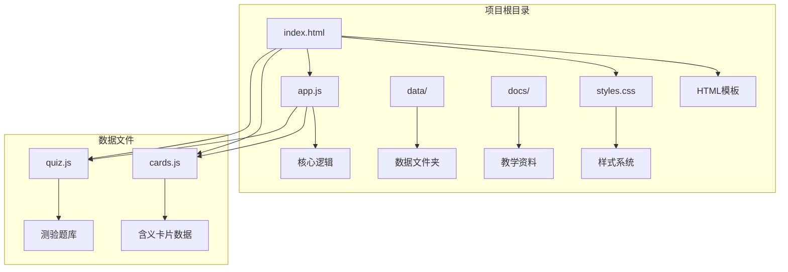
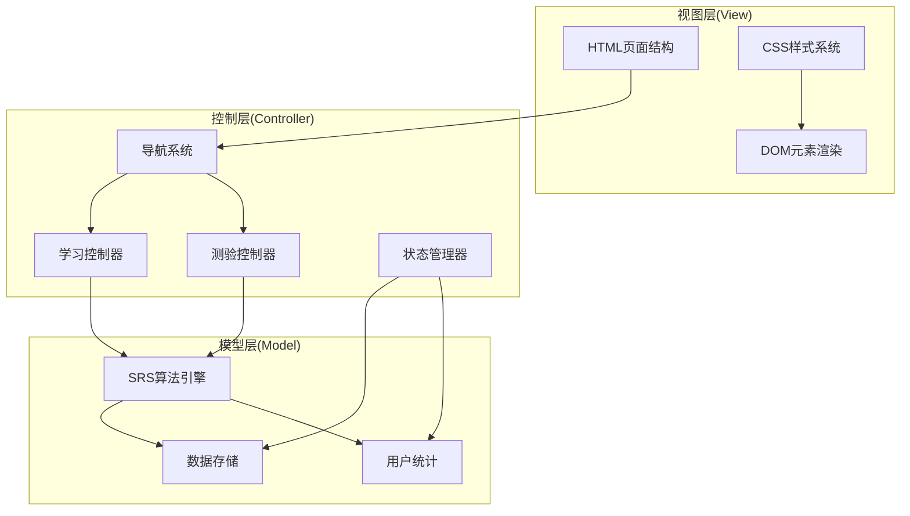
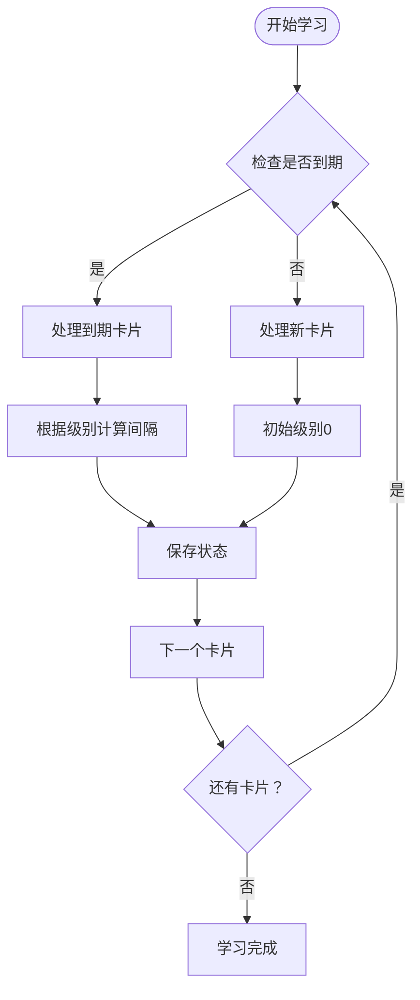
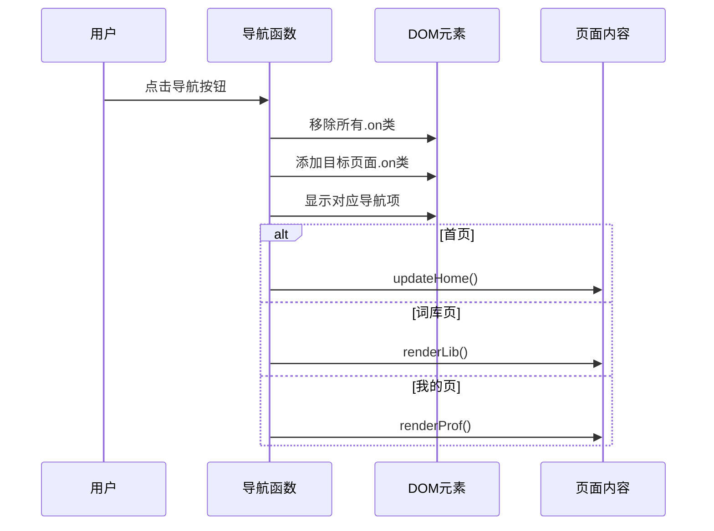
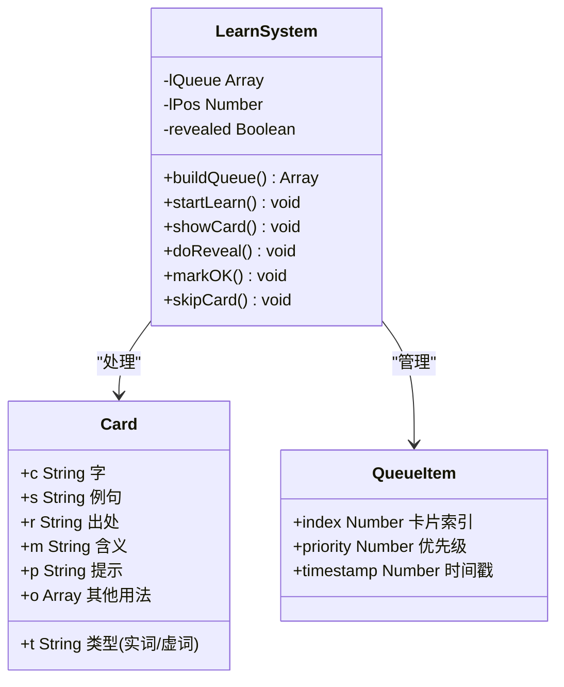
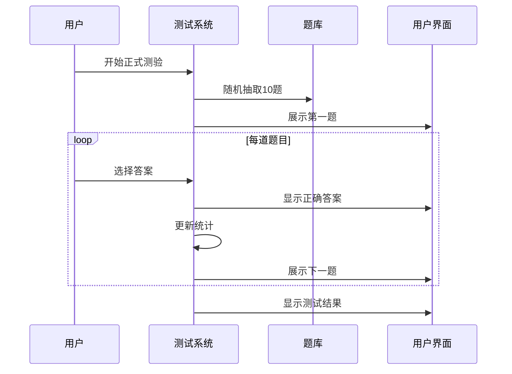
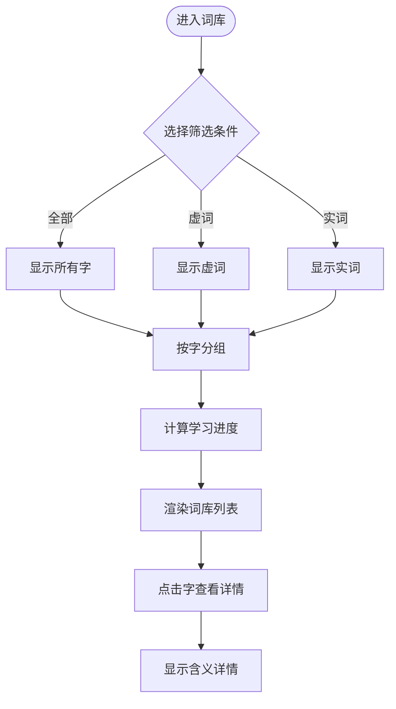
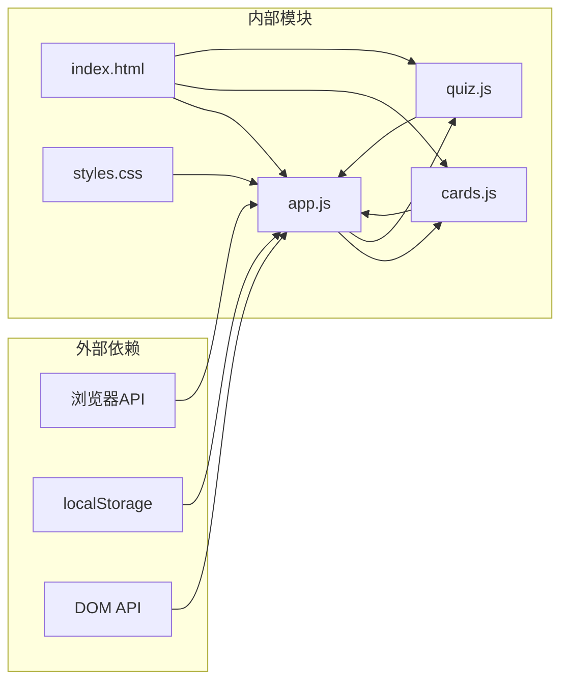

# 代码结构分析

<cite>
**本文档引用的文件**
- [app.js](file://app.js)
- [index.html](file://index.html)
- [styles.css](file://styles.css)
- [data/quiz.js](file://data/quiz.js)
- [CLAUDE.md](file://CLAUDE.md)
</cite>

## 目录
1. [简介](#简介)
2. [项目结构](#项目结构)
3. [核心组件](#核心组件)
4. [架构总览](#架构总览)
5. [详细组件分析](#详细组件分析)
6. [依赖关系分析](#依赖关系分析)
7. [性能考虑](#性能考虑)
8. [故障排除指南](#故障排除指南)
9. [结论](#结论)

## 简介

这是一个基于纯前端技术栈的文言文学习应用，采用单文件HTML架构设计。应用实现了间隔重复系统(Spaced Repetition System, SRS)、智能学习队列、实时测验等功能，专为上海中考/高考文言文实词虚词学习而设计。

该应用采用"零依赖、零构建"的设计理念，直接使用浏览器原生能力运行，所有状态持久化到localStorage中，确保用户数据的安全性和跨设备同步。

## 项目结构

项目采用极简的单文件架构，主要包含以下核心文件：

**图表来源**
- [index.html:1-115](file://index.html#L1-L115)
- [app.js:1-308](file://app.js#L1-L308)

**章节来源**
- [index.html:1-115](file://index.html#L1-L115)
- [styles.css:1-122](file://styles.css#L1-L122)
- [app.js:1-308](file://app.js#L1-L308)

## 核心组件

### 数据层组件

应用的数据层采用全局变量桥接的方式，通过window对象在不同脚本间共享数据：

- **C[] (CARDS)**: 含义卡片数组，包含163张文言文字词卡片
- **Q[] (QUIZZES)**: 测验题库数组，包含69道文言文选择题
- **R{} (复习状态)**: 间隔重复系统状态，包含级别、下次复习时间戳、答对次数
- **stats{} (统计数据)**: 用户学习统计，包含总答题数、正确数

### 状态管理组件

应用实现了完整的本地状态管理系统：

- **localStorage持久化**: 使用`w3_r`和`w3_s`作为存储键名
- **状态恢复机制**: 应用启动时自动从localStorage恢复用户进度
- **实时更新**: 所有用户操作都会即时更新并保存到本地存储

**章节来源**
- [app.js:8-14](file://app.js#L8-L14)
- [app.js:16](file://app.js#L16)
- [CLAUDE.md:26-29](file://CLAUDE.md#L26-L29)

## 架构总览

应用采用经典的MVC架构模式，但简化为单页应用结构：

**图表来源**
- [app.js:27-35](file://app.js#L27-L35)
- [app.js:57-142](file://app.js#L57-L142)
- [app.js:197-228](file://app.js#L197-L228)

## 详细组件分析

### 间隔重复算法模块

间隔重复算法是应用的核心功能，实现了艾宾浩斯遗忘曲线的数学模型：

**图表来源**
- [app.js:4-6](file://app.js#L4-L6)
- [app.js:122-129](file://app.js#L122-L129)
- [app.js:137-140](file://app.js#L137-L140)

算法特点：
- **10级分级系统**: 从"新学"(0)到"熟知"(9)，对应不同的复习间隔
- **指数递增间隔**: 3分钟→30分钟→1.5小时→1天→2天→4天→7天→15天→30天
- **智能降级机制**: 错误回答会降低2个级别，防止过度学习

**章节来源**
- [app.js:4-6](file://app.js#L4-L6)
- [app.js:122-129](file://app.js#L122-L129)
- [app.js:137-140](file://app.js#L137-L140)

### 导航系统模块

导航系统负责页面间的切换和状态管理：

**图表来源**
- [app.js:27-35](file://app.js#L27-L35)
- [app.js:38-54](file://app.js#L38-L54)
- [app.js:237-274](file://app.js#L237-L274)

导航特性：
- **底部导航栏**: 固定位置，包含首页、学习、测验、词库、我的五个入口
- **页面切换动画**: 通过CSS类切换实现平滑过渡
- **状态保持**: 切换页面时保持用户当前的学习进度

**章节来源**
- [app.js:27-35](file://app.js#L27-L35)
- [index.html:86-93](file://index.html#L86-L93)

### 学习系统模块

学习系统实现了闪卡式学习体验：

**图表来源**
- [app.js:58-142](file://app.js#L58-L142)
- [app.js:98-114](file://app.js#L98-L114)

学习流程：
1. **智能队列构建**: 根据过滤条件生成学习队列
2. **闪卡展示**: 卡片翻转展示含义
3. **交互反馈**: 用户选择"记住"或"还不熟"
4. **进度跟踪**: 实时更新学习进度和统计信息

**章节来源**
- [app.js:58-142](file://app.js#L58-L142)
- [app.js:98-114](file://app.js#L98-L114)

### 测试系统模块

测试系统提供了两种测验模式：

**图表来源**
- [app.js:197-228](file://app.js#L197-L228)
- [app.js:151-195](file://app.js#L151-L195)

测试特性：
- **正式测验**: 随机10题四选一，支持键盘快捷键
- **中途小测**: 每15个新词触发的小测验，检验记忆效果
- **实时反馈**: 答案选择后立即显示正确答案和解析

**章节来源**
- [app.js:197-228](file://app.js#L197-L228)
- [app.js:151-195](file://app.js#L151-L195)

### 词库管理系统

词库管理提供了按类型筛选和进度追踪功能：

**图表来源**
- [app.js:230-274](file://app.js#L230-L274)
- [app.js:244-273](file://app.js#L244-L273)

**章节来源**
- [app.js:230-274](file://app.js#L230-L274)

## 依赖关系分析

应用采用松耦合的设计，主要依赖关系如下：

**图表来源**
- [app.js:1](file://app.js#L1)
- [index.html:110-112](file://index.html#L110-L112)

**章节来源**
- [app.js:1](file://app.js#L1)
- [index.html:110-112](file://index.html#L110-L112)

## 性能考虑

### 内存优化策略

1. **数据分块加载**: 通过全局变量一次性加载所有数据，避免重复请求
2. **DOM复用**: 使用innerHTML动态更新，减少DOM操作开销
3. **事件委托**: 通过事件冒泡处理按钮点击，减少事件监听器数量

### 网络性能

1. **静态资源**: 所有文件均为静态资源，无需服务器端处理
2. **缓存友好**: localStorage持久化，避免重复加载数据
3. **CDN字体**: 使用Google Fonts CDN，提升字体加载速度

### 移动端优化

1. **触摸优化**: 所有交互元素均适配触摸屏操作
2. **性能监控**: 使用`-webkit-overflow-scrolling: touch`优化滚动性能
3. **内存管理**: 自动清理临时DOM节点，防止内存泄漏

## 故障排除指南

### 常见问题诊断

1. **页面空白问题**
   - 检查浏览器控制台是否有JavaScript错误
   - 确认所有脚本文件都能正常加载
   - 验证localStorage权限是否正常

2. **学习进度丢失**
   - 检查浏览器是否禁用了localStorage
   - 确认浏览器版本是否支持localStorage API
   - 验证存储键名是否被意外修改

3. **测验功能异常**
   - 检查quiz.js文件是否正确加载
   - 确认题目数据格式是否符合预期
   - 验证答案索引是否在有效范围内

### 调试技巧

1. **开发者工具**: 使用浏览器开发者工具监控localStorage变化
2. **网络面板**: 检查脚本加载状态和错误信息
3. **控制台**: 输出关键变量值验证逻辑执行路径

**章节来源**
- [app.js:9](file://app.js#L9)
- [app.js:18](file://app.js#L18)

## 结论

该文言文学习应用展现了优秀的前端架构设计，通过合理的模块划分和清晰的职责分离，实现了功能完整且易于维护的学习系统。

### 设计优势

1. **架构简洁**: 采用单文件架构，部署简单，维护成本低
2. **用户体验**: 流畅的动画效果和直观的操作界面
3. **数据驱动**: 基于真实教学需求设计的数据结构
4. **性能优秀**: 零依赖、零构建，运行效率高

### 技术特色

1. **间隔重复算法**: 实现了科学的记忆强化机制
2. **移动端优先**: 完整的移动端适配和优化
3. **本地化存储**: 确保用户数据安全和离线可用
4. **游戏化设计**: 通过等级系统提升学习动力

该应用为文言文学习提供了一个高效、便捷、有趣的学习平台，充分体现了现代前端技术在教育领域的应用价值。