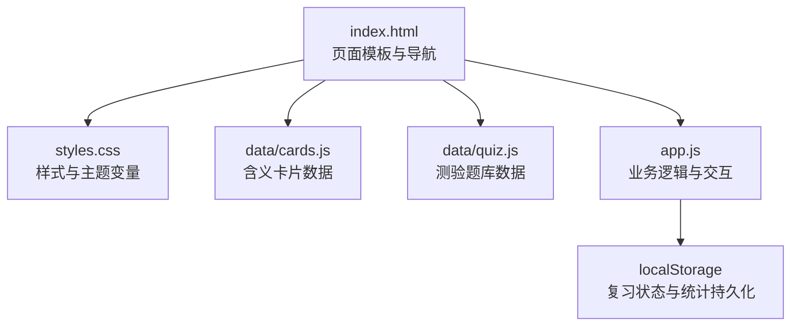
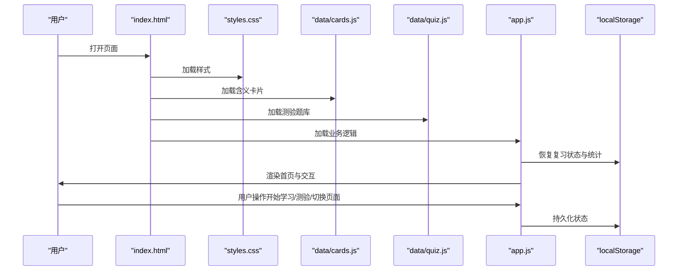
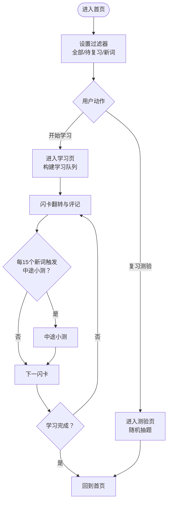
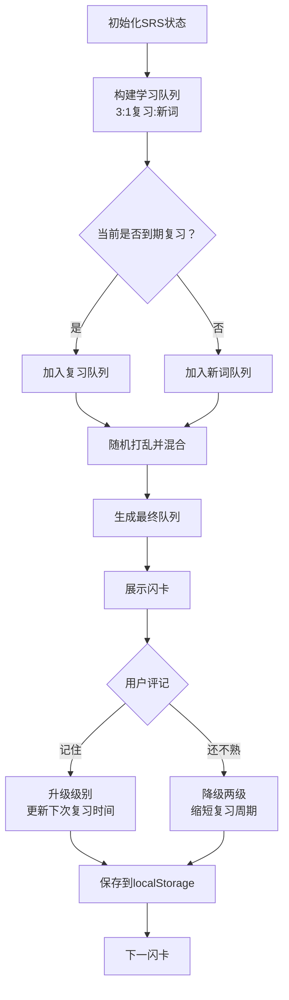
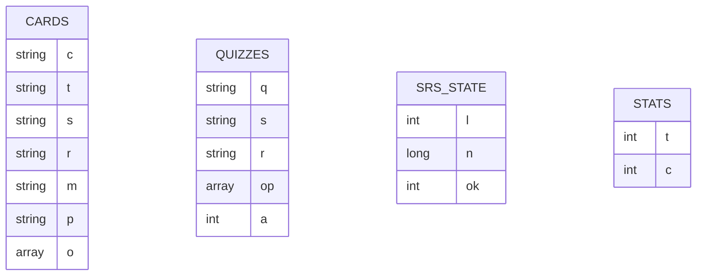
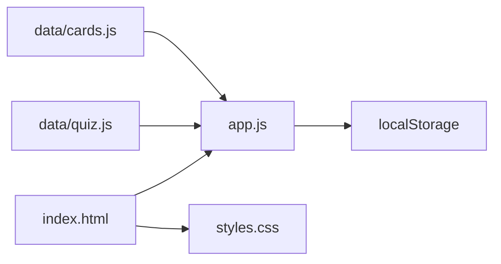

# 开发指南

<cite>
**本文档引用的文件**
- [app.js](file://app.js)
- [index.html](file://index.html)
- [styles.css](file://styles.css)
- [data/cards.js](file://data/cards.js)
- [data/quiz.js](file://data/quiz.js)
- [docs/文言实词·虚词专项梳理.md](file://docs/文言实词·虚词专项梳理.md)
- [docs/文言实词默写检测（120题）.md](file://docs/文言实词默写检测（120题）.md)
- [CLAUDE.md](file://CLAUDE.md)
</cite>

## 目录
1. [简介](#简介)
2. [项目结构](#项目结构)
3. [核心组件](#核心组件)
4. [架构总览](#架构总览)
5. [详细组件分析](#详细组件分析)
6. [依赖关系分析](#依赖关系分析)
7. [性能考量](#性能考量)
8. [调试与测试](#调试与测试)
9. [扩展开发指南](#扩展开发指南)
10. [版本管理与发布](#版本管理与发布)
11. [故障排查](#故障排查)
12. [结论](#结论)

## 简介
本指南面向希望扩展或修改“文言斩”文言文学习应用的开发者，提供从项目结构、模块划分到开发环境搭建、扩展步骤、调试测试、性能优化、代码规范、最佳实践以及版本管理与发布的全流程指导。项目采用纯前端单文件 HTML 应用，零依赖、零构建，使用 localStorage 持久化学习状态，支持间隔重复（Spaced Repetition System, SRS）学习模式与测验功能。

## 项目结构
项目采用极简的单页应用结构，所有资源通过 HTML 页面直接引入，便于本地直接运行与快速迭代。

图表来源
- [index.html:1-115](file://index.html#L1-L115)
- [styles.css:1-122](file://styles.css#L1-L122)
- [data/cards.js:1-166](file://data/cards.js#L1-L166)
- [data/quiz.js:1-72](file://data/quiz.js#L1-L72)
- [app.js:1-308](file://app.js#L1-L308)

章节来源
- [index.html:1-115](file://index.html#L1-L115)
- [CLAUDE.md:14-20](file://CLAUDE.md#L14-L20)

## 核心组件
- 页面与导航：通过页面容器切换实现首页、学习、测验、词库、我的五个页面，底部导航统一控制。
- 学习系统：基于闪卡翻转与间隔重复算法，支持中途小测与进度可视化。
- 测验系统：随机抽取题目进行四选一测验，支持键盘快捷键。
- 数据层：含义卡片与测验题库通过全局变量注入，便于跨文件共享。
- 样式层：使用 CSS 自定义属性统一主题色与字体，支持移动端优先布局。

章节来源
- [app.js:27-35](file://app.js#L27-L35)
- [app.js:38-55](file://app.js#L38-L55)
- [app.js:57-142](file://app.js#L57-L142)
- [app.js:197-228](file://app.js#L197-L228)
- [app.js:230-274](file://app.js#L230-L274)
- [app.js:276-296](file://app.js#L276-L296)
- [index.html:14-84](file://index.html#L14-L84)
- [styles.css:3-8](file://styles.css#L3-L8)

## 架构总览
应用采用“模板 + 数据 + 逻辑 + 样式”的分层架构，数据通过全局变量注入，逻辑在 app.js 中集中处理，页面渲染与交互通过 DOM 操作完成。

图表来源
- [index.html:109-112](file://index.html#L109-L112)
- [app.js:1-11](file://app.js#L1-L11)
- [app.js:306-308](file://app.js#L306-L308)

## 详细组件分析

### 页面与导航组件
- 首页：展示学习进度、过滤器（全部/待复习/新词）、行动入口（开始学习/复习测验）。
- 学习页：闪卡翻转、评记（记住/还不熟）、中途小测触发机制。
- 测验页：随机10题四选一，支持键盘快捷键。
- 词库页：按类型过滤（全部/虚词/实词），展示每个字的含义进度。
- 我的页：等级（童生→状元）与学习统计。

图表来源
- [app.js:38-55](file://app.js#L38-L55)
- [app.js:58-142](file://app.js#L58-L142)
- [app.js:144-195](file://app.js#L144-L195)
- [app.js:197-228](file://app.js#L197-L228)
- [index.html:14-84](file://index.html#L14-L84)

章节来源
- [app.js:27-35](file://app.js#L27-L35)
- [app.js:38-55](file://app.js#L38-L55)
- [app.js:58-142](file://app.js#L58-L142)
- [app.js:144-195](file://app.js#L144-L195)
- [app.js:197-228](file://app.js#L197-L228)
- [index.html:14-84](file://index.html#L14-L84)

### 间隔重复（SRS）组件
- 时间间隔：定义10个级别的时间间隔，从几分钟到一个月，记忆正确升级，忘记降两级。
- 队列构建：按3:1比例混合复习与新词，确保复习与新内容平衡。
- 状态持久化：复习级别、下次复习时间、答对次数保存在 localStorage。

图表来源
- [app.js:4-6](file://app.js#L4-L6)
- [app.js:58-68](file://app.js#L58-L68)
- [app.js:122-136](file://app.js#L122-L136)
- [app.js:137-141](file://app.js#L137-L141)
- [app.js:16-21](file://app.js#L16-L21)

章节来源
- [app.js:4-6](file://app.js#L4-L6)
- [app.js:58-68](file://app.js#L58-L68)
- [app.js:122-136](file://app.js#L122-L136)
- [app.js:137-141](file://app.js#L137-L141)
- [app.js:16-21](file://app.js#L16-L21)

### 数据模型组件
- 含义卡片（C[]）：包含字符、类型（实词/虚词）、例句（含高亮）、出处、含义、记忆提示、其他用法列表。
- 测验题库（Q[]）：包含题目、例句、出处、选项数组、正确索引。
- SRS状态（R）：按索引存储级别、下次复习时间戳、答对次数。
- 统计（stats）：总答题数、正确数。

图表来源
- [data/cards.js:1-166](file://data/cards.js#L1-L166)
- [data/quiz.js:1-72](file://data/quiz.js#L1-L72)
- [app.js:8-11](file://app.js#L8-L11)

章节来源
- [data/cards.js:1-166](file://data/cards.js#L1-L166)
- [data/quiz.js:1-72](file://data/quiz.js#L1-L72)
- [app.js:8-11](file://app.js#L8-L11)

### 样式与主题组件
- 主题变量：在 `:root` 中定义背景、卡片、强调色、绿色、文字、柔和色、边框、字体族等。
- 移动端优先：最大宽度430px，隐藏横向滚动，底部导航与页面容器统一布局。
- 组件样式：包括导航栏、顶部进度条、动作按钮、闪卡、测验选项、模态弹窗、词库行等。

章节来源
- [styles.css:3-8](file://styles.css#L3-L8)
- [styles.css:10-122](file://styles.css#L10-L122)
- [index.html:11-115](file://index.html#L11-L115)

## 依赖关系分析
- 文件加载顺序：cards.js → quiz.js → app.js，确保数据在逻辑之前可用。
- 全局变量桥接：通过 window.CARDS 与 window.QUIZZES 在文件间传递数据。
- 持久化依赖：localStorage 键名固定，保证向后兼容。

图表来源
- [index.html:109-112](file://index.html#L109-L112)
- [app.js:1-11](file://app.js#L1-L11)
- [CLAUDE.md:22-22](file://CLAUDE.md#L22-L22)

章节来源
- [index.html:109-112](file://index.html#L109-L112)
- [app.js:1-11](file://app.js#L1-L11)
- [CLAUDE.md:22-22](file://CLAUDE.md#L22-L22)

## 性能考量
- 零构建与零依赖：减少打包与运行时开销，直接在浏览器中运行。
- 本地存储：避免网络请求，提升启动速度与离线可用性。
- DOM 操作最小化：通过一次性拼接 HTML 并批量更新，减少重排与重绘。
- 队列与筛选：在内存中完成数据筛选与排序，避免不必要的网络或文件 IO。

[本节为通用建议，无需特定文件引用]

## 调试与测试
- 浏览器调试：直接在浏览器开发者工具中查看 DOM、事件绑定与 localStorage 内容。
- 控制台日志：在关键函数（如导航、评分、保存）中添加日志，定位问题。
- 本地存储检查：在 Application/Storage 面板查看 w3_r 与 w3_s 的值，验证 SRS 状态。
- 快捷键测试：在测验页使用 A/B/C/D 或 1/2/3/4 键验证答案提交逻辑。
- 单元测试建议：针对工具函数（如 dueCount、newCount、shuf）编写简单单元测试，验证边界条件。

章节来源
- [app.js:299-304](file://app.js#L299-L304)
- [app.js:16-21](file://app.js#L16-L21)

## 扩展开发指南

### 开发环境搭建
- 直接使用浏览器打开 index.html 即可运行，无需安装 Node.js 或构建工具。
- 推荐使用现代浏览器（Chrome/Firefox/Edge）进行开发与调试。
- 如需热更新或自动刷新，可在本地搭建静态服务器（例如 Python http.server 或 VS Code Live Server）。

章节来源
- [CLAUDE.md:46-46](file://CLAUDE.md#L46-L46)

### 添加新的学习内容
- 扩展含义卡片数据
  - 在 data/cards.js 中新增含义卡片对象，字段与现有卡片保持一致。
  - 注意例句中的高亮标记与出处格式，确保渲染一致。
  - 保存后刷新页面，新卡片将自动纳入学习队列。
- 扩展测验题库
  - 在 data/quiz.js 中新增测验题目对象，包含题目、例句、出处、选项与正确索引。
  - 保持 op 数组长度与 a 索引有效，避免渲染异常。
  - 保存后刷新页面，新题将参与随机测验。

章节来源
- [data/cards.js:1-166](file://data/cards.js#L1-L166)
- [data/quiz.js:1-72](file://data/quiz.js#L1-L72)

### 扩展现有功能
- 修改学习流程
  - 调整队列混合比例：在 buildQueue 中修改复习与新词的比例参数。
  - 调整中途小测阈值：在 markOK 中修改 sNewCount 的阈值。
- 增强测验体验
  - 扩展测验题型：在 renderQ 中增加新的题型分支与渲染逻辑。
  - 支持更多快捷键：在键盘事件监听中增加按键映射。
- 优化界面与交互
  - 在 styles.css 中调整主题变量与组件样式，保持一致性。
  - 在 index.html 中新增页面或组件，注意与现有导航与持久化逻辑兼容。

章节来源
- [app.js:58-68](file://app.js#L58-L68)
- [app.js:122-136](file://app.js#L122-L136)
- [app.js:197-228](file://app.js#L197-L228)
- [app.js:299-304](file://app.js#L299-L304)
- [styles.css:3-8](file://styles.css#L3-L8)
- [index.html:14-84](file://index.html#L14-L84)

### 集成第三方资源
- 文档与教学资料
  - docs 目录包含文言实词虚词专项梳理与默写检测等资料，可用于校对与扩展题库。
  - 可将外部文档转换为结构化 JSON，作为数据源补充或生成新题库。
- 外部链接与资源
  - 在 index.html 中添加外部资源链接（如字体、图标 CDN），注意与现有样式兼容。
  - 使用相对路径或绝对路径引入额外脚本，确保加载顺序与全局变量桥接。

章节来源
- [docs/文言实词·虚词专项梳理.md:1-800](file://docs/文言实词·虚词专项梳理.md#L1-L800)
- [docs/文言实词默写检测（120题）.md:1-800](file://docs/文言实词默写检测（120题）.md#L1-L800)
- [index.html:7-9](file://index.html#L7-L9)

## 版本管理与发布
- 版本标识：当前版本为 v2（demo），可通过文件名或注释维护版本号。
- 发布流程
  - 本地测试：在浏览器中验证所有功能与数据加载。
  - 提交变更：将修改后的文件提交到版本控制系统，保留 CLAUDE.md 作为开发指引。
  - 打包发布：将 index.html、styles.css、data/*.js 与 docs 资料打包为发布包。
  - 分发渠道：通过 GitHub Pages、静态托管平台或本地部署分发。

章节来源
- [CLAUDE.md:1-80](file://CLAUDE.md#L1-L80)

## 故障排查
- 页面无法加载或空白
  - 检查 data/cards.js 与 data/quiz.js 是否正确加载，确认全局变量是否注入。
  - 检查浏览器控制台是否存在语法错误或跨域问题。
- 学习状态异常
  - 检查 localStorage 中 w3_r 与 w3_s 的值是否损坏，必要时清理缓存后重试。
  - 确认 dueCount 与 newCount 的计算逻辑是否符合预期。
- 测验无法提交或快捷键无效
  - 检查键盘事件监听是否生效，确认选项元素 ID 与事件绑定一致。
  - 验证答案索引与正确索引匹配，避免渲染错误导致无法提交。

章节来源
- [app.js:16-21](file://app.js#L16-L21)
- [app.js:299-304](file://app.js#L299-L304)
- [app.js:216-227](file://app.js#L216-L227)

## 结论
本指南提供了“文言斩”应用的完整开发路线图，涵盖结构分析、模块划分、扩展步骤、调试测试、性能优化与版本发布。开发者可基于现有单页应用架构快速迭代，通过数据层扩展与逻辑增强持续完善学习体验，同时保持零依赖、零构建的简洁与高效。