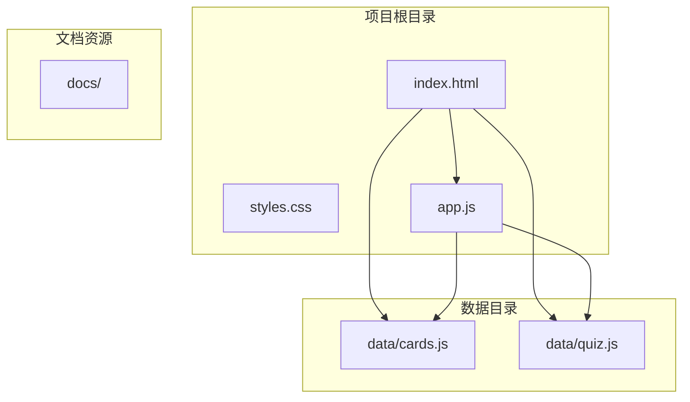
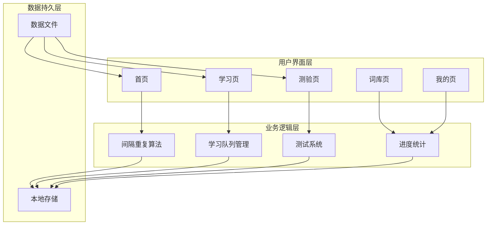
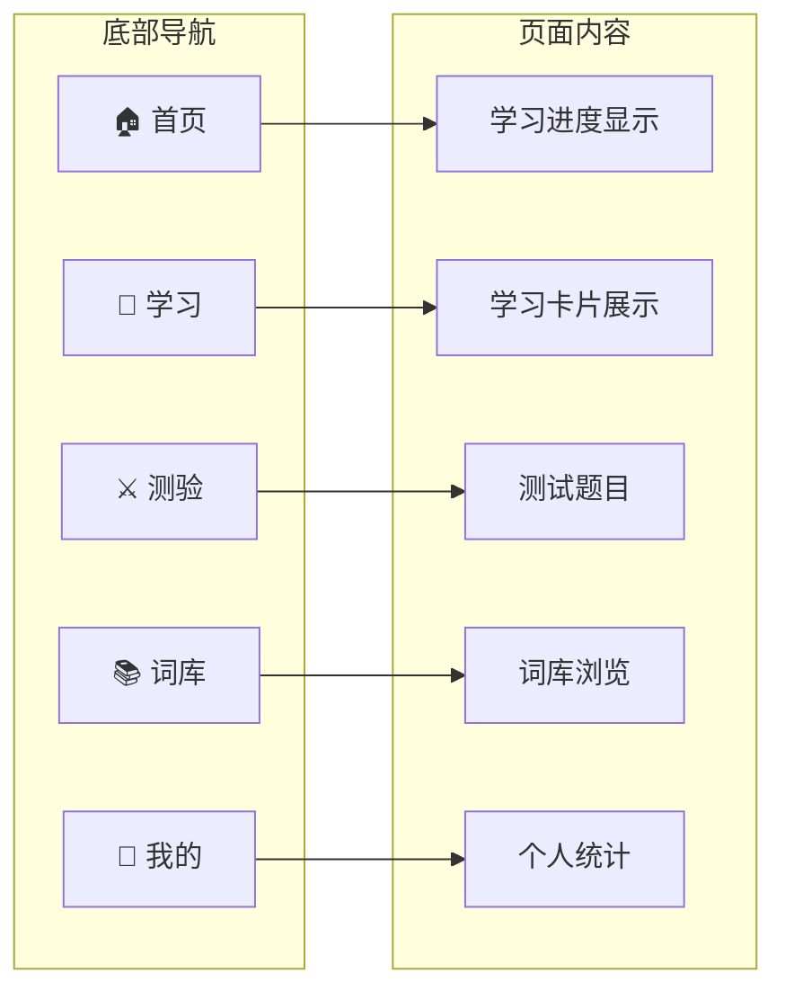
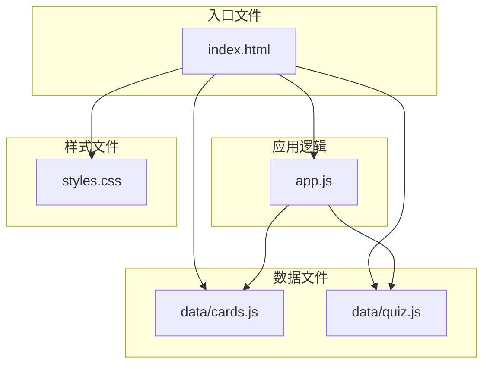
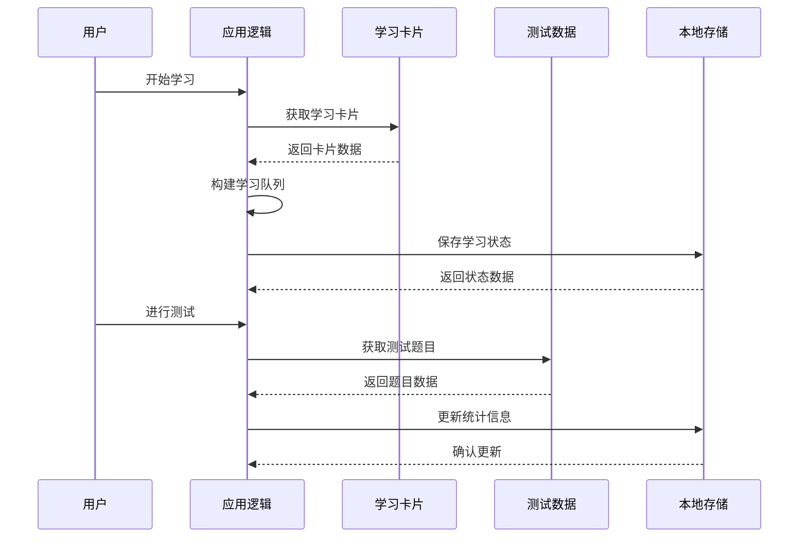

# 扩展开发指导

<cite>
**本文档引用的文件**
- [app.js](file://app.js)
- [cards.js](file://data/cards.js)
- [quiz.js](file://data/quiz.js)
- [index.html](file://index.html)
- [styles.css](file://styles.css)
</cite>

## 目录
1. [简介](#简介)
2. [项目结构](#项目结构)
3. [核心组件](#核心组件)
4. [架构概览](#架构概览)
5. [详细组件分析](#详细组件分析)
6. [依赖关系分析](#依赖关系分析)
7. [性能考虑](#性能考虑)
8. [故障排除指南](#故障排除指南)
9. [结论](#结论)

## 简介

这是一个基于Web的文言文学习应用，采用间隔重复算法进行记忆训练。该系统提供了学习卡片管理、测试功能、进度跟踪和个性化学习体验。本文档旨在为开发者提供完整的扩展开发指导，包括添加新学习卡片、测试题目、自定义学习算法以及新增页面功能模块的方法。

## 项目结构

该项目采用简洁的单页应用架构，主要文件组织如下：



**图表来源**
- [index.html:110-112](file://index.html#L110-L112)
- [app.js](file://app.js#L1)

**章节来源**
- [index.html:1-115](file://index.html#L1-L115)
- [app.js:1-308](file://app.js#L1-L308)

## 核心组件

### 数据层组件

系统的核心数据结构分为两个主要部分：

1. **学习卡片数据** (`CARDS`)
2. **测试题目数据** (`QUIZZES`)

这两个数组分别存储在独立的JavaScript文件中，通过全局变量形式暴露给主应用。

**章节来源**
- [cards.js:1-166](file://data/cards.js#L1-L166)
- [quiz.js:1-72](file://data/quiz.js#L1-L72)

### 应用逻辑组件

主应用逻辑集中在单个JavaScript文件中，包含以下核心功能模块：

- 间隔重复算法实现
- 学习队列管理
- 用户界面交互
- 进度状态保存
- 测试系统

**章节来源**
- [app.js:1-308](file://app.js#L1-L308)

## 架构概览

系统采用事件驱动的单页应用架构，具有清晰的分层设计：



**图表来源**
- [app.js:58-142](file://app.js#L58-L142)
- [app.js:198-228](file://app.js#L198-L228)

## 详细组件分析

### 学习卡片系统 (cards.js)

#### 数据结构规范

学习卡片采用统一的对象结构，包含以下必需字段：

| 字段名 | 类型 | 必需 | 描述 | 示例值 |
|--------|------|------|------|--------|
| `c` | String | ✓ | 文言文字 | "之" |
| `t` | String | ✓ | 词性分类 | "虚词" |
| `s` | String | ✓ | 含义例句（HTML） | "<b class='hl'>之</b>" |
| `r` | String | ✓ | 出处来源 | "《论语》" |
| `m` | String | ✓ | 完整含义解释 | "代词：它（指善者）" |
| `p` | String | ✓ | 记忆提示/技巧 | "「之」代替前文的善者" |
| `o` | Array | ✗ | 其他用法列表 | ["助词：的","动词：到……去"] |

#### 字段验证规则

1. **必需字段完整性**：所有卡片必须包含 `c`, `t`, `s`, `r`, `m`, `p` 字段
2. **数据类型一致性**：
   - `c`: 单个汉字字符
   - `t`: "虚词" 或 "实词"
   - `s`: 包含高亮标记的HTML字符串
   - `r`: 文言文出处字符串
   - `m`: 含义解释字符串
   - `p`: 记忆提示字符串
   - `o`: 字符串数组（可选）
3. **高亮标记规范**：例句中的目标字必须使用 `<b class="hl">字</b>` 格式

#### 添加新学习卡片的步骤

1. **准备数据内容**
   ```javascript
   // 示例：添加一个新的虚词卡片
   {c:'然',t:'虚词',s:'<b class="hl">然</b>杂然相许',r:'《愚公移山》',m:'助词：……的样子',p:'纷纷表示赞同',o:['代词：这样/对','连词：然而']},
   ```

2. **遵循格式规范**
   - 确保例句使用正确的高亮标记
   - 含义解释要准确且简洁
   - 记忆提示要实用有效

3. **验证数据质量**
   - 检查词性分类是否正确
   - 确认出处来源的真实性
   - 验证例句的语法正确性

**章节来源**
- [cards.js:1-166](file://data/cards.js#L1-L166)

### 测试题目系统 (quiz.js)

#### 题目结构规范

测试题目采用标准化的对象结构：

| 字段名 | 类型 | 必需 | 描述 | 示例值 |
|--------|------|------|------|--------|
| `q` | String | ✓ | 题目文本 | "「之」是什么意思？" |
| `s` | String | ✓ | 语境例句（HTML） | "择其善者而从<b class='hl'>之</b>" |
| `r` | String | ✓ | 出处来源 | "《论语》" |
| `op` | Array | ✓ | 选项数组 | ["代词，它（指善者）","助词，的","动词，到……去","取消句子独立性"] |
| `a` | Number | ✓ | 正确答案索引 | 0 |

#### 选项生成机制

系统自动处理选项生成和随机化：

1. **正确答案提取**：从相关学习卡片中提取正确含义
2. **干扰项生成**：从同一卡片的其他用法中选择3个干扰项
3. **随机化处理**：使用 `sort(function(){return Math.random()-.5;})` 随机排列选项
4. **索引确定**：确保正确答案的索引位置

#### 添加新测试题目的步骤

1. **选择目标词汇**
   - 从现有的学习卡片中选择合适的词汇
   - 确保该词汇有多个不同的用法

2. **编写题目内容**
   ```javascript
   {q:'「然」是什么意思？',s:'<b class="hl">然</b>杂然相许',r:'《愚公移山》',op:['助词：……的样子','代词：这样/对','连词：然而','副词：是/就是'],a:0},
   ```

3. **验证题目质量**
   - 检查选项的合理性
   - 确认正确答案的准确性
   - 验证语境例句的相关性

**章节来源**
- [quiz.js:1-72](file://data/quiz.js#L1-L72)

### 间隔重复算法 (app.js)

#### 算法参数配置

系统实现了标准的间隔重复算法，包含以下关键参数：

```mermaid
flowchart TD
subgraph "间隔时间配置"
INT[INT=[0,180000,900000,5400000,86400000,172800000,345600000,604800000,1296000000,2592000000]]
LVL[LVL_NAME=['新学','速记','巩固','短期','隔日','短周','中周','长周','月检','熟知']]
CLR[LVL_CLR=['#bbb','#e08080','#d89040','#d4a830','#50a868','#4890b8','#6878b8','#7868c0','#c08040','#b068a8']]
end
subgraph "学习状态管理"
R[用户学习状态]
STATS[统计信息]
QUEUE[学习队列]
end
INT --> R
LVL --> R
CLR --> R
R --> STATS
STATS --> QUEUE
```

**图表来源**
- [app.js:4-13](file://app.js#L4-L13)

#### 学习级别系统

| 级别编号 | 级别名称 | 间隔时间 | 颜色标识 |
|----------|----------|----------|----------|
| 0 | 新学 | 0秒 | #bbb |
| 1 | 速记 | 3分钟 | #e08080 |
| 2 | 巩固 | 15分钟 | #d89040 |
| 3 | 短期 | 1小时 | #d4a830 |
| 4 | 隔日 | 1天 | #50a868 |
| 5 | 短周 | 1周 | #4890b8 |
| 6 | 中周 | 1周 | #6878b8 |
| 7 | 长周 | 1周 | #7868c0 |
| 8 | 月检 | 1个月 | #c08040 |
| 9 | 熟知 | 最大间隔 | #b068a8 |

#### 自定义学习算法的扩展方法

##### 方法一：调整间隔参数
```javascript
// 修改间隔时间数组
var INT=[0,3600000,21600000,129600000,259200000,518400000,1036800000,2592000000,5184000000,10368000000];
```

##### 方法二：修改学习策略
```javascript
// 自定义复习混合策略
function buildQueue(){
    var q=[],n=now();
    if(lFilter==='new'){
        for(var i=0;i<C.length;i++)if(!done(i))q.push(i);
    } else if(lFilter==='due'){
        for(var i=0;i<C.length;i++)if(done(i)&&nextT(i)<=n)q.push(i);
    } else{
        // 自定义混合策略：增加新词比例
        var rev=[],nw=[];
        for(var i=0;i<C.length;i++){
            if(done(i)&&nextT(i)<=n)rev.push(i);
            else if(!done(i))nw.push(i);
        }
        shuf(rev);shuf(nw);
        var re,ni;re=ni=0;
        while(re<rev.length||ni<nw.length){
            // 调整复习与新词的比例
            if(ni<nw.length)q.push(nw[ni++]);
            if(re<rev.length)q.push(rev[re++]);
            if(re<rev.length)q.push(rev[re++]);
        }
    }
    return q;
}
```

##### 方法三：添加新的学习模式
```javascript
// 添加"深度学习"模式
function startDeepLearn(){
    var deepQueue=buildDeepQueue();
    lQueue=deepQueue;lPos=0;sNewCount=0;sNewList=[];
    nav('learn');
    showCard();
}

function buildDeepQueue(){
    // 实现深度学习队列构建逻辑
    // 例如：优先处理高难度词汇
    var q=[],highDifficultWords=getHighDifficultyWords();
    q=q.concat(highDifficultWords);
    return q;
}
```

**章节来源**
- [app.js:4-26](file://app.js#L4-L26)
- [app.js:58-68](file://app.js#L58-L68)

### 用户界面系统

#### 页面导航架构

系统采用底部导航栏的移动端优化设计：



**图表来源**
- [index.html:87-93](file://index.html#L87-L93)

#### 主题样式系统

系统使用CSS变量实现主题定制：

```css
:root{
  --bg:#f5f0e8;          /* 背景色 */
  --card:#ffffff;        /* 卡片背景色 */
  --accent:#c04030;      /* 强调色 */
  --gold:#b8860b;        /* 金色 */
  --green:#3d8b63;       /* 绿色 */
  --text:#2c2420;        /* 主文字色 */
  --muted:#9a8e80;       /* 次要文字色 */
  --border:#ebe5d8;      /* 边框色 */
  --serif:'Noto Serif SC', serif;  /* 衬线字体 */
  --sans:'PingFang SC', sans-serif; /* 无衬线字体 */
}
```

**章节来源**
- [styles.css:3-8](file://styles.css#L3-L8)

## 依赖关系分析

### 文件依赖关系



**图表来源**
- [index.html:110-112](file://index.html#L110-L112)
- [app.js](file://app.js#L1)

### 数据依赖关系

学习系统的核心数据流：



**图表来源**
- [app.js:58-142](file://app.js#L58-L142)
- [app.js:198-228](file://app.js#L198-L228)

**章节来源**
- [app.js:1-308](file://app.js#L1-L308)

## 性能考虑

### 内存优化策略

1. **数据加载优化**
   - 使用全局变量避免重复加载
   - 实现懒加载机制减少初始内存占用

2. **DOM操作优化**
   - 批量更新DOM元素
   - 使用CSS动画替代JavaScript动画

3. **存储优化**
   - 使用localStorage进行数据持久化
   - 实现增量更新减少存储压力

### 加载性能优化

```javascript
// 优化的初始化流程
function initOptimized(){
    // 预加载关键数据
    preloadCriticalData();
    
    // 延迟加载非关键资源
    setTimeout(() => {
        loadNonCriticalResources();
    }, 100);
    
    // 监控性能指标
    performanceMonitor.start();
}
```

## 故障排除指南

### 常见问题诊断

#### 学习卡片无法显示

**症状**：学习页面空白或显示异常

**可能原因**：
1. JSON格式错误
2. 缺少必需字段
3. 字符编码问题

**解决方案**：
```javascript
// 添加数据验证函数
function validateCard(card){
    const requiredFields = ['c', 't', 's', 'r', 'm', 'p'];
    for(let field of requiredFields){
        if(!card.hasOwnProperty(field)){
            console.error(`缺少必需字段: ${field}`);
            return false;
        }
    }
    return true;
}

// 使用示例
C.forEach((card, index) => {
    if(!validateCard(card)){
        console.error(`卡片 ${index} 数据无效`);
    }
});
```

#### 测试题目显示异常

**症状**：测试页面选项错乱或无法选择

**可能原因**：
1. 选项数组长度不符合要求
2. 正确答案索引超出范围
3. HTML标签格式错误

**解决方案**：
```javascript
// 添加测试题目验证
function validateQuestion(question){
    if(!Array.isArray(question.op) || question.op.length !== 4){
        console.error('选项数量必须为4个');
        return false;
    }
    
    if(question.a < 0 || question.a >= question.op.length){
        console.error('正确答案索引超出范围');
        return false;
    }
    
    return true;
}
```

#### 学习进度保存失败

**症状**：刷新页面后学习进度丢失

**可能原因**：
1. localStorage权限问题
2. JSON序列化失败
3. 存储空间不足

**解决方案**：
```javascript
// 改进的保存机制
function safeSave(){
    try {
        localStorage.setItem('w3_r', JSON.stringify(R));
        localStorage.setItem('w3_s', JSON.stringify(stats));
        return true;
    } catch(e) {
        console.error('保存失败:', e);
        // 回退到sessionStorage
        sessionStorage.setItem('w3_r', JSON.stringify(R));
        return false;
    }
}
```

**章节来源**
- [app.js:16-17](file://app.js#L16-L17)
- [app.js:9-10](file://app.js#L9-L10)

## 结论

本文档提供了完整的扩展开发指导，涵盖了文言文学习应用的核心功能扩展方法。通过遵循本文档的规范和最佳实践，开发者可以：

1. **安全地添加新的学习卡片**：按照统一的数据格式规范，确保数据质量和用户体验
2. **有效地扩展测试系统**：保持测试题目的质量和多样性
3. **灵活地定制学习算法**：根据需求调整间隔重复参数和学习策略
4. **平滑地集成新功能模块**：遵循现有的架构模式和设计原则

该系统的设计充分考虑了移动端优化、性能考量和用户体验，在保持简洁性的同时提供了强大的扩展能力。建议在进行任何扩展开发时，都要充分测试新功能对现有系统的影响，并遵循渐进式开发的原则。