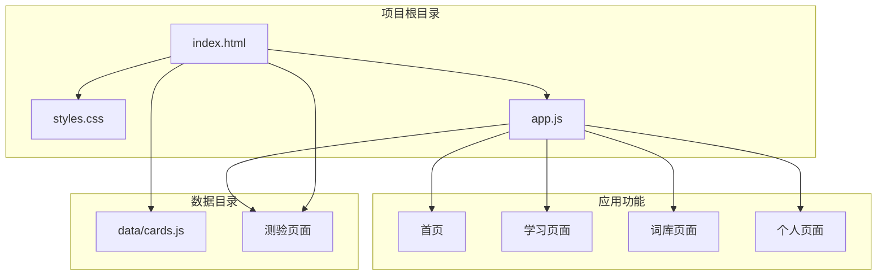
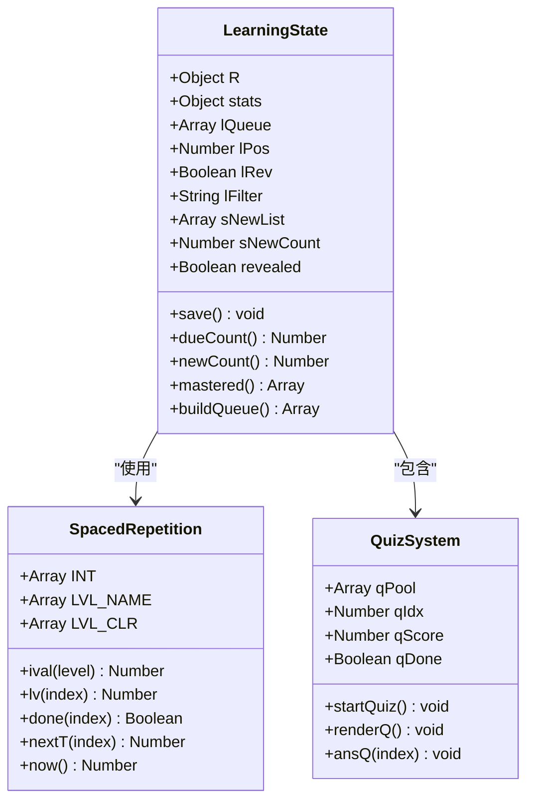
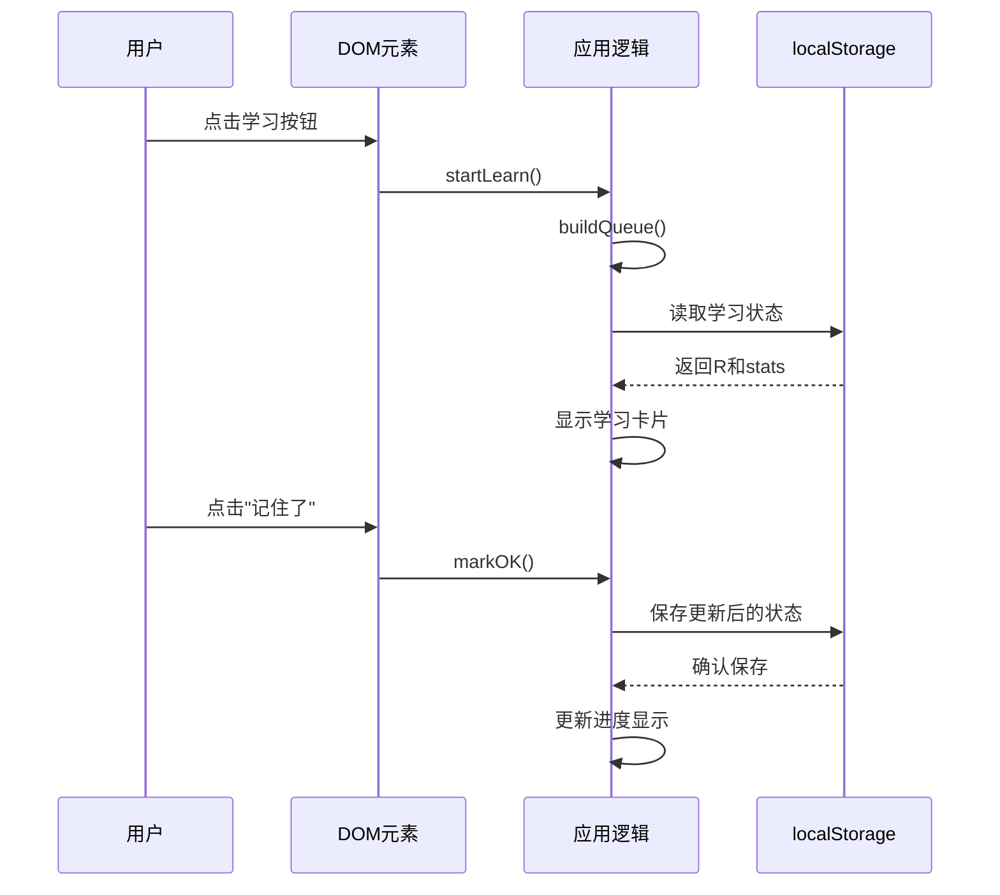
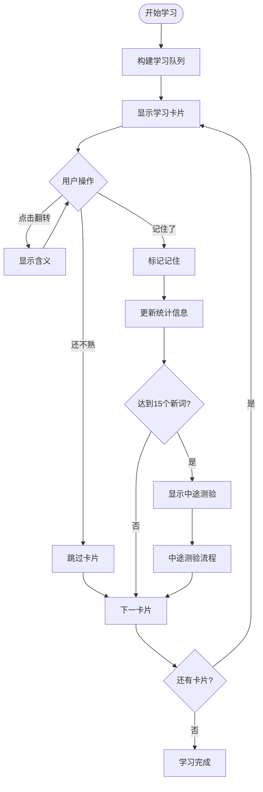
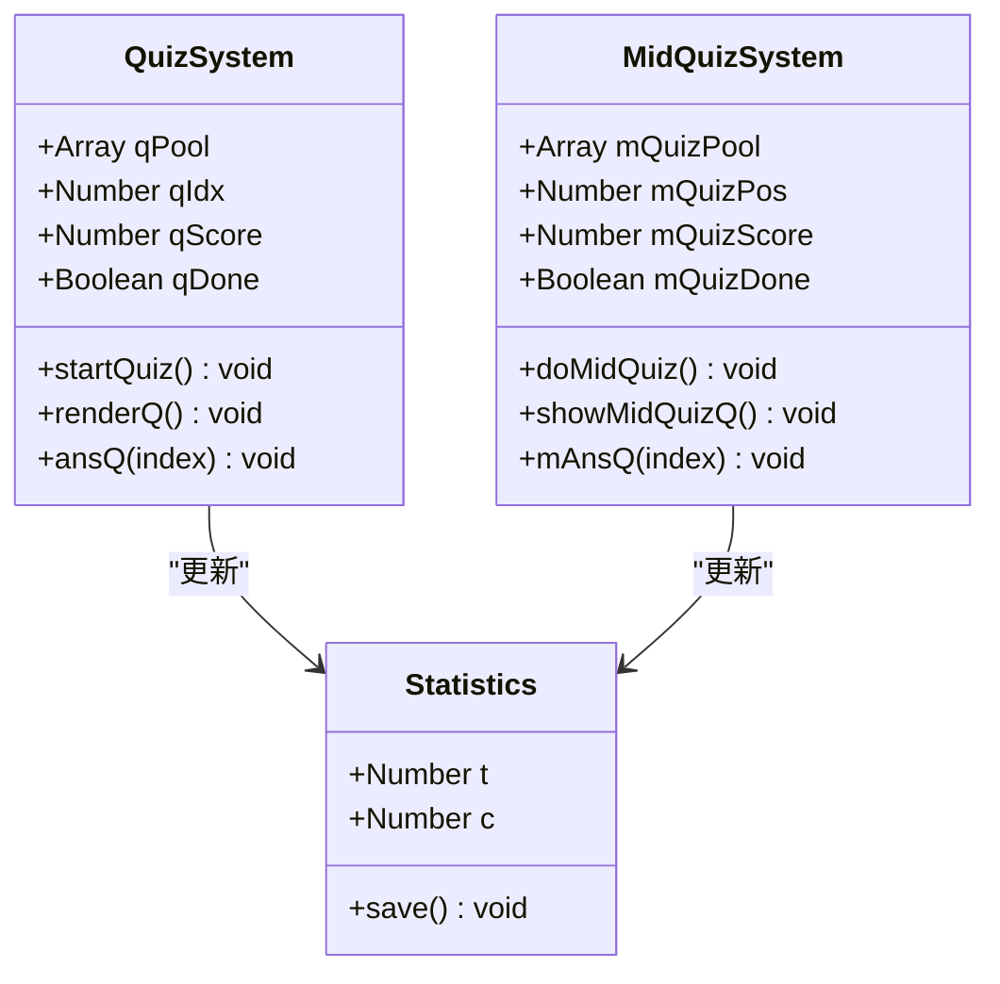
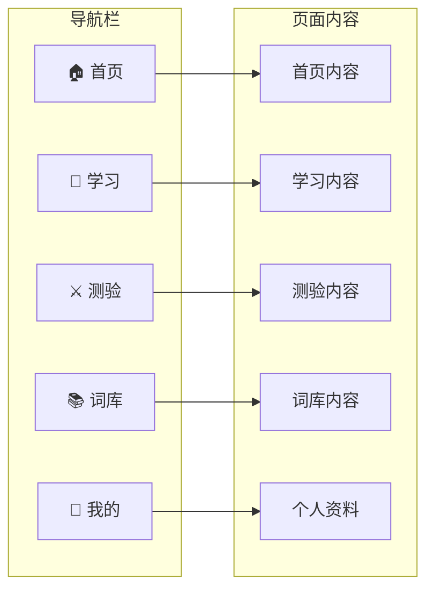
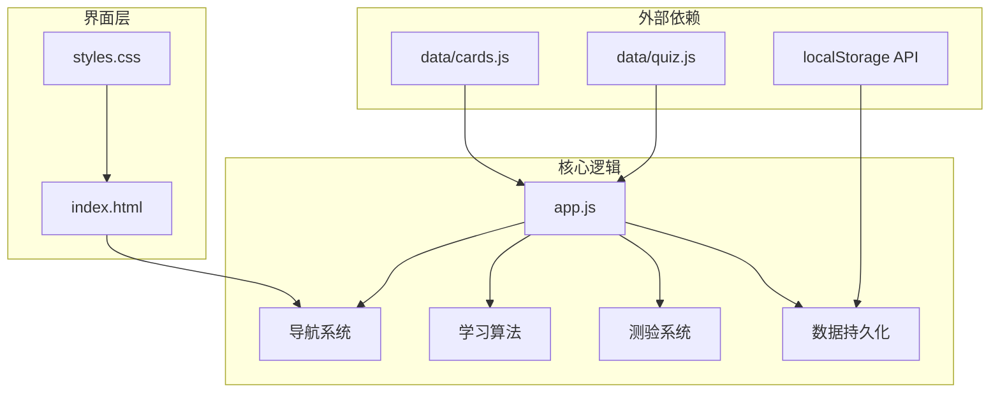

# 调试与测试

<cite>
**本文档引用的文件**
- [app.js](file://app.js)
- [index.html](file://index.html)
- [styles.css](file://styles.css)
- [data/quiz.js](file://data/quiz.js)
- [data/cards.js](file://data/cards.js)
</cite>

## 目录
1. [简介](#简介)
2. [项目结构](#项目结构)
3. [核心组件](#核心组件)
4. [架构概览](#架构概览)
5. [详细组件分析](#详细组件分析)
6. [依赖关系分析](#依赖关系分析)
7. [性能考虑](#性能考虑)
8. [故障排除指南](#故障排除指南)
9. [结论](#结论)
10. [附录](#附录)

## 简介

本文件为文言文学习应用的调试与测试指南，涵盖localStorage数据检查与修改、浏览器开发者工具使用、单元测试与集成测试编写方法，以及常见问题诊断和测试用例设计。该应用采用间隔重复算法进行文言文字词的记忆训练，支持学习进度跟踪、测验评估和词库管理等功能。

## 项目结构

该项目采用模块化架构，将HTML、CSS、JavaScript逻辑和数据分离，便于维护和测试：



**图表来源**
- [index.html:1-115](file://index.html#L1-L115)
- [app.js:1-308](file://app.js#L1-L308)

**章节来源**
- [index.html:1-115](file://index.html#L1-L115)
- [app.js:1-308](file://app.js#L1-L308)

## 核心组件

### 数据持久化系统

应用使用localStorage存储用户学习状态，包含两个主要数据集：

1. **学习记录 (w3_r)**: 存储每个词汇的学习进度和间隔重复参数
2. **统计信息 (w3_s)**: 存储用户的测验统计和正确率



**图表来源**
- [app.js:8-25](file://app.js#L8-L25)
- [app.js:16](file://app.js#L16)
- [app.js:198-228](file://app.js#L198-L228)

### 学习算法核心

应用实现了基于间隔重复理论的记忆算法，包含以下关键组件：

- **间隔时间表**: 定义不同学习阶段的复习间隔
- **等级系统**: 从新学到熟练的九个学习等级
- **队列构建**: 根据过滤条件生成学习队列
- **进度跟踪**: 实时更新学习进度和统计数据

**章节来源**
- [app.js:3-6](file://app.js#L3-L6)
- [app.js:8-13](file://app.js#L8-L13)
- [app.js:58-68](file://app.js#L58-L68)

## 架构概览

应用采用事件驱动的单页应用架构，通过DOM操作实现页面切换和内容渲染：



**图表来源**
- [app.js:69-72](file://app.js#L69-L72)
- [app.js:122-136](file://app.js#L122-L136)
- [app.js:16](file://app.js#L16)

## 详细组件分析

### 学习页面组件

学习页面是应用的核心交互区域，负责展示文言文字词卡片和处理用户反馈：



**图表来源**
- [app.js:69-72](file://app.js#L69-L72)
- [app.js:73-136](file://app.js#L73-L136)
- [app.js:145-195](file://app.js#L145-L195)

### 测验系统组件

应用提供两种测验模式：正式测验和中途测验，用于评估用户的学习效果：



**图表来源**
- [app.js:198-228](file://app.js#L198-L228)
- [app.js:145-195](file://app.js#L145-L195)
- [app.js:18-10](file://app.js#L18-L10)

**章节来源**
- [app.js:198-228](file://app.js#L198-L228)
- [app.js:145-195](file://app.js#L145-L195)

### 页面导航系统

应用采用底部导航栏实现页面切换，支持响应式设计和动画效果：



**图表来源**
- [index.html:87-93](file://index.html#L87-L93)
- [app.js:28-35](file://app.js#L28-L35)

**章节来源**
- [index.html:87-93](file://index.html#L87-L93)
- [app.js:28-35](file://app.js#L28-L35)

## 依赖关系分析

应用的模块依赖关系清晰明确，遵循单一职责原则：



**图表来源**
- [index.html:110-112](file://index.html#L110-L112)
- [app.js:1-1](file://app.js#L1-L1)
- [app.js:16](file://app.js#L16)

**章节来源**
- [index.html:110-112](file://index.html#L110-L112)
- [app.js:1-1](file://app.js#L1-L1)

## 性能考虑

### 内存优化策略

1. **数据结构优化**: 使用数组索引而非对象属性访问，减少内存占用
2. **DOM操作最小化**: 批量更新DOM元素，避免频繁的重排重绘
3. **事件委托**: 使用事件冒泡机制减少事件监听器数量
4. **延迟加载**: 仅在需要时渲染页面内容

### 加载性能

- **资源分离**: 将CSS、JS和数据分离，支持浏览器缓存
- **按需加载**: 通过脚本顺序确保数据在应用逻辑之前加载
- **压缩优化**: 移除不必要的空格和注释，减少文件大小

## 故障排除指南

### localStorage数据问题

#### 检查localStorage数据

1. **打开浏览器开发者工具**
   - Chrome/Firefox: F12 或右键选择"检查元素"
   - Safari: 开发菜单中启用"显示Web检查器"

2. **进入存储面板**
   - Application → Storage → Local Storage
   - 查找域名对应的localStorage条目

3. **查看学习数据**
   - 键名: `w3_r` (学习记录)
   - 键名: `w3_s` (统计信息)

#### 重置学习进度

**方法一：通过控制台重置**
```javascript
// 重置学习记录
localStorage.removeItem('w3_r');

// 重置统计信息  
localStorage.removeItem('w3_s');

// 刷新页面
location.reload();
```

**方法二：手动编辑localStorage**
1. 在Application面板找到localStorage条目
2. 双击值字段进行编辑
3. 将学习记录重置为空对象 `{}`

#### 数据同步问题诊断

1. **检查数据完整性**
   ```javascript
   // 验证学习记录格式
   const r = JSON.parse(localStorage.getItem('w3_r'));
   console.log('学习记录长度:', r.length);
   console.log('示例记录:', r[0]);
   ```

2. **验证统计数据**
   ```javascript
   // 检查统计信息
   const stats = JSON.parse(localStorage.getItem('w3_s'));
   console.log('总答题数:', stats.t);
   console.log('正确数:', stats.c);
   ```

### 界面显示异常

#### 调试步骤

1. **检查CSS变量**
   - 打开Elements面板
   - 检查`:root`中的CSS变量定义
   - 验证颜色、字体等样式变量

2. **验证DOM结构**
   - 检查页面元素是否正确渲染
   - 确认事件绑定是否正常工作

3. **调试JavaScript错误**
   - 打开Console面板
   - 查看是否有JavaScript错误
   - 检查函数调用栈

#### 常见界面问题

**问题**: 卡片无法翻转
- 检查CSS类名 `fc-meaning` 和 `open`
- 验证JavaScript事件绑定

**问题**: 进度条不显示
- 检查 `hBar` 元素的宽度设置
- 验证CSS过渡动画

### 性能问题排查

#### 内存泄漏检测

1. **使用Chrome DevTools Memory面板**
   - 运行一段时间后截图内存快照
   - 比较不同时间段的内存使用情况
   - 查找可能的内存泄漏点

2. **监控DOM节点数量**
   ```javascript
   // 检查DOM节点数量
   console.log('DOM节点总数:', document.querySelectorAll('*').length);
   ```

#### 网络请求监控

1. **打开Network面板**
2. **刷新页面**
3. **检查资源加载**
   - 确认CSS、JS文件正确加载
   - 验证数据文件加载状态

### JavaScript调试技巧

#### 断点调试

1. **设置断点**
   - 在需要调试的函数中添加 `debugger;` 语句
   - 或在Sources面板中点击行号

2. **变量检查**
   - 使用Scope面板查看当前作用域变量
   - 使用Watch面板监视特定表达式

3. **调用栈分析**
   - 查看函数调用链
   - 理解程序执行流程

#### 性能分析

1. **使用Performance面板**
   - 记录用户交互过程
   - 分析JavaScript执行时间
   - 识别性能瓶颈

## 结论

本调试与测试文档提供了文言文学习应用的完整调试指南，涵盖了localStorage数据管理、浏览器开发者工具使用、测试方法和常见问题诊断。通过遵循这些指导原则，开发者可以有效地维护和优化应用性能，确保用户获得良好的学习体验。

应用采用的间隔重复算法和模块化架构为测试提供了良好的基础，使得单元测试和集成测试能够有效实施。建议在开发过程中持续进行测试，确保功能稳定性和用户体验质量。

## 附录

### 测试用例设计

#### 单元测试场景

1. **学习算法测试**
   - 验证间隔时间计算
   - 测试等级提升逻辑
   - 检查队列构建算法

2. **数据持久化测试**
   - 验证localStorage读写操作
   - 测试数据格式兼容性
   - 检查错误处理机制

3. **用户界面测试**
   - 验证页面切换功能
   - 测试响应式布局
   - 检查交互元素状态

#### 集成测试场景

1. **完整学习流程测试**
   - 从开始学习到完成的端到端测试
   - 验证数据在各组件间的传递
   - 检查状态同步机制

2. **边界条件测试**
   - 测试空数据状态
   - 验证异常输入处理
   - 检查性能极限情况

### 快速参考

#### 常用调试命令

```javascript
// 检查学习进度
console.log('学习记录:', JSON.parse(localStorage.getItem('w3_r')));
console.log('统计信息:', JSON.parse(localStorage.getItem('w3_s')));

// 重置数据
localStorage.removeItem('w3_r');
localStorage.removeItem('w3_s');

// 检查DOM元素
console.log('学习卡片:', document.getElementById('fcWrap'));

// 监控事件
document.addEventListener('click', function(e) {
    console.log('点击目标:', e.target);
});
```

#### 性能监控

```javascript
// 性能测量
const start = performance.now();
// 执行需要测试的代码
const end = performance.now();
console.log('执行时间:', end - start, '毫秒');
```