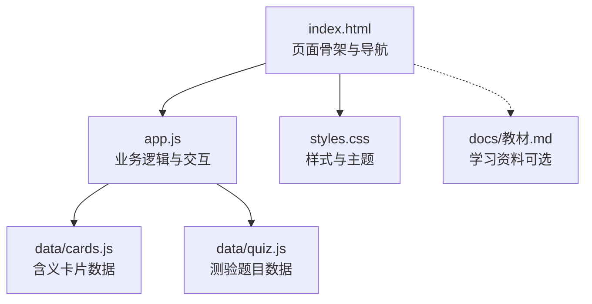
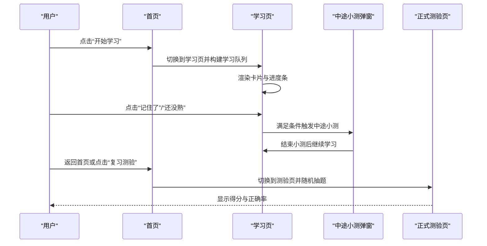
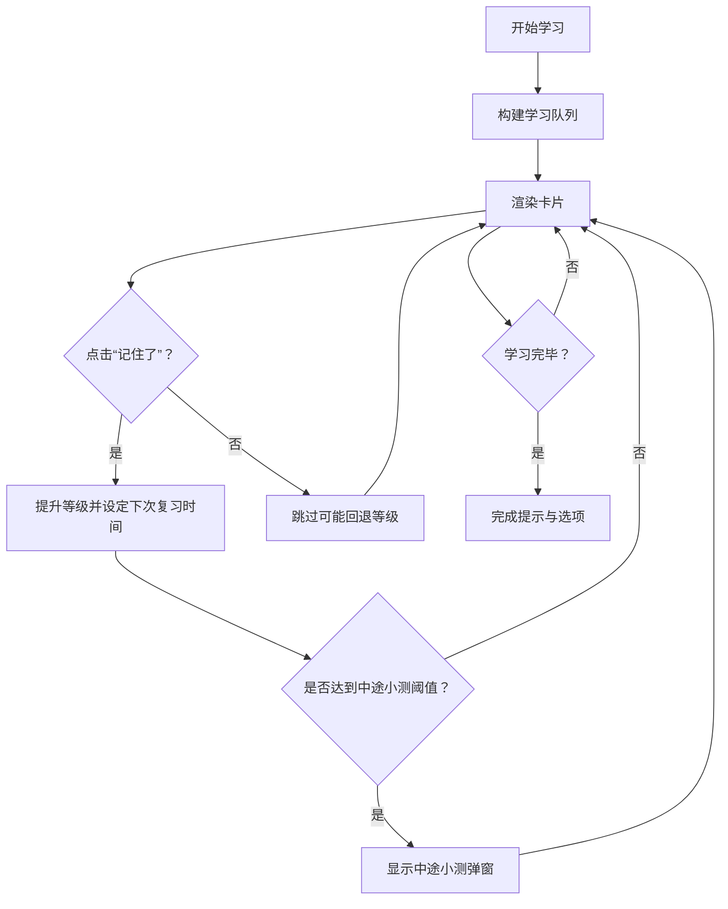
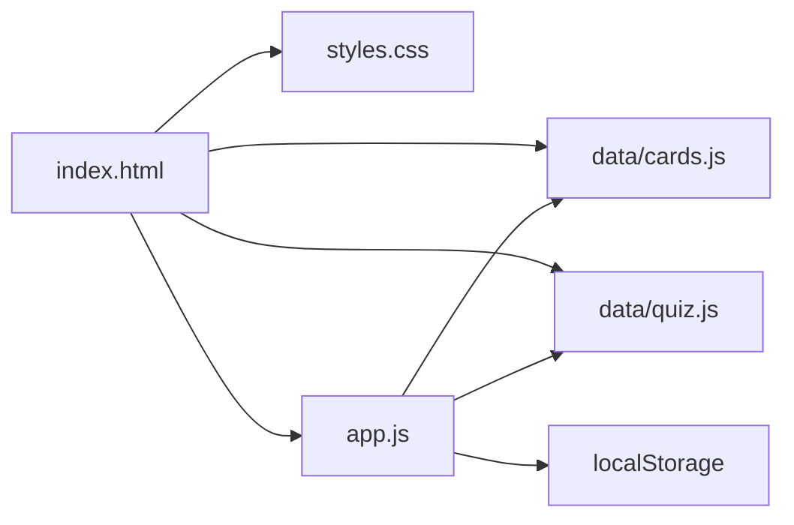

# 快速开始

<cite>
**本文引用的文件**
- [index.html](file://index.html)
- [app.js](file://app.js)
- [styles.css](file://styles.css)
- [cards.js](file://data/cards.js)
- [quiz.js](file://data/quiz.js)
- [上海中考文言文·实词虚词辨析自学教材.md](file://docs/上海中考文言文·实词虚词辨析自学教材.md)
</cite>

## 目录
1. [简介](#简介)
2. [项目结构](#项目结构)
3. [核心组件](#核心组件)
4. [架构总览](#架构总览)
5. [详细组件解析](#详细组件解析)
6. [依赖关系分析](#依赖关系分析)
7. [性能与体验建议](#性能与体验建议)
8. [常见问题与故障排除](#常见问题与故障排除)
9. [结语](#结语)

## 简介
本指南面向首次使用“文言斩”文言文学习应用的用户，帮助你在5分钟内完成基本操作并开始学习。无需安装，直接下载使用即可。应用内置文言实词、虚词与高频测验题，采用间隔重复机制帮助你高效记忆，同时提供“中途小测”与“正式测验”，让你在学习过程中不断巩固。

## 项目结构
应用采用单页静态网站结构，核心由 HTML 页面、样式表与脚本组成，数据以 JS 文件形式内嵌加载。

图表来源
- [index.html:1-115](file://index.html#L1-L115)
- [app.js:1-308](file://app.js#L1-L308)
- [styles.css:1-122](file://styles.css#L1-L122)
- [cards.js:1-166](file://data/cards.js#L1-L166)
- [quiz.js:1-72](file://data/quiz.js#L1-L72)

章节来源
- [index.html:1-115](file://index.html#L1-L115)
- [app.js:1-308](file://app.js#L1-L308)
- [styles.css:1-122](file://styles.css#L1-L122)
- [cards.js:1-166](file://data/cards.js#L1-L166)
- [quiz.js:1-72](file://data/quiz.js#L1-L72)

## 核心组件
- 页面容器与导航
  - 顶部标题与连击显示（首页）
  - 底部导航栏（首页/学习/测验/词库/我的）
- 首页
  - 总学习进度条与统计
  - 过滤器（全部/待复习/新词）
  - 行动入口：开始学习、复习测验
- 学习页
  - 卡片翻转展示字词、例句、出处、含义与提示
  - 学习进度条与当前进度
  - 记忆按钮：还没熟、记住了
  - “中途小测”弹窗（每学满若干新含义触发）
- 测验页
  - 正式测验（随机10题）
  - 小测（针对本轮新学含义）
- 词库页
  - 分类筛选（全部/虚词/实词）
  - 字级进度可视化
- 我的页
  - 等级徽章与进度条
  - 统计：学过含义数、测验正确率、测验次数、已掌握核心字数

章节来源
- [index.html:14-106](file://index.html#L14-L106)
- [app.js:37-55](file://app.js#L37-L55)
- [app.js:57-142](file://app.js#L57-L142)
- [app.js:197-228](file://app.js#L197-L228)
- [app.js:230-274](file://app.js#L230-L274)
- [app.js:276-296](file://app.js#L276-L296)

## 架构总览
应用采用“前端单页 + 内嵌数据”的轻量架构，所有逻辑集中在 app.js 中，通过 DOM 操作切换页面与渲染内容。数据来自 data/cards.js 与 data/quiz.js，状态持久化在 localStorage 中。

图表来源
- [index.html:28-30](file://index.html#L28-L30)
- [app.js:69-72](file://app.js#L69-L72)
- [app.js:144-195](file://app.js#L144-L195)
- [app.js:197-228](file://app.js#L197-L228)

## 详细组件解析

### 首页（总览与入口）
- 功能要点
  - 展示总学习进度（已学/总数）、进度条与“已掌握核心字”数量
  - 提供过滤器：全部、待复习、新词
  - 行动入口：开始学习、复习测验
- 交互流程
  - 点击“开始学习”进入学习队列构建与渲染
  - 点击“复习测验”进入正式测验

章节来源
- [index.html:14-31](file://index.html#L14-L31)
- [app.js:37-55](file://app.js#L37-L55)
- [app.js:69-72](file://app.js#L69-L72)

### 学习页（间隔重复与翻转卡片）
- 功能要点
  - 卡片包含字、例句、出处、含义与提示
  - 点击卡片翻转查看含义
  - 记住/跳过按钮更新记忆等级与下次复习时间
  - 学习进度条与当前进度
- 交互流程
  - 点击“记住了”：提升记忆等级，保存状态，触发“中途小测”弹窗（每学满若干新含义）
  - 点击“还没熟”：若已学过则回退等级，保存状态
  - 完成一轮学习后，可选择去测验或回到首页

图表来源
- [app.js:57-142](file://app.js#L57-L142)
- [app.js:144-195](file://app.js#L144-L195)

章节来源
- [index.html:33-41](file://index.html#L33-L41)
- [app.js:57-142](file://app.js#L57-L142)
- [app.js:144-195](file://app.js#L144-L195)

### 中途小测（即时巩固）
- 触发条件
  - 每学满若干新含义（例如15个）自动弹窗
- 形式
  - 从本轮新学卡片中抽取若干题目（最多10题）
  - 语境选义，支持键盘快捷键答题
- 结果
  - 显示得分与正确率，给出鼓励性评价，继续学习

章节来源
- [app.js:144-195](file://app.js#L144-L195)
- [index.html:95-106](file://index.html#L95-L106)

### 正式测验（复习巩固）
- 形式
  - 从 quiz.js 数据中随机抽取10题
  - 语境选义，支持键盘快捷键答题
- 结果
  - 显示得分与正确率，提供“再来一轮”与“回到首页”

章节来源
- [index.html:43-51](file://index.html#L43-L51)
- [app.js:197-228](file://app.js#L197-L228)
- [quiz.js:1-72](file://data/quiz.js#L1-L72)

### 词库页（分类与进度）
- 功能要点
  - 分类筛选：全部/虚词/实词
  - 字级进度可视化：每个字的多个含义以点阵显示掌握情况
  - 展示字词、类别、等级与出处
- 使用建议
  - 通过“全部/虚词/实词”筛选快速定位目标
  - 查看字级进度，了解整体掌握程度

章节来源
- [index.html:53-67](file://index.html#L53-L67)
- [app.js:230-274](file://app.js#L230-L274)

### 我的页（等级与统计）
- 功能要点
  - 等级徽章与进度条（从“童生”到“状元”）
  - 统计指标：学过含义数、测验正确率、测验次数、已掌握核心字数
- 使用建议
  - 关注等级与正确率变化，评估学习效果
  - 通过“再掌握X字可升至XX”了解升级路径

章节来源
- [index.html:69-84](file://index.html#L69-L84)
- [app.js:276-296](file://app.js#L276-L296)

## 依赖关系分析
- HTML 依赖
  - 引入样式与脚本，加载数据文件
- JS 依赖
  - app.js 依赖全局变量 window.CARDS 与 window.QUIZZES
  - app.js 依赖 localStorage 进行状态持久化
- 数据依赖
  - cards.js：字词含义、例句、出处、类别、其他用法
  - quiz.js：测验题目、选项与答案

图表来源
- [index.html:109-112](file://index.html#L109-L112)
- [app.js:1](file://app.js#L1)
- [cards.js:1-166](file://data/cards.js#L1-L166)
- [quiz.js:1-72](file://data/quiz.js#L1-L72)

章节来源
- [index.html:109-112](file://index.html#L109-L112)
- [app.js:1-11](file://app.js#L1-L11)

## 性能与体验建议
- 无需网络依赖：所有资源内嵌，打开即用
- 本地存储：学习进度与统计自动保存，刷新不丢失
- 移动端友好：页面布局适配移动端，底部导航清晰
- 键盘答题：支持键盘 A/B/C/D 快速作答，提升效率

[本节为通用建议，不直接分析具体文件]

## 常见问题与故障排除
- 无法看到学习内容
  - 确认浏览器支持与网络访问正常
  - 检查浏览器控制台是否有加载错误
- 学习进度未保存
  - 确认浏览器允许本地存储（localStorage）
  - 如隐私模式限制，请切换到常规模式
- 测验题目为空
  - 确认 data/quiz.js 已正确加载
  - 检查浏览器控制台是否存在语法错误
- 卡片无法翻转
  - 确认点击区域有效，尝试使用鼠标或触摸
- 无法使用键盘答题
  - 确保答题时焦点在页面上，避免输入框占用焦点

章节来源
- [index.html:109-112](file://index.html#L109-L112)
- [app.js:16-18](file://app.js#L16-L18)

## 结语
“文言斩”以简洁直观的方式帮助你系统学习文言实词与虚词。按本指南完成首次使用后，建议：
- 每日安排固定时间进行“开始学习”与“复习测验”
- 利用“词库”查看字级进度，针对性强化薄弱点
- 结合 docs/教材.md 进行理论补充与深化理解

[本节为总结性内容，不直接分析具体文件]