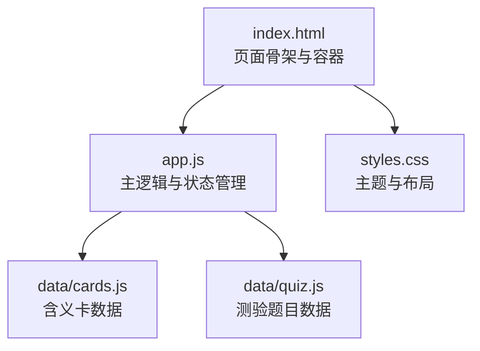
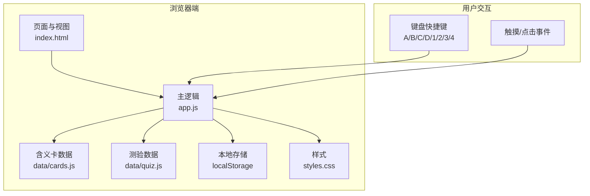
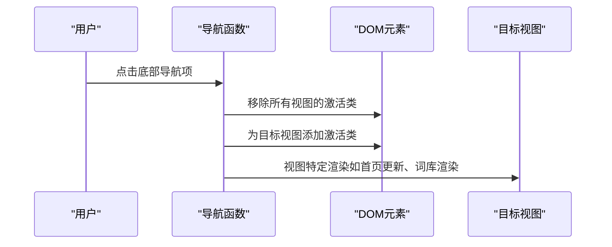
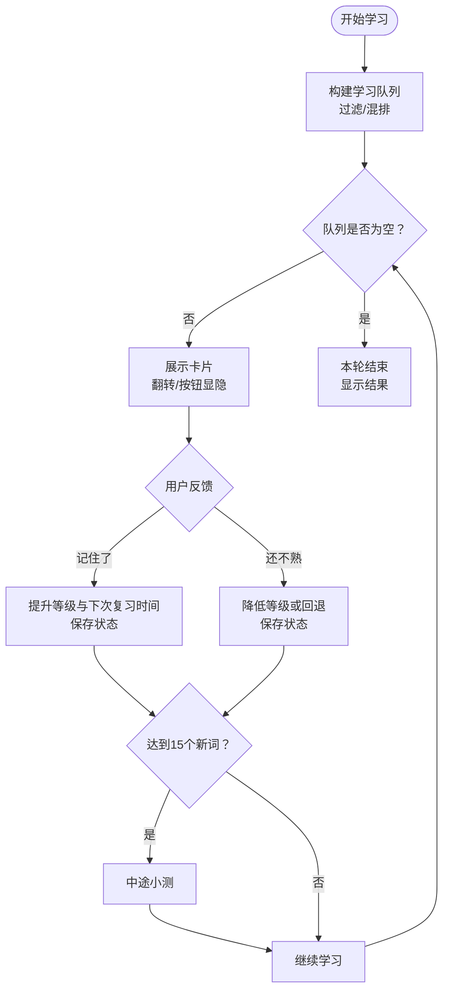
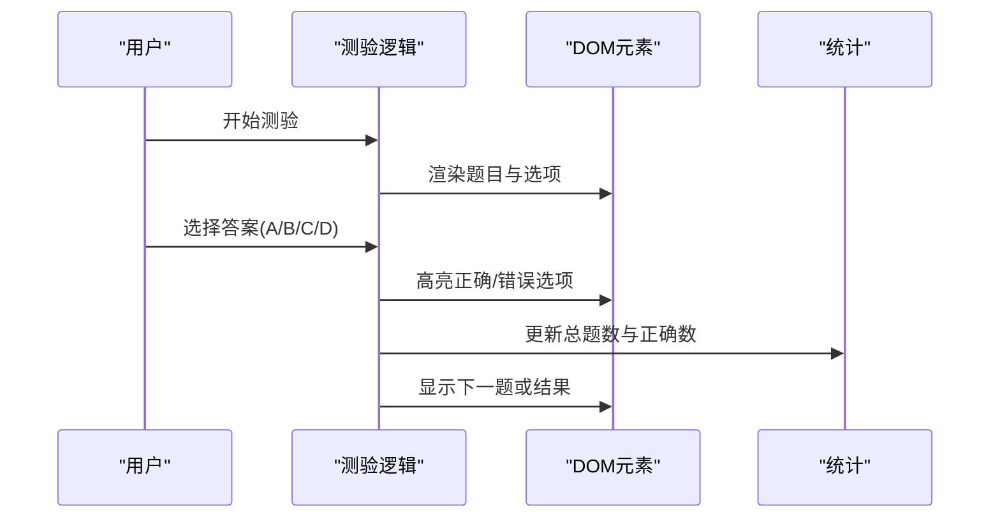
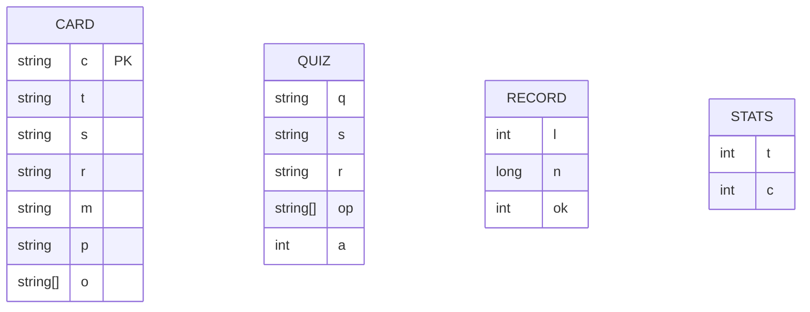
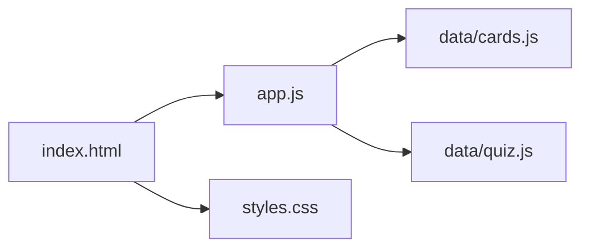

# 技术架构

<cite>
**本文档引用的文件**
- [app.js](file://app.js)
- [index.html](file://index.html)
- [styles.css](file://styles.css)
- [cards.js](file://data/cards.js)
- [quiz.js](file://data/quiz.js)
</cite>

## 目录
1. [简介](#简介)
2. [项目结构](#项目结构)
3. [核心组件](#核心组件)
4. [架构总览](#架构总览)
5. [详细组件分析](#详细组件分析)
6. [依赖关系分析](#依赖关系分析)
7. [性能考量](#性能考量)
8. [故障排查指南](#故障排查指南)
9. [结论](#结论)
10. [附录](#附录)

## 简介
本项目是一个纯前端的文言文学习应用，采用原生 JavaScript 实现，无需任何后端服务或构建工具。系统围绕“含义卡”和“测验”两大功能模块展开，结合间隔重复算法与本地存储，形成完整的记忆训练闭环。整体架构强调易部署、低门槛、可维护与可扩展，适合在浏览器内直接运行与分发。

## 项目结构
项目采用扁平化组织，核心文件如下：
- HTML 页面负责页面骨架与导航容器
- CSS 提供主题样式与响应式布局
- 数据文件定义词汇卡片与测验题目
- 主脚本负责业务逻辑、状态管理与交互控制

图表来源
- [index.html](file://index.html)
- [app.js](file://app.js)
- [styles.css](file://styles.css)
- [cards.js](file://data/cards.js)
- [quiz.js](file://data/quiz.js)

章节来源
- [index.html](file://index.html)
- [app.js](file://app.js)
- [styles.css](file://styles.css)
- [cards.js](file://data/cards.js)
- [quiz.js](file://data/quiz.js)

## 核心组件
- 页面容器与导航
  - 顶部导航栏与底部导航栏，支持首页、学习、测验、词库、我的五个视图切换
  - 视图通过类选择器与显示/隐藏控制实现
- 学习流程
  - 构建学习队列（新词优先、复习优先、混合轮换）
  - 卡片翻转展示含义，按钮反馈“记住了/还不熟”
  - 中途小测与正式测验穿插，强化记忆
- 数据与状态
  - 含义卡数据与测验题目数据通过全局变量注入
  - 本地存储持久化学习进度与统计信息
- 用户界面
  - 渐变背景、丝滑动画、徽章等级标识、进度条与提示文案

章节来源
- [index.html](file://index.html)
- [app.js](file://app.js)
- [styles.css](file://styles.css)
- [cards.js](file://data/cards.js)
- [quiz.js](file://data/quiz.js)

## 架构总览
系统采用纯前端单页应用（SPA）模式，所有逻辑在浏览器内执行，无网络请求与服务器耦合。核心流程包括：
- 初始化：加载数据、读取本地存储、渲染首页
- 导航：切换视图并按需更新内容
- 学习：构建队列、展示卡片、处理反馈、保存状态
- 测验：随机抽题、选项高亮、统计得分
- 统计：计算掌握度、等级与进度条

图表来源
- [index.html](file://index.html)
- [app.js](file://app.js)
- [styles.css](file://styles.css)
- [cards.js](file://data/cards.js)
- [quiz.js](file://data/quiz.js)

## 详细组件分析

### 页面与导航组件
- 功能要点
  - 顶部与底部导航，支持视图切换与当前激活态高亮
  - 首页展示总进度、分类筛选与行动入口
  - 学习页与测验页分别承载卡片与题目容器
  - 词库页按类别与字符聚合展示掌握情况
  - 我的页展示等级、正确率、测验次数与掌握字数
- 控制逻辑
  - 通过 DOM 查询与类名切换实现视图切换
  - 按钮与图标点击绑定到主逻辑函数
- 可扩展性
  - 新增视图只需在 HTML 中添加容器与底部导航项，并在主逻辑中补充导航函数

图表来源
- [index.html](file://index.html)
- [app.js](file://app.js)

章节来源
- [index.html](file://index.html)
- [app.js](file://app.js)

### 学习与复习组件
- 功能要点
  - 构建学习队列：支持“全部/待复习/新词”三种过滤
  - 卡片展示：字符、例句、出处、含义与提示；点击翻转显示含义
  - 反馈处理：记住了提升等级与下次复习时间；还不熟降低等级或回退
  - 中途小测：每学满若干新含义触发，检验记忆效果
- 状态管理
  - 当前队列、位置、复习标记、过滤条件、新词计数与列表
  - 通过本地存储持久化学习记录与统计
- 交互细节
  - 翻转动画与按钮显隐联动
  - 键盘快捷键支持答题

图表来源
- [app.js](file://app.js)

章节来源
- [app.js](file://app.js)

### 测验组件
- 功能要点
  - 正式测验：随机抽取10题，语境选义
  - 小测：中途小测，检验最近学习的新含义
  - 结果展示：分数、正确率与等级提示
- 交互细节
  - 选项高亮区分正确/错误/未选
  - 键盘快捷键支持答题

图表来源
- [app.js](file://app.js)

章节来源
- [app.js](file://app.js)

### 数据模型与存储策略
- 数据模型
  - 含义卡对象：字符、类型（虚词/实词）、例句、出处、含义、解析、其他用法等字段
  - 测验题目对象：问题、例句、出处、选项数组、正确索引
- 存储策略
  - 学习记录：按索引映射等级、下次复习时间、正确次数
  - 统计信息：总答题数、正确数
  - 本地持久化：使用 localStorage，键名分别为学习记录与统计

图表来源
- [cards.js](file://data/cards.js)
- [quiz.js](file://data/quiz.js)
- [app.js](file://app.js)

章节来源
- [cards.js](file://data/cards.js)
- [quiz.js](file://data/quiz.js)
- [app.js](file://app.js)

### 事件处理与用户界面控制
- 事件处理
  - 视图切换：点击导航项触发
  - 学习反馈：按钮点击与卡片翻转
  - 键盘快捷键：A/B/C/D 或 1/2/3/4 选择答案
- UI 控制
  - 进度条、徽章等级、提示文案、模态框与动画
  - 响应式布局与主题色系

章节来源
- [index.html](file://index.html)
- [app.js](file://app.js)
- [styles.css](file://styles.css)

## 依赖关系分析
- 文件间依赖
  - app.js 依赖全局数据（cards.js、quiz.js 注入）
  - index.html 加载 app.js 并包含数据脚本
  - styles.css 为所有视图提供统一样式
- 内聚与耦合
  - 主逻辑集中于 app.js，职责清晰
  - HTML 仅负责结构与事件绑定，样式与数据分离良好
- 循环依赖
  - 无循环依赖，数据通过全局变量注入，避免模块化复杂度

图表来源
- [index.html](file://index.html)
- [app.js](file://app.js)
- [styles.css](file://styles.css)
- [cards.js](file://data/cards.js)
- [quiz.js](file://data/quiz.js)

章节来源
- [index.html](file://index.html)
- [app.js](file://app.js)
- [styles.css](file://styles.css)
- [cards.js](file://data/cards.js)
- [quiz.js](file://data/quiz.js)

## 性能考量
- 渲染优化
  - 使用一次性拼接 HTML 并批量更新 DOM，减少重排
  - 动画与过渡集中在 CSS，避免 JS 频繁操作样式
- 计算优化
  - 队列构建与统计函数尽量避免重复遍历
  - 本地存储读写合并为一次保存
- 体积与加载
  - 无打包与依赖，首屏加载轻量
  - 数据文件按需注入，避免不必要的网络请求

## 故障排查指南
- 无法加载数据
  - 检查数据脚本是否正确引入与语法
  - 确认全局变量命名一致（含义卡与测验）
- 学习记录异常
  - 清空 localStorage 对应键值后重试
  - 检查保存函数调用时机与 JSON 序列化
- 视图切换无效
  - 确认导航函数与 DOM 类名匹配
  - 检查视图容器 ID 与激活类名
- 键盘快捷键无效
  - 确认事件监听绑定与按键码映射
  - 注意测验进行中的状态锁

章节来源
- [app.js](file://app.js)
- [index.html](file://index.html)

## 结论
该系统以纯前端架构实现了文言文学习的核心功能，具备以下优势：
- 易部署：无需服务器与构建，直接在浏览器运行
- 易维护：逻辑集中、结构清晰、无第三方依赖
- 可扩展：新增视图与功能模块成本低，数据与样式分离明确
同时，纯前端架构也存在限制：
- 无网络能力：无法在线同步与个性化推荐
- 无动态内容：数据更新需替换文件
- 无服务端缓存：性能受限于客户端资源

## 附录
- 技术选型理由
  - 原生 JavaScript：零依赖、跨平台、开发门槛低
  - 本地存储：无需后端即可持久化用户数据
  - 单页应用：减少页面刷新，提升交互流畅度
- 替代方案权衡
  - 使用现代框架（如 Vue/React）可提升可维护性，但增加体积与学习成本
  - 引入构建工具（Webpack/Vite）可优化资源与模块化，但引入复杂度
  - 服务端方案可实现多端同步与个性化，但增加运维与隐私风险