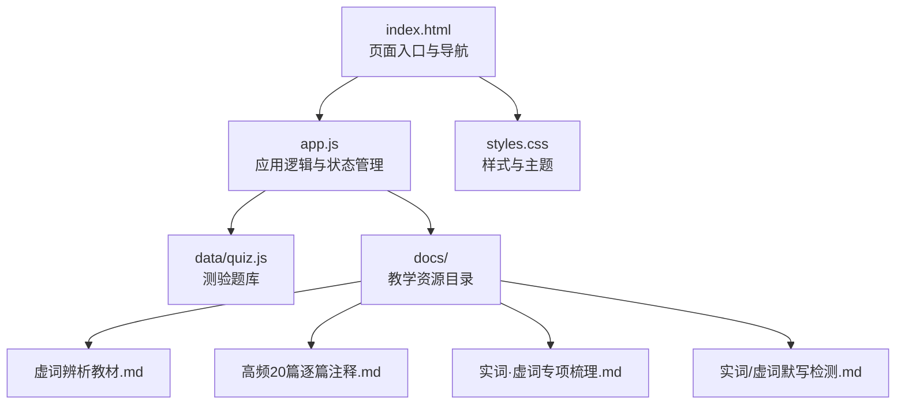
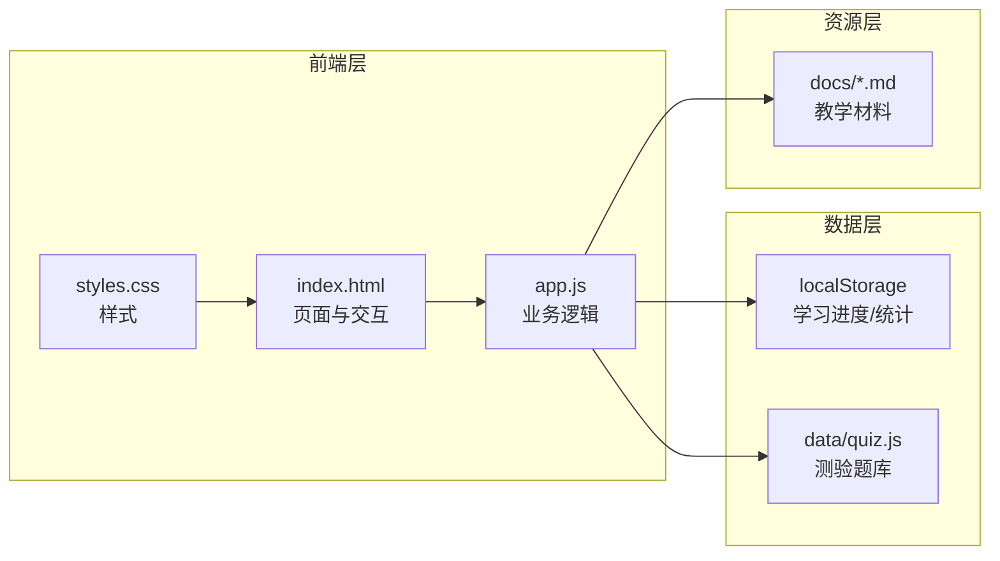
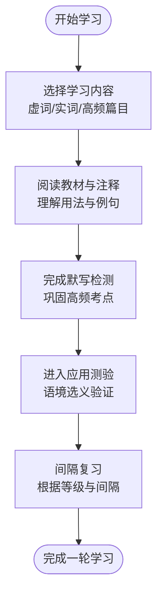
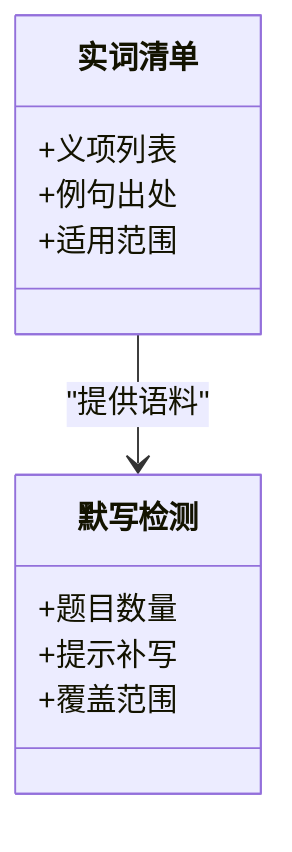
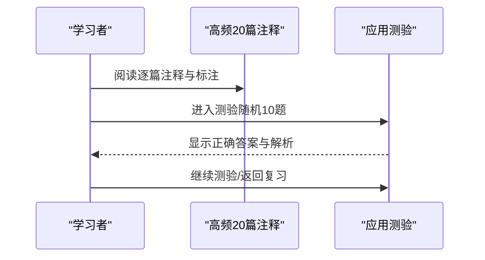
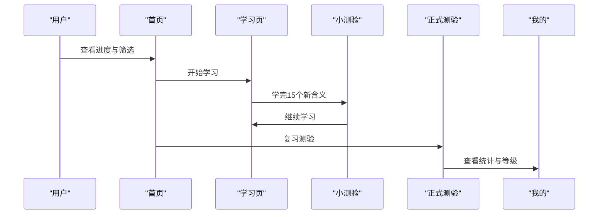
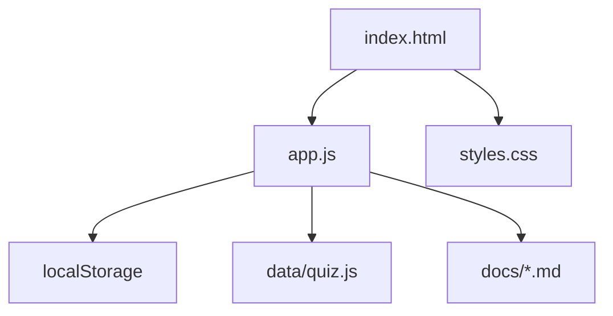

# 教育资源

<cite>
**本文档引用的文件**
- [index.html](file://index.html)
- [app.js](file://app.js)
- [styles.css](file://styles.css)
- [quiz.js](file://data/quiz.js)
- [上海中考文言文·实词虚词辨析自学教材.md](file://docs/上海中考文言文·实词虚词辨析自学教材.md)
- [上海中考高频20篇文言文——全文逐篇注释.md](file://docs/上海中考高频20篇文言文——全文逐篇注释.md)
- [上海市初中、高中文言文实词和虚词.md](file://docs/上海市初中、高中文言文实词和虚词.md)
- [文言实词·虚词专项梳理.md](file://docs/文言实词·虚词专项梳理.md)
- [文言实词默写检测（120题）.md](file://docs/文言实词默写检测（120题）.md)
- [文言虚词默写检测（121题）.md](file://docs/文言虚词默写检测（121题）.md)
</cite>

## 目录
1. [简介](#简介)
2. [项目结构](#项目结构)
3. [核心组件](#核心组件)
4. [架构总览](#架构总览)
5. [详细组件分析](#详细组件分析)
6. [依赖分析](#依赖分析)
7. [性能考量](#性能考量)
8. [故障排查指南](#故障排查指南)
9. [结论](#结论)
10. [附录](#附录)

## 简介
本教育资源围绕“文言文”学习，系统整理了实词、虚词、高频篇目与配套练习，辅以基于 Web 的学习应用，帮助学习者高效掌握文言文基础知识、强化辨析能力、提升应试水平。资源覆盖：
- 虚词系统梳理与辨析（之、其、以、而、于、为等）
- 实词高频义项与例句（按音序/主题组织）
- 上海中考高频20篇逐篇注释与词性标注
- 默写检测（实词120题、虚词121题）
- 学习计划建议、进度安排与效果评估方法
- 应用功能与资源结合使用指南

## 项目结构
本项目采用前端单页应用（SPA）结构，静态资源与学习资料分离：
- 前端界面与逻辑：index.html、app.js、styles.css
- 学习资源：docs/ 下的各类教学材料
- 测验数据：data/quiz.js（语境选义测验题）

图表来源
- [index.html](file://index.html)
- [app.js](file://app.js)
- [styles.css](file://styles.css)
- [quiz.js](file://data/quiz.js)

章节来源
- [index.html](file://index.html)
- [app.js](file://app.js)
- [styles.css](file://styles.css)
- [quiz.js](file://data/quiz.js)

## 核心组件
- 页面与导航
  - 首页：展示总学习进度、筛选学习模式（全部/待复习/新词）、快捷入口（开始学习、复习测验）
  - 学习页：卡片式呈现“字/词+例句+出处”，支持翻转查看含义与难度标签
  - 测验页：随机10题语境选义测验，支持键盘答题
  - 词库页：按类别（全部/虚词/实词）浏览已学词汇
  - 我的页：等级与统计信息（掌握字数、正确率、测验次数等）
- 应用逻辑
  - 间隔重复算法：基于间隔数组与等级映射，控制复习节奏
  - 本地存储：持久化学习进度与统计数据
  - 小测验：阶段性检验新词掌握情况
- 资源对接
  - 虚词/实词教材与高频篇目作为学习素材
  - 默写检测题作为巩固与自测工具
  - 测验题库与应用联动，形成“学—练—测—评”的闭环

章节来源
- [index.html](file://index.html)
- [app.js](file://app.js)
- [styles.css](file://styles.css)
- [quiz.js](file://data/quiz.js)

## 架构总览
应用采用“资源+前端”的轻量架构，学习资源以 Markdown 文档形式沉淀，前端负责渲染、交互与数据持久化。

图表来源
- [index.html](file://index.html)
- [app.js](file://app.js)
- [styles.css](file://styles.css)
- [quiz.js](file://data/quiz.js)

## 详细组件分析

### 虚词系统与辨析
- 教材与梳理
  - “之、其、以、而、于、为”等高频虚词的多种用法（代词、结构助词、取独、宾语前置、定语后置、音节助词、动词“到/去”等）
  - 每个义项配有典型例句与出处，便于迁移运用
- 高频20篇注释
  - 对《论语》《陋室铭》《爱莲说》等篇目进行逐句标注，突出实词与虚词的词性与用法
  - 提供“速查表”汇总核心虚词与实词高频考点
- 默写检测
  - 虚词121题，覆盖“而、何、乎、乃、其、且、若、所、为、焉、也、以、因、于、与、则、者、之”等
  - 通过填空强化对典型用法的记忆

图表来源
- [文言实词·虚词专项梳理.md](file://docs/文言实词·虚词专项梳理.md)
- [上海中考高频20篇文言文——全文逐篇注释.md](file://docs/上海中考高频20篇文言文——全文逐篇注释.md)
- [文言虚词默写检测（121题）.md](file://docs/文言虚词默写检测（121题）.md)

章节来源
- [文言实词·虚词专项梳理.md](file://docs/文言实词·虚词专项梳理.md)
- [上海中考高频20篇文言文——全文逐篇注释.md](file://docs/上海中考高频20篇文言文——全文逐篇注释.md)
- [文言虚词默写检测（121题）.md](file://docs/文言虚词默写检测（121题）.md)

### 实词高频义项与迁移
- 初中/高中实词清单
  - 初中约140词、高中在初中基础上扩展约30词，覆盖义项与例句
  - 按音序/主题组织，便于检索与记忆
- 默写检测（120题）
  - 每题对应一个高频实词，给出提示补写名句
  - 通过反复书写强化字形与语境记忆

图表来源
- [上海市初中、高中文言文实词和虚词.md](file://docs/上海市初中、高中文言文实词和虚词.md)
- [文言实词默写检测（120题）.md](file://docs/文言实词默写检测（120题）.md)

章节来源
- [上海市初中、高中文言文实词和虚词.md](file://docs/上海市初中、高中文言文实词和虚词.md)
- [文言实词默写检测（120题）.md](file://docs/文言实词默写检测（120题）.md)

### 高频20篇逐篇注释
- 逐句标注实词/虚词，标注通假字、古今异义、词类活用
- 提供“学习建议”：逐篇精读、虚词归纳、实词积累、活用识别、默写检测
- 适用于中考/模拟测试的高频篇目训练

图表来源
- [上海中考高频20篇文言文——全文逐篇注释.md](file://docs/上海中考高频20篇文言文——全文逐篇注释.md)
- [app.js](file://app.js)

章节来源
- [上海中考高频20篇文言文——全文逐篇注释.md](file://docs/上海中考高频20篇文言文——全文逐篇注释.md)
- [app.js](file://app.js)

### 应用功能与学习流程
- 首页与导航
  - 展示学习进度、筛选学习模式、快捷入口
- 学习页
  - 卡片式呈现“字/词+例句+出处”
  - 点击翻转查看含义与难度标签
  - 记住/跳过按钮驱动间隔重复
- 小测验
  - 每学15个新含义触发，检验记忆效果
- 正式测验
  - 随机10题语境选义，统计正确率
- 词库与我的
  - 分类浏览已学词汇，查看等级与统计

图表来源
- [index.html](file://index.html)
- [app.js](file://app.js)

章节来源
- [index.html](file://index.html)
- [app.js](file://app.js)

## 依赖分析
- 前端依赖
  - index.html 引入 app.js、quiz.js、styles.css
  - app.js 使用 localStorage 存储学习进度与统计
- 资源依赖
  - docs/ 下的教材与注释作为学习素材
  - data/quiz.js 作为测验题库
- 数据结构
  - QUIZZES：测验题数组（q、s、r、op、a）
  - CARDS：学习卡片数组（c、t、m、s、r、p、o）

图表来源
- [index.html](file://index.html)
- [app.js](file://app.js)
- [styles.css](file://styles.css)
- [quiz.js](file://data/quiz.js)

章节来源
- [index.html](file://index.html)
- [app.js](file://app.js)
- [styles.css](file://styles.css)
- [quiz.js](file://data/quiz.js)

## 性能考量
- 资源加载
  - 将教学材料以静态 Markdown 存放，减少运行时解析成本
  - 测验题库与学习卡片数据体积较小，加载与渲染流畅
- 交互体验
  - 卡片翻转与按钮动画采用 CSS 过渡，保证顺滑
  - 本地存储避免频繁网络请求
- 学习节奏
  - 间隔重复算法根据等级动态调整复习间隔，降低无效重复

## 故障排查指南
- 页面空白或资源加载失败
  - 检查浏览器控制台是否存在跨域或资源路径错误
  - 确认 data 与 docs 目录结构完整
- 学习进度未保存
  - 检查浏览器是否禁用 localStorage
  - 清除浏览器缓存后重试
- 测验无响应
  - 确认 quiz.js 是否正确引入
  - 检查键盘事件绑定是否生效（支持 A/B/C/D 或 1/2/3/4）

章节来源
- [index.html](file://index.html)
- [app.js](file://app.js)
- [styles.css](file://styles.css)
- [quiz.js](file://data/quiz.js)

## 结论
本教育资源以“教材—练习—测验—评估—复习”的闭环设计，结合应用的间隔重复机制，帮助学习者系统掌握文言文实词、虚词与高频篇目。通过默写检测与语境选义测验强化记忆与迁移能力，配合学习计划与进度追踪，实现高效、可持续的学习路径。

## 附录

### 学习计划建议（示例）
- 周计划（建议时长：4周）
  - 第1周：虚词系统梳理（之、其、以、而、于、为），完成教材与专项梳理
  - 第2周：高频20篇逐篇精读与注释，完成默写检测（虚词）
  - 第3周：实词高频义项整理（按音序/主题），完成默写检测（实词）
  - 第4周：综合测验与错题回顾，应用复习与统计分析

- 日计划（建议时长：15分钟/天）
  - 10分钟：学习页卡片学习（新词/复习）
  - 5分钟：应用测验（10题）

- 评估方法
  - 正确率≥80%：掌握良好，可适当缩短间隔
  - 正确率60%~79%：继续巩固，增加复习频率
  - 正确率<60%：回看教材与注释，重新默写检测

### 进阶学习路径
- 从“高频篇目”拓展到“高考文言文”专题
- 结合“文言翻译”与“文言断句”专项训练
- 阅读课外文言文选段，迁移课堂所学