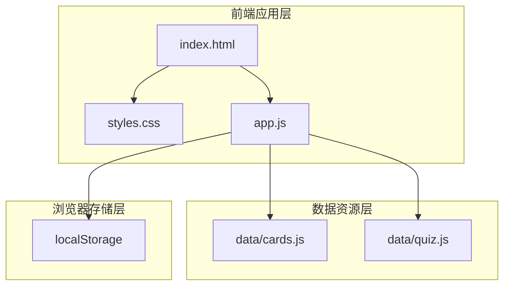
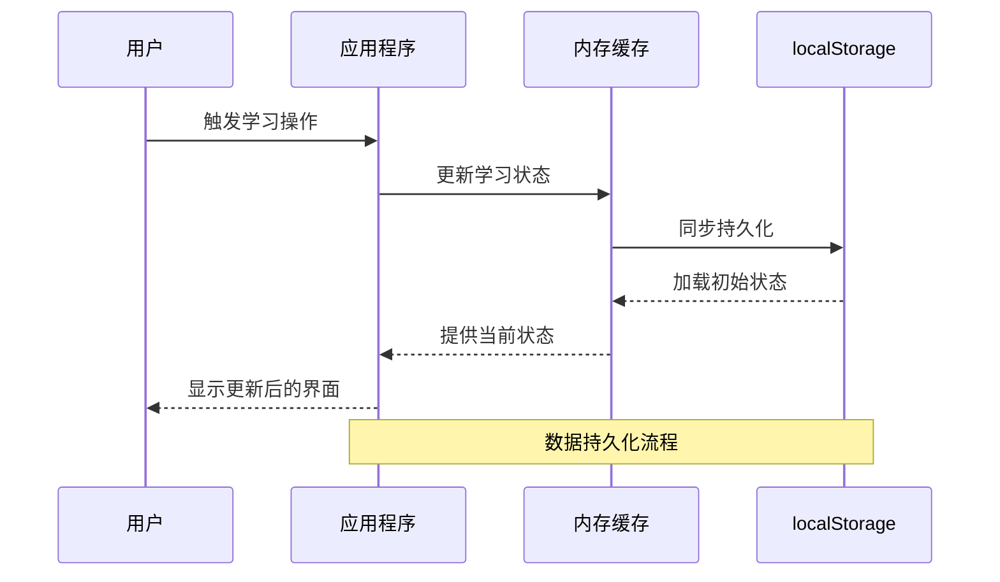
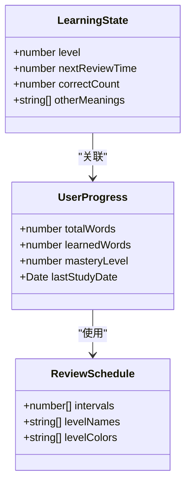
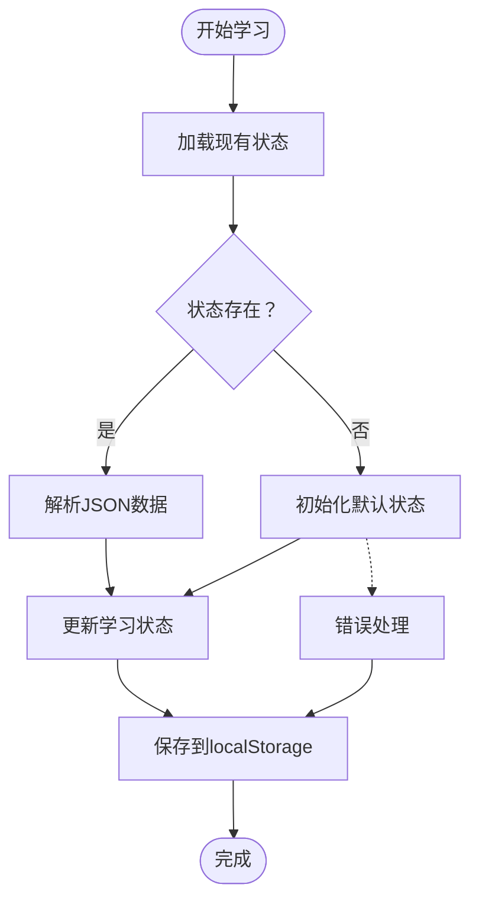
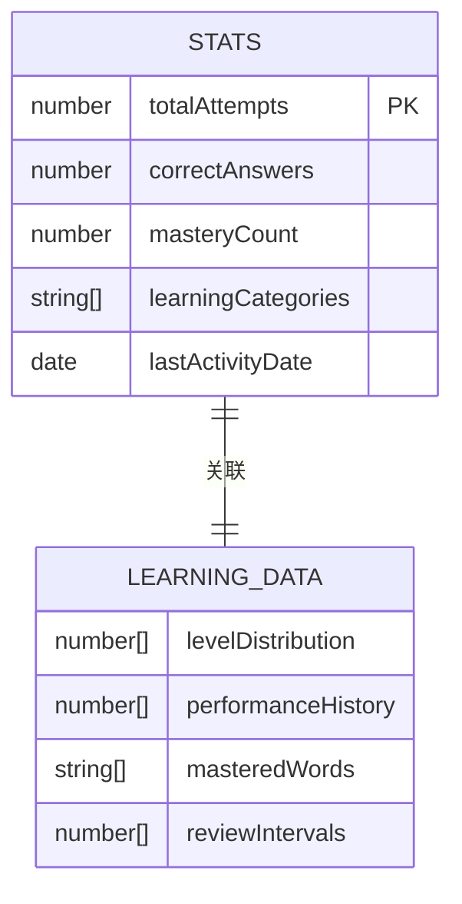
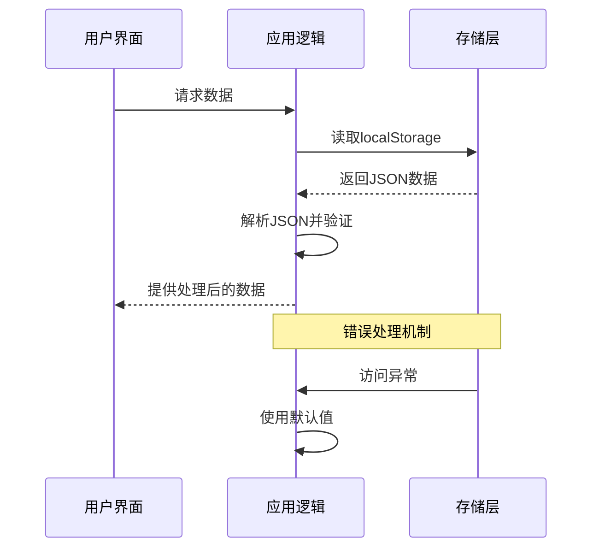
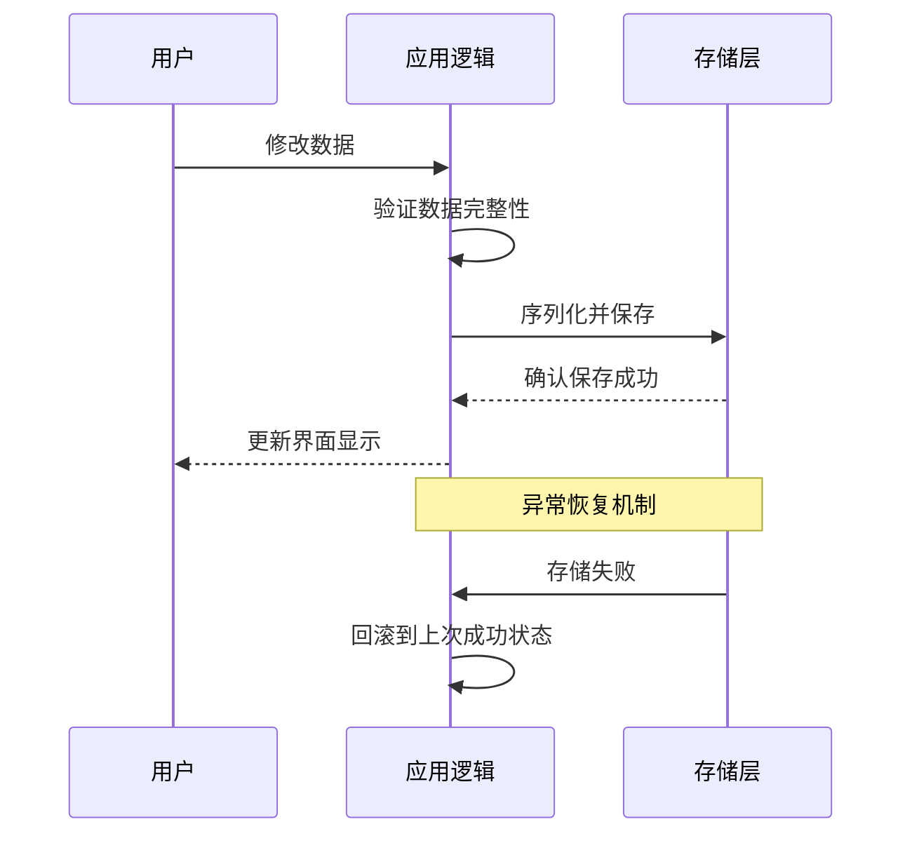
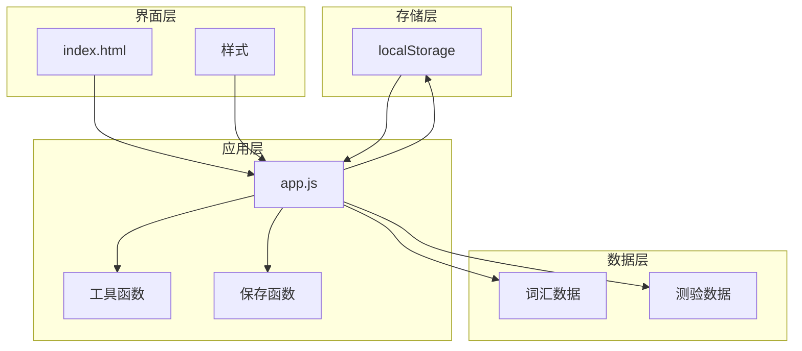

# 存储机制

<cite>
**本文档引用的文件**
- [app.js](file://app.js)
- [index.html](file://index.html)
- [styles.css](file://styles.css)
- [data/cards.js](file://data/cards.js)
- [data/quiz.js](file://data/quiz.js)
</cite>

## 目录
1. [简介](#简介)
2. [项目结构](#项目结构)
3. [核心组件](#核心组件)
4. [架构概览](#架构概览)
5. [详细组件分析](#详细组件分析)
6. [依赖关系分析](#依赖关系分析)
7. [性能考量](#性能考量)
8. [故障排除指南](#故障排除指南)
9. [结论](#结论)
10. [附录](#附录)

## 简介
本项目采用浏览器本地存储机制实现数据持久化，主要使用 localStorage 进行用户学习状态、答题统计等数据的保存与恢复。系统通过间隔重复算法管理学习进度，结合本地存储实现跨会话的数据保持。

## 项目结构
项目采用简洁的单页面应用架构，核心文件组织如下：
- 主应用逻辑：app.js
- 页面结构：index.html  
- 样式定义：styles.css
- 数据资源：data/cards.js、data/quiz.js

**图表来源**
- [index.html:1-115](file://index.html#L1-L115)
- [app.js:1-308](file://app.js#L1-L308)
- [data/cards.js:1-166](file://data/cards.js#L1-L166)
- [data/quiz.js:1-72](file://data/quiz.js#L1-L72)

**章节来源**
- [index.html:1-115](file://index.html#L1-L115)
- [app.js:1-308](file://app.js#L1-L308)

## 核心组件
系统的核心存储组件围绕以下关键元素构建：

### 存储键值对结构
系统使用两个主要的 localStorage 键进行数据持久化：
- `w3_r`: 用户学习状态数据
- `w3_s`: 统计信息数据

### 数据序列化策略
所有数据均采用 JSON 序列化方式进行存储，确保数据结构的完整性和可移植性。

### 缓存策略
应用采用内存缓存 + 持久化存储的双重策略：
- 内存缓存：运行时状态存储在 JavaScript 变量中
- 持久化存储：定期将状态同步到 localStorage

**章节来源**
- [app.js:8-16](file://app.js#L8-L16)

## 架构概览
系统采用分层存储架构，实现数据的高效管理和持久化。

**图表来源**
- [app.js:8-16](file://app.js#L8-L16)
- [app.js:122-136](file://app.js#L122-L136)

## 详细组件分析

### 学习状态存储组件
学习状态存储组件负责管理用户的词汇学习进度和复习安排。

#### 数据模型结构
学习状态数据采用数组索引映射的方式存储，每个词汇对应一个状态对象：

**图表来源**
- [app.js:4-6](file://app.js#L4-L6)
- [app.js:122-136](file://app.js#L122-L136)

#### 存储实现细节
学习状态的存储和检索通过以下函数实现：

**图表来源**
- [app.js:8-16](file://app.js#L8-L16)
- [app.js:122-136](file://app.js#L122-L136)

**章节来源**
- [app.js:8-16](file://app.js#L8-L16)
- [app.js:122-136](file://app.js#L122-L136)

### 统计信息存储组件
统计信息存储组件负责记录用户的答题表现和学习成果。

#### 数据结构设计
统计信息采用简洁的对象结构，包含关键的学习指标：

**图表来源**
- [app.js:10](file://app.js#L10)
- [app.js:182-194](file://app.js#L182-L194)

#### 数据更新策略
统计信息的更新遵循实时同步原则，确保用户操作的即时反馈。

**章节来源**
- [app.js:10](file://app.js#L10)
- [app.js:182-194](file://app.js#L182-L194)

### 数据访问模式
系统采用多种数据访问模式确保数据的一致性和完整性：

#### 读取访问模式

**图表来源**
- [app.js:8-16](file://app.js#L8-L16)

#### 写入访问模式

**图表来源**
- [app.js:16](file://app.js#L16)
- [app.js:182-194](file://app.js#L182-L194)

**章节来源**
- [app.js:8-16](file://app.js#L8-L16)
- [app.js:16](file://app.js#L16)

## 依赖关系分析
系统存储机制的依赖关系呈现清晰的层次结构：

**图表来源**
- [app.js:1-308](file://app.js#L1-L308)
- [index.html:1-115](file://index.html#L1-L115)

**章节来源**
- [app.js:1-308](file://app.js#L1-L308)
- [index.html:1-115](file://index.html#L1-L115)

## 性能考量
系统在存储性能方面采用了多项优化策略：

### 存储优化策略
1. **增量更新**：仅在必要时更新存储内容，避免频繁的磁盘 I/O 操作
2. **批量保存**：将多个状态更新合并为单次保存操作
3. **数据压缩**：使用紧凑的 JSON 格式减少存储空间占用
4. **懒加载**：按需加载数据，避免一次性加载大量数据

### 内存管理
- 使用弱引用避免内存泄漏
- 定期清理无效数据
- 实现数据生命周期管理

### 性能监控
系统实现了基本的性能监控机制，包括：
- 存储操作耗时统计
- 数据完整性检查
- 错误恢复机制

## 故障排除指南
针对存储机制可能出现的问题，提供以下解决方案：

### 常见问题及解决方法

#### 存储权限问题
**症状**：localStorage 访问被拒绝
**解决方法**：
- 检查浏览器隐私设置
- 确认网站具有存储权限
- 尝试清除浏览器缓存

#### 数据损坏问题
**症状**：加载数据时出现解析错误
**解决方法**：
- 实现数据校验机制
- 提供默认值回退策略
- 实现数据修复功能

#### 存储容量问题
**症状**：存储空间不足导致保存失败
**解决方法**：
- 实现数据压缩功能
- 提供手动清理选项
- 优化数据结构设计

**章节来源**
- [app.js:8-16](file://app.js#L8-L16)

## 结论
本项目的存储机制设计合理，通过 localStorage 实现了有效的数据持久化。系统采用简洁的数据结构、完善的错误处理机制和优化的性能策略，确保了良好的用户体验。建议在未来版本中进一步增强数据迁移和版本兼容性支持。

## 附录

### 数据存储格式规范
- **存储键名**：`w3_r`、`w3_s`
- **数据格式**：JSON 对象
- **编码方式**：UTF-8
- **存储位置**：浏览器本地存储

### 版本兼容性
- 支持现代浏览器的 localStorage API
- 提供降级处理机制
- 实现数据格式向后兼容

### 最佳实践建议
1. 定期备份重要数据
2. 实现数据迁移脚本
3. 提供手动导出功能
4. 建立数据恢复机制