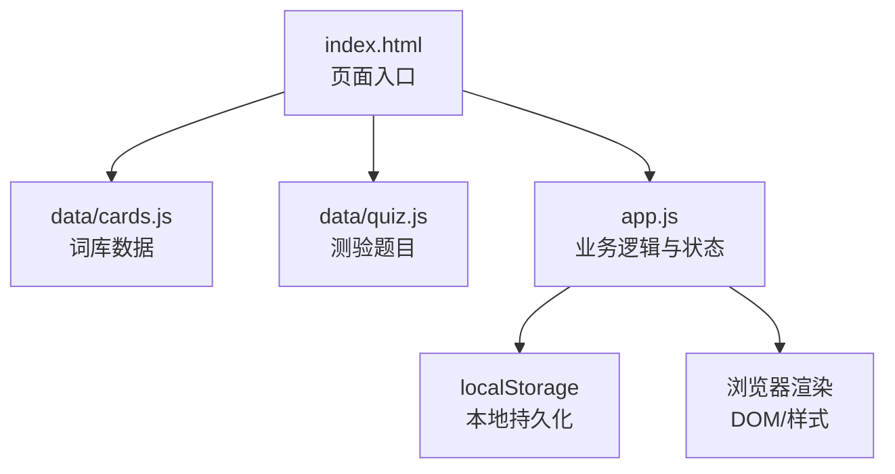
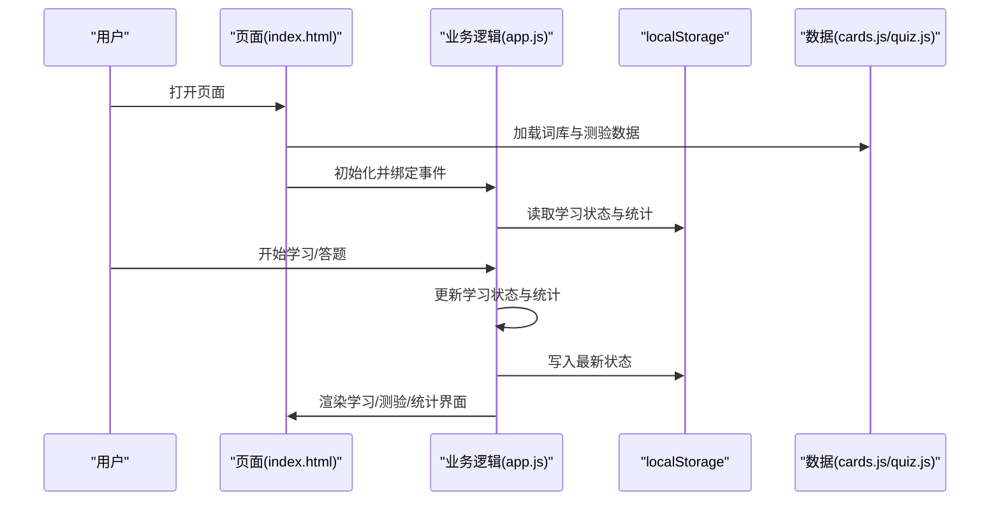
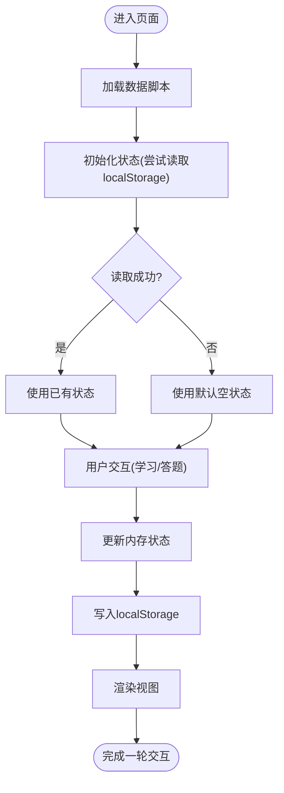
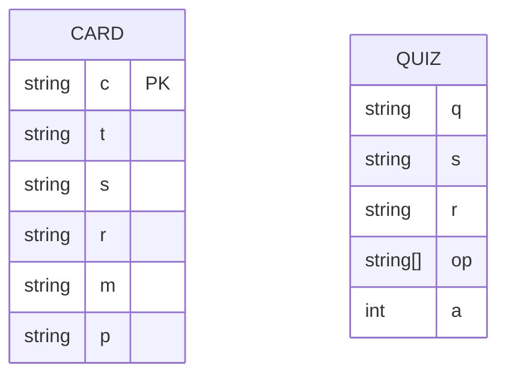
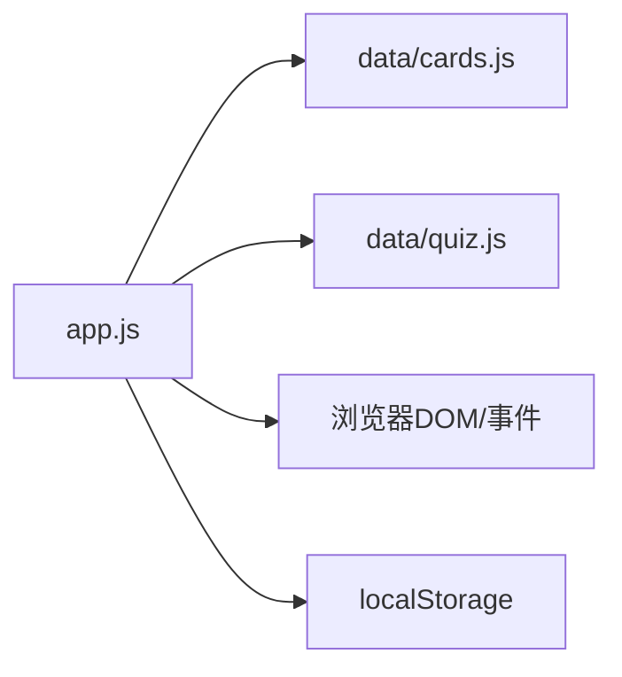

# 数据安全

<cite>
**本文档引用的文件**
- [app.js](file://app.js)
- [index.html](file://index.html)
- [styles.css](file://styles.css)
- [cards.js](file://data/cards.js)
- [quiz.js](file://data/quiz.js)
</cite>

## 目录
1. [简介](#简介)
2. [项目结构](#项目结构)
3. [核心组件](#核心组件)
4. [架构总览](#架构总览)
5. [详细组件分析](#详细组件分析)
6. [依赖关系分析](#依赖关系分析)
7. [性能考量](#性能考量)
8. [故障排查指南](#故障排查指南)
9. [结论](#结论)
10. [附录](#附录)

## 简介
本文件面向“文言文学习应用”的数据安全与隐私保护，基于仓库现有实现进行系统化分析。重点涵盖：
- 本地存储的安全性考虑与访问控制
- 用户数据的隐私政策边界与使用限制
- 数据完整性与防篡改现状评估
- 异常处理与潜在风险识别
- 浏览器安全限制与最佳实践建议

本应用为纯前端单页应用，所有数据与状态均保存在浏览器本地存储中，未涉及服务端交互或第三方数据传输，因此数据保护策略主要围绕本地存储安全、输入校验与最小化原则展开。

## 项目结构
应用采用静态资源组织方式，核心逻辑集中在单页 HTML 中通过脚本加载数据与业务逻辑：
- 页面入口：index.html
- 样式：styles.css
- 数据：data/cards.js、data/quiz.js
- 业务逻辑：app.js

图表来源
- [index.html](file://index.html)
- [app.js](file://app.js)
- [cards.js](file://data/cards.js)
- [quiz.js](file://data/quiz.js)

章节来源
- [index.html](file://index.html)
- [app.js](file://app.js)
- [styles.css](file://styles.css)
- [cards.js](file://data/cards.js)
- [quiz.js](file://data/quiz.js)

## 核心组件
- 本地状态与持久化
  - 学习进度与答题统计通过 localStorage 持久化，键名包含“w3_r”“w3_s”，分别对应卡片学习状态与统计信息。
  - 保存函数统一调用 localStorage 接口，确保状态落盘。
- 数据模型
  - 词库数据与测验题目均为静态数组，通过全局变量暴露给业务逻辑。
- 渲染与交互
  - 页面通过 DOM 操作动态更新学习进度、测验界面与统计展示。

章节来源
- [app.js:8-16](file://app.js#L8-L16)
- [app.js:15](file://app.js#L15)
- [cards.js:1](file://data/cards.js#L1)
- [quiz.js:1](file://data/quiz.js#L1)

## 架构总览
应用采用“静态资源 + 本地存储”的纯前端架构，数据流如下：
- 数据加载：HTML 引入数据脚本，初始化全局数据对象
- 业务处理：JS 计算学习队列、记录答题结果、维护学习等级
- 状态持久化：将学习状态与统计写入 localStorage
- 视图更新：根据当前状态渲染页面内容

图表来源
- [index.html](file://index.html)
- [app.js:8-16](file://app.js#L8-L16)
- [cards.js:1](file://data/cards.js#L1)
- [quiz.js:1](file://data/quiz.js#L1)

## 详细组件分析

### 本地存储与访问控制
- 存储位置与键值
  - 键名“w3_r”“w3_s”用于区分卡片学习状态与答题统计。
- 读取与容错
  - 读取时包含 JSON 解析与空值兜底，避免解析异常导致崩溃。
- 写入时机
  - 关键操作（标记记住、跳过复习、中途测验答题）均触发保存。
- 访问控制
  - 仅页面上下文可访问，无法跨域共享；但同一站点内任意脚本均可读取。

图表来源
- [app.js:8-16](file://app.js#L8-L16)
- [app.js:15](file://app.js#L15)

章节来源
- [app.js:8-16](file://app.js#L8-L16)
- [app.js:15](file://app.js#L15)

### 数据模型与完整性
- 数据来源
  - 词库与测验数据为静态数组，随页面加载注入全局命名空间。
- 完整性现状
  - 未发现内置校验或哈希校验机制；若数据被篡改，可能影响学习进度与测验结果。
- 防篡改建议
  - 可引入数据摘要（如哈希）与版本号字段，在读取时进行一致性校验。
  - 对关键字段（如答案索引）进行范围校验与类型约束。

图表来源
- [cards.js:1](file://data/cards.js#L1)
- [quiz.js:1](file://data/quiz.js#L1)

章节来源
- [cards.js:1](file://data/cards.js#L1)
- [quiz.js:1](file://data/quiz.js#L1)

### 隐私政策与数据收集范围
- 收集范围
  - 仅收集用户在学习过程中的行为数据：学习状态、答题次数、正确次数、复习轮次等。
- 使用限制
  - 数据完全保存在本地，未上传至任何服务器或第三方接口。
- 第三方资源
  - 页面引入字体资源，但不传输用户信息；无 Cookie 或追踪脚本。

章节来源
- [index.html:7-9](file://index.html#L7-L9)
- [app.js:8-16](file://app.js#L8-L16)

### 异常处理与健壮性
- JSON 解析异常
  - 读取 localStorage 时使用 try/catch 并回退为空对象，避免崩溃。
- 空状态兜底
  - 若键不存在，默认构造空状态，保证后续逻辑可用。
- 交互异常
  - 答题与学习流程中存在防重复提交的开关变量，减少并发问题。

章节来源
- [app.js:8-16](file://app.js#L8-L16)
- [app.js:198-228](file://app.js#L198-L228)

## 依赖关系分析
- 组件耦合
  - app.js 依赖全局数据对象（cards/quiz），并通过 DOM 操作驱动视图。
- 外部依赖
  - 仅依赖浏览器原生 localStorage 与 DOM API。
- 潜在循环依赖
  - 当前结构无循环依赖风险。

图表来源
- [app.js](file://app.js)
- [cards.js](file://data/cards.js)
- [quiz.js](file://data/quiz.js)

章节来源
- [app.js](file://app.js)
- [cards.js](file://data/cards.js)
- [quiz.js](file://data/quiz.js)

## 性能考量
- 本地存储读写
  - 小型数据集（数百条词库与测验题）读写开销极低，性能影响可忽略。
- 渲染优化
  - 使用 CSS 动画与过渡提升交互体验，注意避免频繁重排。
- 数据体积
  - 当前数据体积较小，无需分片或懒加载；若扩展至更大规模，可考虑按需加载。

## 故障排查指南
- 本地存储损坏
  - 症状：学习进度丢失或统计异常
  - 处理：清理浏览器本地存储或删除相关键值，刷新页面后重新学习
- 答案选项错乱
  - 症状：选项顺序与正确答案不匹配
  - 处理：检查数据脚本中的答案索引字段是否被意外修改
- 页面空白或功能异常
  - 症状：页面无法加载或交互失效
  - 处理：确认数据脚本加载成功、全局变量可用；检查浏览器控制台错误

章节来源
- [app.js:8-16](file://app.js#L8-L16)
- [cards.js:1](file://data/cards.js#L1)
- [quiz.js:1](file://data/quiz.js#L1)

## 结论
该应用在数据安全方面遵循“最小化原则”：仅在本地存储必要的学习状态与统计信息，未引入任何服务端或第三方依赖，从而有效降低了数据泄露与滥用的风险。当前实现具备基本的容错能力（JSON 解析异常处理），但在数据完整性与防篡改方面尚未建立机制。建议在保持纯前端架构的前提下，逐步引入数据校验与版本控制，以进一步增强系统的可靠性与安全性。

## 附录

### 数据保护与隐私策略清单
- 本地存储安全
  - 仅保存必要数据，避免敏感信息
  - 使用统一的键名前缀与命名规范，便于审计与清理
- 数据完整性
  - 引入数据摘要与版本号字段，读取时进行一致性校验
  - 对关键字段（如答案索引）进行范围与类型校验
- 访问控制
  - 严格限制脚本作用域，避免全局污染
  - 不在页面中暴露敏感配置或密钥
- 隐私政策
  - 明确声明仅本地存储，不上传任何数据
  - 不使用第三方跟踪或分析脚本
- 异常处理
  - 对本地存储读写进行统一封装与错误处理
  - 提供手动清理与重置功能

### 浏览器安全限制与最佳实践
- 同源策略
  - 本地数据仅在同一站点内可访问，避免跨站泄露
- HTTPS 与安全上下文
  - 在生产环境中启用 HTTPS，防止中间人攻击
- 输入与输出校验
  - 对用户交互输入进行白名单校验，避免注入与越界
- 最小权限原则
  - 仅授予必要的 DOM 权限，避免过度授权