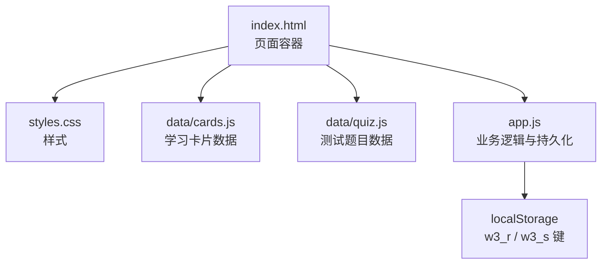
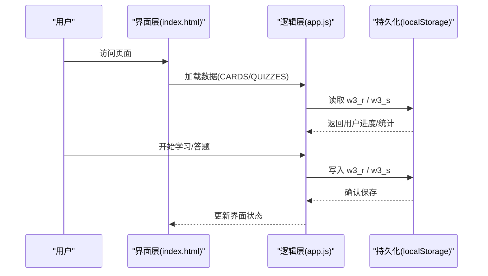
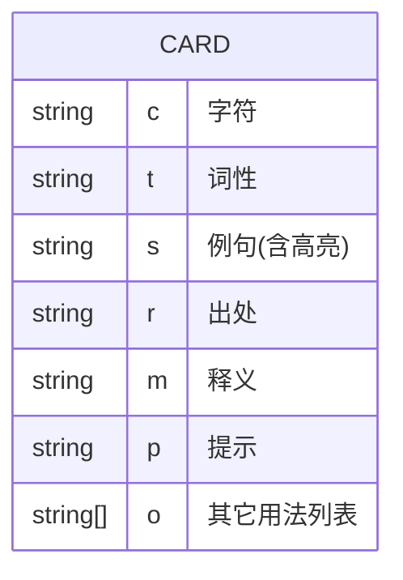
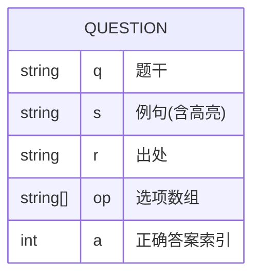
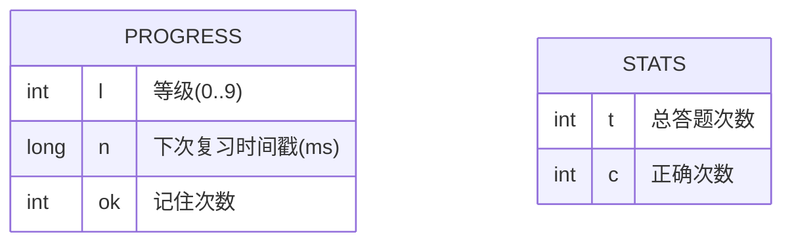
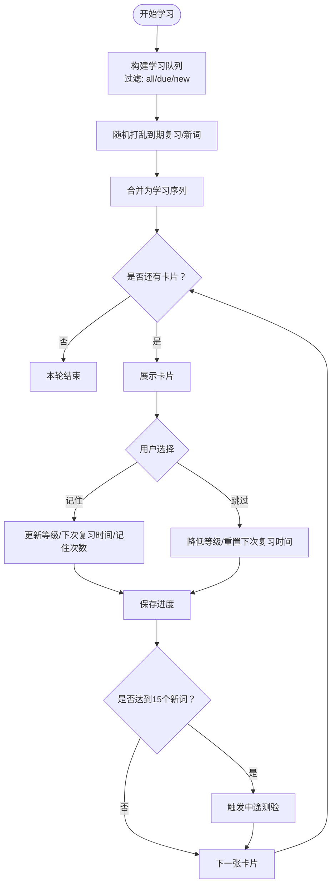
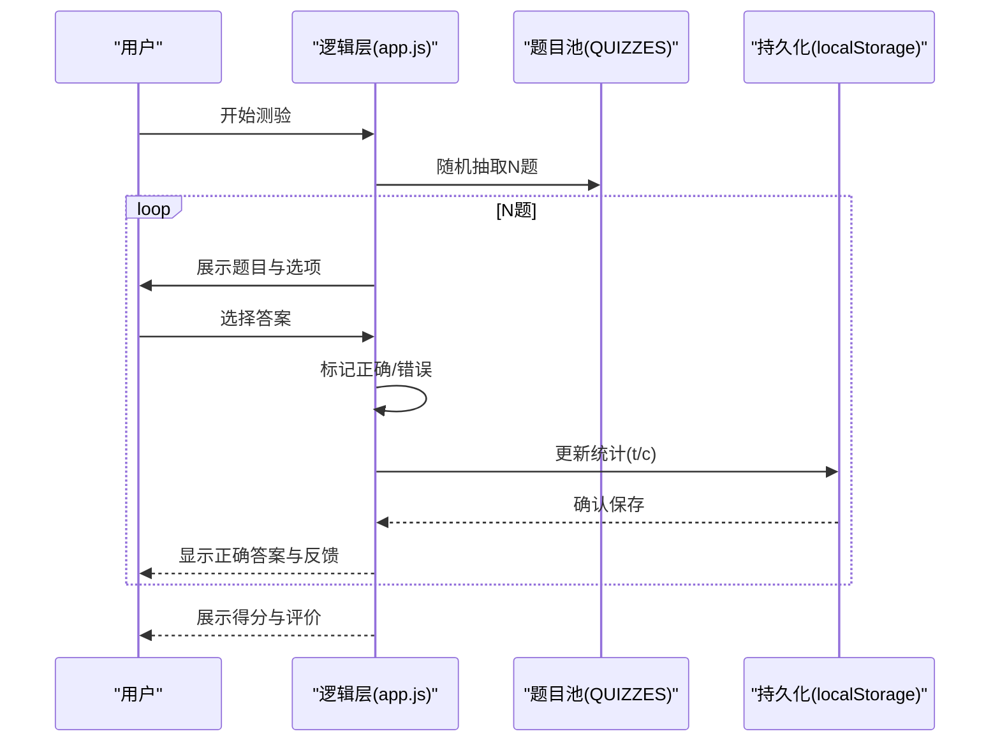
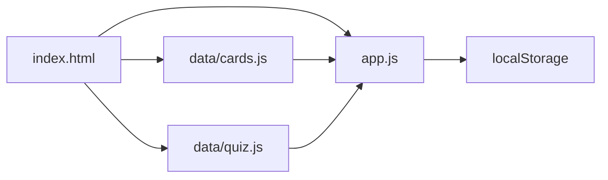

# 数据管理

<cite>
**本文档引用的文件**
- [app.js](file://app.js)
- [cards.js](file://data/cards.js)
- [quiz.js](file://data/quiz.js)
- [index.html](file://index.html)
- [styles.css](file://styles.css)
</cite>

## 目录
1. [简介](#简介)
2. [项目结构](#项目结构)
3. [核心组件](#核心组件)
4. [架构总览](#架构总览)
5. [详细组件分析](#详细组件分析)
6. [依赖关系分析](#依赖关系分析)
7. [性能考量](#性能考量)
8. [故障排查指南](#故障排查指南)
9. [结论](#结论)
10. [附录](#附录)

## 简介
本文件面向文言文学习应用“文言斩”的数据管理，系统性阐述学习卡片、测试题目与用户进度的数据结构与管理策略，解析 localStorage 的使用方式、数据持久化机制与同步策略，给出导入导出、备份恢复与迁移建议，并提供数据格式规范、字段定义与验证规则，最后分析数据安全性与隐私保护措施。

## 项目结构
应用采用“数据与逻辑分离”的模块化组织：
- index.html：页面骨架与导航容器
- styles.css：样式资源
- data/cards.js：学习卡片数据集合（window.CARDS）
- data/quiz.js：测试题目数据集合（window.QUIZZES）
- app.js：业务逻辑、状态管理、持久化与交互

图表来源
- [index.html](file://index.html)
- [styles.css](file://styles.css)
- [cards.js](file://data/cards.js)
- [quiz.js](file://data/quiz.js)
- [app.js](file://app.js)

章节来源
- [index.html](file://index.html)
- [styles.css](file://styles.css)
- [cards.js](file://data/cards.js)
- [quiz.js](file://data/quiz.js)
- [app.js](file://app.js)

## 核心组件
- 学习卡片集合：window.CARDS，包含163条含义卡片，每条卡片描述字符、词性、例句、出处、释义、提示与其它用法列表。
- 测试题目集合：window.QUIZZES，包含69道语境选义题目，每题包含题干、例句、出处、选项数组与正确答案索引。
- 用户进度与统计：localStorage 中的 w3_r 与 w3_s，分别存储学习进度与答题统计。

章节来源
- [cards.js](file://data/cards.js)
- [quiz.js](file://data/quiz.js)
- [app.js](file://app.js)

## 架构总览
应用采用“前端本地持久化”架构：数据以静态资源形式加载，运行时在内存中维护状态，通过 localStorage 实现跨会话持久化。学习流程围绕“间隔重复算法”展开，结合“中途测验”与“正式测验”，形成闭环的学习与评估体系。

图表来源
- [app.js](file://app.js)
- [index.html](file://index.html)

## 详细组件分析

### 学习卡片数据模型
学习卡片用于展示文言词汇的多种用法与语境，支持“其它用法”扩展展示。

- 数据来源：window.CARDS
- 结构要点：
  - 字符 c：目标字
  - 词性 t：虚词/实词
  - 例句 s：带高亮标记的句子片段
  - 出处 r：篇目名称
  - 释义 m：标准解释
  - 提示 p：记忆要点
  - 其它用法 o：候选解释列表（用于扩展展示）

图表来源
- [cards.js](file://data/cards.js)

章节来源
- [cards.js](file://data/cards.js)

### 测试题目数据模型
测试题目采用“语境选义”模式，从高频虚词/实词中抽取典型例句，提供四个选项与正确答案索引。

- 数据来源：window.QUIZZES
- 结构要点：
  - 题干 q：问题表述
  - 例句 s：带高亮标记的句子片段
  - 出处 r：篇目名称
  - 选项 op：四个选项数组
  - 正确答案 a：选项索引

图表来源
- [quiz.js](file://data/quiz.js)

章节来源
- [quiz.js](file://data/quiz.js)

### 用户进度与统计模型
用户进度与统计通过 localStorage 持久化，键名分别为 w3_r 与 w3_s。

- 进度键 w3_r：按卡片索引映射的学习状态对象
  - 字段 l：当前轮次等级（0~9）
  - 字段 n：下次复习时间戳
  - 字段 ok：累计“记住”次数
- 统计键 w3_s：答题统计对象
  - 字段 t：总答题次数
  - 字段 c：正确次数

图表来源
- [app.js](file://app.js)

章节来源
- [app.js](file://app.js)

### 间隔重复与学习队列
应用内置间隔重复算法，依据等级 l 推算下次复习时间 n，并在学习界面按“新词优先/到期复习混合”策略生成学习队列。

图表来源
- [app.js](file://app.js)

章节来源
- [app.js](file://app.js)

### 测验流程
正式测验与中途测验均采用随机抽题与选项打乱策略，提供即时反馈与正确率统计。

图表来源
- [app.js](file://app.js)
- [quiz.js](file://data/quiz.js)

章节来源
- [app.js](file://app.js)
- [quiz.js](file://data/quiz.js)

## 依赖关系分析
- 页面依赖顺序：index.html → data/cards.js → data/quiz.js → app.js
- 数据依赖：app.js 通过 window.CARDS 与 window.QUIZZES 使用静态数据
- 持久化依赖：app.js 通过 localStorage 读写用户进度与统计

图表来源
- [index.html](file://index.html)
- [cards.js](file://data/cards.js)
- [quiz.js](file://data/quiz.js)
- [app.js](file://app.js)

章节来源
- [index.html](file://index.html)
- [cards.js](file://data/cards.js)
- [quiz.js](file://data/quiz.js)
- [app.js](file://app.js)

## 性能考量
- 内存占用：学习卡片与题目集合规模较小，加载后常驻内存，查询与渲染开销低。
- 随机抽题：使用数组切片与打乱算法，复杂度 O(N log N)，在移动端可接受。
- 本地存储：频繁读写 localStorage 可能阻塞主线程，建议批量保存或节流。
- 渲染优化：学习卡片与题目渲染采用一次性拼接 DOM，避免频繁重排；中途测验弹窗采用条件显示，减少 DOM 变更。

## 故障排查指南
- 无法读取进度
  - 现象：进度重置或为空
  - 排查：检查 localStorage 中键值是否存在与 JSON 是否有效
  - 处理：初始化默认空对象，确保 JSON 解析异常时有兜底
- 保存失败
  - 现象：刷新后进度丢失
  - 排查：确认 save() 调用路径与 localStorage 写入权限
  - 处理：在 save() 周围包裹 try/catch 并记录错误
- 题目/卡片加载异常
  - 现象：页面空白或报错
  - 排查：检查 data/*.js 文件加载顺序与语法
  - 处理：确保 index.html 中 script 标签顺序正确
- 浏览器兼容
  - 现象：某些浏览器不支持 localStorage 或禁用
  - 处理：提供降级提示与本地文件导出/导入能力

章节来源
- [app.js](file://app.js)
- [index.html](file://index.html)

## 结论
本应用以静态数据与 localStorage 为核心的数据管理策略，实现了轻量、可移植、无需后端的文言文学习体验。通过间隔重复与测验闭环，有效提升记忆效率。建议后续增强数据导入导出、备份恢复与迁移能力，以进一步提升用户体验与数据安全性。

## 附录

### 数据格式规范与字段定义
- 学习卡片字段
  - c：字符串，目标字
  - t：字符串，词性（虚词/实词）
  - s：字符串，例句（含高亮标记）
  - r：字符串，出处
  - m：字符串，标准释义
  - p：字符串，记忆提示
  - o：字符串数组，其它用法列表
- 测试题目字段
  - q：字符串，题干
  - s：字符串，例句（含高亮标记）
  - r：字符串，出处
  - op：字符串数组，四个选项
  - a：整数，正确答案在 op 中的索引
- 用户进度字段
  - l：整数，等级（0~9）
  - n：长整型，下次复习时间戳（毫秒）
  - ok：整数，记住次数
- 统计字段
  - t：整数，总答题次数
  - c：整数，正确次数

章节来源
- [cards.js](file://data/cards.js)
- [quiz.js](file://data/quiz.js)
- [app.js](file://app.js)

### 验证规则
- 字段存在性：卡片与题目均需包含必要字段
- 类型约束：时间戳为数值类型；等级与索引为整数
- 一致性校验：题目正确答案索引应在选项数组范围内
- JSON 合法性：localStorage 中的 JSON 必须可解析，否则回退到默认值

章节来源
- [app.js](file://app.js)
- [cards.js](file://data/cards.js)
- [quiz.js](file://data/quiz.js)

### 数据持久化与同步策略
- 持久化位置：localStorage
- 键名：
  - w3_r：学习进度
  - w3_s：答题统计
- 同步策略：
  - 即时保存：每次用户操作（记住/跳过/答题）后调用保存函数
  - 批量保存：在学习队列结束或中途测验结束后统一保存
  - 降级处理：解析失败时回退到空对象并继续运行

章节来源
- [app.js](file://app.js)

### 导入导出、备份恢复与迁移建议
- 导入导出
  - 导出：将 w3_r 与 w3_s 序列化为 JSON 文本，提供下载链接
  - 导入：读取 JSON 文件，校验结构与字段合法性后合并到当前状态
- 备份恢复
  - 备份：定期导出用户进度与统计，保存到本地或云端
  - 恢复：在新设备或新浏览器中导入备份，恢复学习进度
- 数据迁移
  - 版本升级：若数据结构发生变更，提供迁移脚本将旧格式转换为新格式
  - 向后兼容：读取时对缺失字段填充默认值，避免破坏现有进度

[本节为通用实践建议，不直接分析具体文件]

### 数据安全性与隐私保护
- 本地存储：数据仅存在于用户设备，无需网络传输，降低泄露风险
- 最小化原则：仅存储必要的学习进度与统计信息，不收集个人身份信息
- 用户控制：提供一键清除进度的功能，尊重用户删除权
- 传输安全：如需云端同步，建议采用 HTTPS 与加密存储

[本节为通用实践建议，不直接分析具体文件]