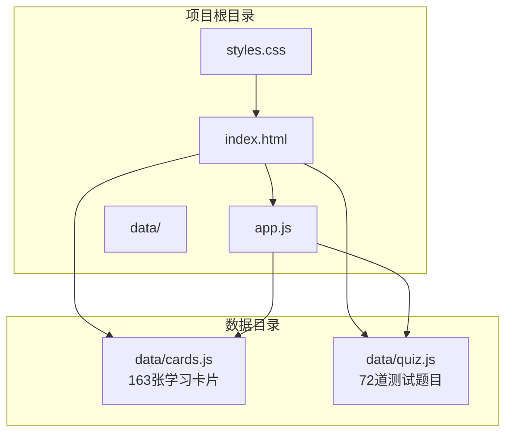
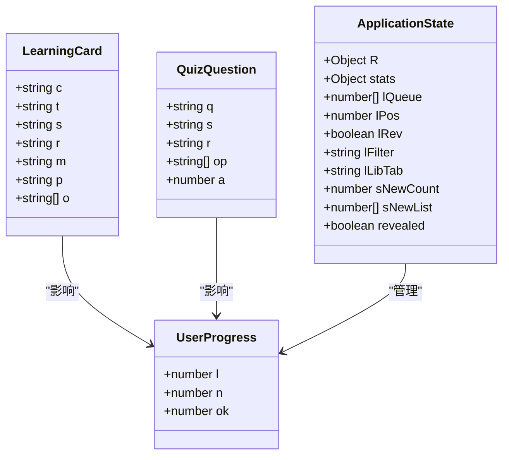
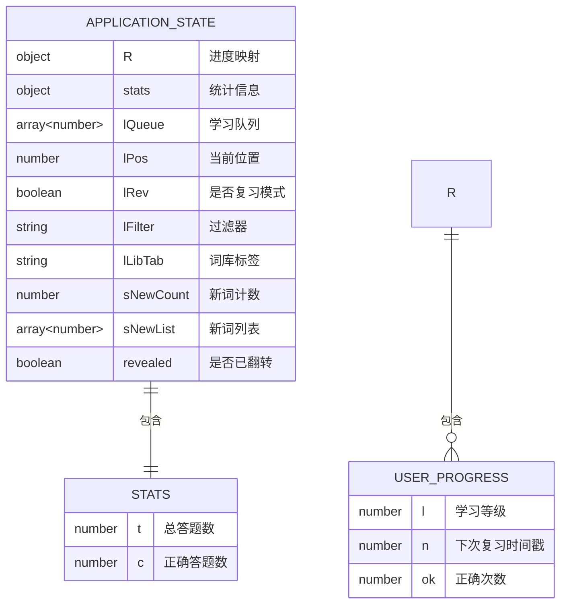
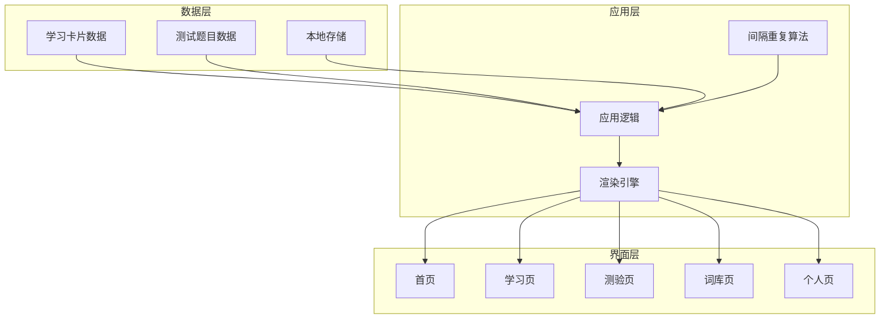

# 数据结构说明

<cite>
**本文档引用的文件**
- [app.js](file://app.js)
- [data/cards.js](file://data/cards.js)
- [data/quiz.js](file://data/quiz.js)
- [index.html](file://index.html)
- [styles.css](file://styles.css)
</cite>

## 目录
1. [简介](#简介)
2. [项目结构](#项目结构)
3. [核心数据模型](#核心数据模型)
4. [学习卡片数据结构](#学习卡片数据结构)
5. [测试题目数据结构](#测试题目数据结构)
6. [用户进度数据模型](#用户进度数据模型)
7. [数据关系与依赖分析](#数据关系与依赖分析)
8. [字段定义与验证规则](#字段定义与验证规则)
9. [数据格式示例](#数据格式示例)
10. [扩展与修改指南](#扩展与修改指南)
11. [性能考虑](#性能考虑)
12. [故障排除指南](#故障排除指南)
13. [结论](#结论)

## 简介

这是一个基于Web的文言文学习应用，采用间隔重复算法进行记忆训练。该应用提供了文言文虚词和实词的学习功能，包含163张含义卡片和72道测试题目。系统通过本地存储保存用户的学习进度和统计数据。

## 项目结构

该项目采用简洁的单页面架构，主要文件组织如下：



**图表来源**
- [index.html:110-112](file://index.html#L110-L112)
- [app.js:1](file://app.js#L1)

**章节来源**
- [index.html:1-115](file://index.html#L1-L115)
- [app.js:1-308](file://app.js#L1-L308)

## 核心数据模型

应用的核心数据模型围绕三个主要组件构建：

1. **学习卡片集合** (`window.CARDS`)
2. **测试题目集合** (`window.QUIZZES`)
3. **用户进度状态** (`localStorage: w3_r, w3_s`)



**图表来源**
- [data/cards.js:1](file://data/cards.js#L1)
- [data/quiz.js:1](file://data/quiz.js#L1)
- [app.js:8-13](file://app.js#L8-L13)

## 学习卡片数据结构

### 基本字段定义

每个学习卡片包含以下核心字段：

| 字段 | 类型 | 描述 | 示例 |
|------|------|------|------|
| `c` | string | 文言文字母 | `"之"` |
| `t` | string | 词性分类 | `"虚词"` 或 `"实词"` |
| `s` | string | 包含目标字的例句（HTML格式） | `"择其善者而从<b class="hl">之</b>"` |
| `r` | string | 出处（作者/篇名） | `"《论语》"` |
| `m` | string | 主要释义 | `"代词：它（指善者）"` |
| `p` | string | 解析说明 | `"「之」代替前文的善者"` |
| `o` | string[] | 其他选项（可选） | `["助词：的","动词：到……去","取消句子独立性"]` |

### 字段详细说明

#### 字符字段 (`c`)
- **类型**: string
- **长度**: 单个汉字字符
- **用途**: 显示学习的主要文言文字
- **约束**: 必须为有效的中文字符

#### 词性字段 (`t`)
- **类型**: string
- **取值范围**: `"虚词"` 或 `"实词"`
- **用途**: 分类标识，用于词库筛选和统计

#### 例句字段 (`s`)
- **类型**: string (HTML格式)
- **格式要求**: 包含目标字的例句，目标字使用`<b class="hl">`标签高亮
- **用途**: 提供语境化的学习材料
- **验证**: 必须包含有效的HTML标记

#### 出处字段 (`r`)
- **类型**: string
- **格式**: 使用《书名》格式
- **示例**: `"《论语》"`, `"《爱莲说》"`

#### 释义字段 (`m`)
- **类型**: string
- **格式**: 标准的文言文释义格式
- **示例**: `"代词：它（指善者）"`, `"动词：到……去"`

#### 解析字段 (`p`)
- **类型**: string
- **用途**: 提供语法和语义解析
- **长度**: 通常为20-50字符

#### 其他选项字段 (`o`)
- **类型**: string[]
- **长度**: 3个选项
- **用途**: 用于中途测验的干扰项
- **约束**: 必须与主释义不同

**章节来源**
- [data/cards.js:1](file://data/cards.js#L1-L166)

## 测试题目数据结构

### 基本字段定义

测试题目采用统一的数据结构：

| 字段 | 类型 | 描述 | 示例 |
|------|------|------|------|
| `q` | string | 问题文本 | `"「之」是什么意思？"` |
| `s` | string | 包含目标字的例句 | `"择其善者而从<b class="hl">之</b>"` |
| `r` | string | 出处 | `"《论语》"` |
| `op` | string[] | 选项数组 | 4个选项 |
| `a` | number | 正确答案索引 | `0` |

### 选项数组规范

测试题目的选项数组具有严格的要求：
- **数量**: 固定4个选项
- **顺序**: 第一个选项为正确答案
- **格式**: 每个选项为字符串，包含完整的释义说明

**章节来源**
- [data/quiz.js:1](file://data/quiz.js#L1-L72)

## 用户进度数据模型

### 进度状态结构

用户的学习进度通过`localStorage`中的`w3_r`和`w3_s`两个键值保存：



**图表来源**
- [app.js:8-13](file://app.js#L8-L13)
- [app.js:16](file://app.js#L16)

### 进度状态字段详解

#### 用户进度映射 (`R`)
- **结构**: `Object<number, UserProgress>`
- **键**: 学习卡片的索引号
- **值**: 用户对该卡片的学习进度

#### 统计信息 (`stats`)
- **结构**: `{t: number, c: number}`
- **t**: 总答题数（包括跳过的题目）
- **c**: 正确答题数

#### 学习队列 (`lQueue`)
- **类型**: Array<number>
- **用途**: 当前学习批次的卡片索引序列
- **生成**: 基于过滤器和间隔重复算法

**章节来源**
- [app.js:8-13](file://app.js#L8-L13)
- [app.js:16](file://app.js#L16)

## 数据关系与依赖分析

### 组件间依赖关系



**图表来源**
- [app.js:1](file://app.js#L1)
- [index.html:14-84](file://index.html#L14-L84)

### 关键依赖关系

1. **全局变量依赖**: `window.CARDS` 和 `window.QUIZZES`
2. **本地存储依赖**: `localStorage` 用于持久化用户进度
3. **DOM操作依赖**: 所有界面渲染都依赖于HTML结构
4. **算法依赖**: 间隔重复算法依赖于时间戳和等级系统

**章节来源**
- [app.js:1](file://app.js#L1)
- [index.html:110-112](file://index.html#L110-L112)

## 字段定义与验证规则

### 学习卡片字段验证规则

| 字段 | 必填 | 类型 | 长度限制 | 格式要求 | 验证规则 |
|------|------|------|----------|----------|----------|
| `c` | 是 | string | 1字符 | 中文字符 | 必须为有效汉字 |
| `t` | 是 | string | 2字符 | `"虚词"`或`"实词"` | 枚举值验证 |
| `s` | 是 | string | 变长 | HTML格式 | 必须包含`<b class="hl">`标签 |
| `r` | 是 | string | 变长 | 书名格式 | 必须使用《》格式 |
| `m` | 是 | string | 变长 | 释义格式 | 必须包含分类标识 |
| `p` | 是 | string | 20-50字符 | 解析说明 | 不能为空 |
| `o` | 可选 | string[] | 3个 | 释义数组 | 长度必须为3 |

### 测试题目字段验证规则

| 字段 | 必填 | 类型 | 长度限制 | 格式要求 | 验证规则 |
|------|------|------|----------|----------|----------|
| `q` | 是 | string | 变长 | 问题文本 | 必须包含目标字 |
| `s` | 是 | string | 变长 | HTML格式 | 必须包含`<b class="hl">`标签 |
| `r` | 是 | string | 变长 | 书名格式 | 必须使用《》格式 |
| `op` | 是 | string[] | 4个 | 选项数组 | 长度必须为4，第一个为正确答案 |
| `a` | 是 | number | 1个 | 索引值 | 必须为0-3之间的数字 |

### 用户进度字段验证规则

| 字段 | 必填 | 类型 | 数值范围 | 验证规则 |
|------|------|------|----------|----------|
| `l` | 是 | number | 0-9 | 等级索引，不能超过数组长度 |
| `n` | 是 | number | 时间戳 | 必须为未来时间 |
| `ok` | 是 | number | >=0 | 正整数计数器 |
| `t` | 是 | number | >=0 | 总答题数计数器 |
| `c` | 是 | number | >=0 | 正确答题数计数器 |

**章节来源**
- [data/cards.js:1](file://data/cards.js#L1-L166)
- [data/quiz.js:1](file://data/quiz.js#L1-L72)
- [app.js:8-13](file://app.js#L8-L13)

## 数据格式示例

### 学习卡片格式示例

```javascript
{
  c: "之",
  t: "虚词", 
  s: "择其善者而从<b class=\"hl\">之</b>",
  r: "《论语》",
  m: "代词：它（指善者）",
  p: "「之」代替前文的善者",
  o: ["助词：的","动词：到……去","取消句子独立性"]
}
```

### 测试题目格式示例

```javascript
{
  q: "「之」是什么意思？",
  s: "择其善者而从<b class=\"hl\">之</b>", 
  r: "《论语》",
  op: [
    "代词，它（指善者）",
    "助词，的", 
    "动词，到……去",
    "取消句子独立性"
  ],
  a: 0
}
```

### 用户进度格式示例

```javascript
// 单个卡片进度
{
  l: 2,
  n: 1640995200000,
  ok: 5
}

// 应用状态
{
  t: 25,
  c: 20
}
```

**章节来源**
- [data/cards.js:2](file://data/cards.js#L2)
- [data/quiz.js:2](file://data/quiz.js#L2)
- [app.js:9](file://app.js#L9)

## 扩展与修改指南

### 添加新的学习卡片

1. **遵循现有格式**: 参考现有的学习卡片格式
2. **选择正确的分类**: 确保`t`字段为`"虚词"`或`"实词"`
3. **例句格式**: 例句必须包含目标字的`<b class="hl">`高亮标记
4. **释义规范**: 释义必须包含分类标识（如"代词："、"动词："等）
5. **其他选项**: 提供3个合理的干扰项，确保与主释义不同

### 修改测试题目

1. **问题格式**: 问题必须包含目标字，格式为`"「目标字」是什么意思？"`
2. **选项设计**: 确保第一个选项为正确答案，其余3个为合理干扰项
3. **例句一致性**: 例句格式必须与学习卡片保持一致
4. **出处标注**: 出处必须使用标准的《书名》格式

### 扩展用户进度功能

1. **新增统计指标**: 在`stats`对象中添加新的计数器
2. **进度级别调整**: 修改`INT`数组和`LVL_NAME`数组以调整间隔时间
3. **界面更新**: 更新相关的DOM元素以显示新的统计信息
4. **数据迁移**: 确保新版本的兼容性和数据迁移

### 性能优化建议

1. **数据分页**: 对于大量数据，考虑实现分页加载
2. **缓存策略**: 实现智能缓存机制减少重复计算
3. **懒加载**: 对于大型数据集，实现按需加载
4. **内存管理**: 定期清理不需要的进度数据

**章节来源**
- [data/cards.js:1](file://data/cards.js#L1-L166)
- [data/quiz.js:1](file://data/quiz.js#L1-L72)
- [app.js:4-6](file://app.js#L4-L6)

## 性能考虑

### 内存使用优化

1. **数据压缩**: 考虑对重复的字符串进行压缩存储
2. **增量更新**: 仅保存变化的进度数据而非完整状态
3. **垃圾回收**: 定期清理过期的学习数据

### 加载性能优化

1. **异步加载**: 将数据文件异步加载，避免阻塞页面渲染
2. **预加载策略**: 实现智能预加载机制
3. **缓存机制**: 利用浏览器缓存减少网络请求

### 计算性能优化

1. **算法优化**: 优化间隔重复算法的计算复杂度
2. **批量处理**: 对多个操作进行批量处理
3. **延迟计算**: 将耗时操作延迟到用户交互时执行

## 故障排除指南

### 常见问题诊断

1. **数据加载失败**
   - 检查`data/cards.js`和`data/quiz.js`文件是否存在
   - 验证JavaScript语法是否正确
   - 确认文件路径是否正确

2. **进度数据丢失**
   - 检查浏览器的localStorage权限
   - 验证数据格式是否符合预期
   - 确认数据序列化/反序列化过程

3. **界面显示异常**
   - 检查CSS样式文件是否正确加载
   - 验证HTML结构是否完整
   - 确认JavaScript执行顺序

### 调试技巧

1. **控制台调试**: 使用浏览器开发者工具检查JavaScript错误
2. **数据验证**: 在关键节点添加数据验证逻辑
3. **性能监控**: 监控内存使用和执行时间
4. **用户反馈**: 收集用户使用过程中的问题反馈

**章节来源**
- [app.js:9](file://app.js#L9)
- [app.js:16](file://app.js#L16)

## 结论

这个文言文学习应用采用了清晰的数据结构设计，通过标准化的学习卡片和测试题目格式，实现了高效的记忆训练功能。系统的核心优势在于：

1. **结构化数据**: 清晰定义的数据模型便于维护和扩展
2. **间隔重复算法**: 基于科学记忆原理的学习策略
3. **本地存储**: 确保用户数据的安全和隐私
4. **响应式设计**: 适配多种设备的学习体验

通过遵循本文档的指导原则，开发者可以安全地扩展和修改数据格式，同时保持系统的稳定性和用户体验的一致性。