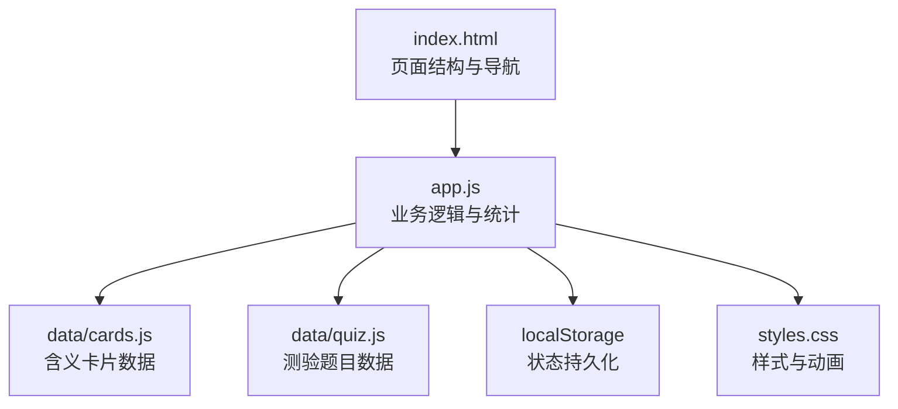
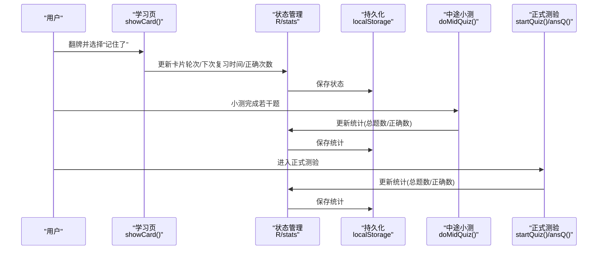
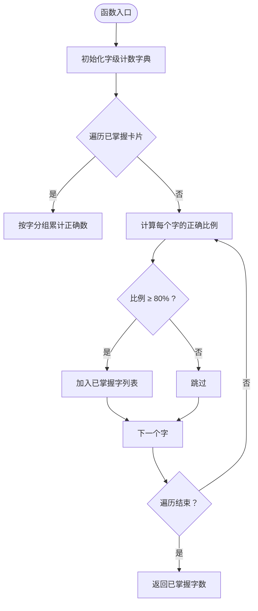
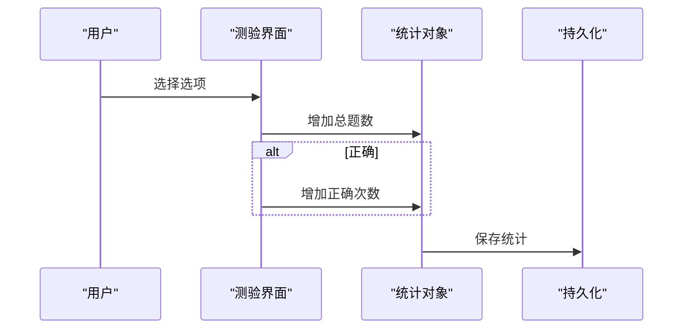
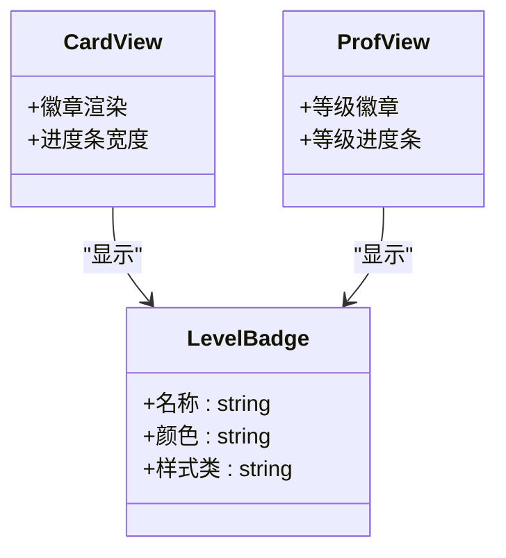
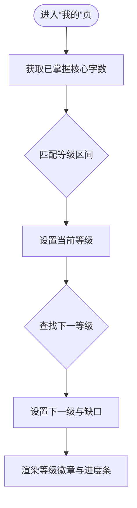
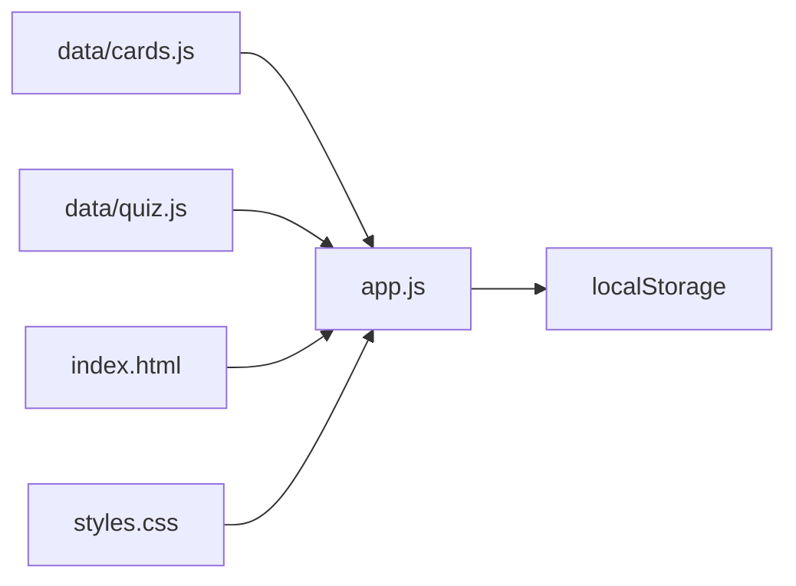

# 个人统计

<cite>
**本文引用的文件**
- [app.js](file://app.js)
- [index.html](file://index.html)
- [styles.css](file://styles.css)
- [data/cards.js](file://data/cards.js)
- [data/quiz.js](file://data/quiz.js)
</cite>

## 目录
1. [简介](#简介)
2. [项目结构](#项目结构)
3. [核心组件](#核心组件)
4. [架构总览](#架构总览)
5. [详细组件分析](#详细组件分析)
6. [依赖关系分析](#依赖关系分析)
7. [性能考量](#性能考量)
8. [故障排查指南](#故障排查指南)
9. [结论](#结论)
10. [附录](#附录)

## 简介
本文件面向“个人统计”功能，围绕学习进度统计、成就等级系统、学习效果评估机制进行系统化说明。重点解释掌握字数统计、正确率计算、等级晋升规则与排名系统设计；阐述统计数据的采集方式、存储格式、展示逻辑与动态更新机制；并给出实现分析，包括 master 计算、等级徽章视觉设计、进度条动画效果、成就徽章获取条件等。最后提供学习数据分析方法、进步趋势跟踪与学习计划制定建议。

## 项目结构
该应用采用前端单页架构，核心逻辑集中在 app.js，页面结构由 index.html 定义，样式由 styles.css 提供，数据卡片与测验题目分别来自 data/cards.js 和 data/quiz.js。统计相关的核心状态保存在浏览器本地存储中，实现跨会话持久化。

图表来源
- [index.html](file://index.html)
- [app.js](file://app.js)
- [data/cards.js](file://data/cards.js)
- [data/quiz.js](file://data/quiz.js)
- [styles.css](file://styles.css)

章节来源
- [index.html](file://index.html)
- [app.js](file://app.js)
- [data/cards.js](file://data/cards.js)
- [data/quiz.js](file://data/quiz.js)
- [styles.css](file://styles.css)

## 核心组件
- 统计状态与持久化
  - 统计对象：包含总答题数与正确次数，用于计算正确率。
  - 状态对象：记录每张卡片的学习轮次、下次复习时间与正确次数，支持间隔重复算法。
  - 持久化：通过本地存储将上述对象序列化保存，初始化时从本地恢复。
- 掌握字数统计
  - 基于“核心字”的掌握阈值（≥80%含义正确），统计已掌握核心字数量。
- 正确率计算
  - 正确率 = 正确次数 / 总答题数 × 100%，保留整数百分比。
- 等级与徽章
  - 等级名称与颜色映射，按学习轮次与复习时间推进。
  - 等级徽章在卡片详情与词库视图中显示。
- 排行与进度
  - 首页进度条与“已掌握核心字”提示。
  - “我的”页展示等级、正确率、测验次数与掌握字数，并提供等级进度条。

章节来源
- [app.js](file://app.js)
- [index.html](file://index.html)
- [styles.css](file://styles.css)

## 架构总览
个人统计贯穿“学习—测验—展示”闭环：
- 学习阶段：构建学习队列，翻牌后选择“还不熟/记住了”，触发状态更新与持久化。
- 测验阶段：正式测验与中途小测，记录答题与正确情况，更新统计。
- 展示阶段：首页进度、词库字级进度、我的页统计与等级进度条。

图表来源
- [app.js](file://app.js)

## 详细组件分析

### 掌握字数统计（mastered）
- 统计口径
  - 以“核心字”为单位，统计每个字的所有含义中被正确掌握的比例。
  - 当某字的正确含义占比达到或超过阈值（≥80%）时，视为该字已掌握。
- 实现要点
  - 遍历所有已掌握卡片，按字聚合计数。
  - 对每个字，计算其正确含义数与总含义数的比值。
  - 返回达到阈值的字集合长度作为“已掌握核心字数”。

图表来源
- [app.js](file://app.js)

章节来源
- [app.js](file://app.js)

### 正确率计算与统计更新
- 数据来源
  - 统计对象包含总答题数与正确次数。
- 更新时机
  - 正式测验与中途小测均会在用户选择答案后更新统计。
- 显示位置
  - “我的”页展示正确率、测验次数与掌握字数；首页展示“已掌握核心字”。

图表来源
- [app.js](file://app.js)

章节来源
- [app.js](file://app.js)

### 等级徽章与进度条
- 等级徽章
  - 等级名称与颜色数组定义，按卡片当前轮次映射徽章样式。
  - 在学习卡片与词库字行中显示，区分“新学/复习/第 N 轮复习”。
- 进度条动画
  - 使用过渡宽度实现平滑动画，提升交互体验。
  - 首页与“我的”页的进度条均采用相同动画策略。

图表来源
- [app.js](file://app.js)
- [styles.css](file://styles.css)

章节来源
- [app.js](file://app.js)
- [styles.css](file://styles.css)

### 排行与等级晋升规则
- 等级体系
  - 以“已掌握核心字数”为晋升依据，设定多个等级区间。
- 晋升逻辑
  - 根据当前掌握字数定位所在区间，显示当前等级与下一级所需差距。
  - 等级进度条根据当前区间上下限线性插值计算宽度。

图表来源
- [app.js](file://app.js)

章节来源
- [app.js](file://app.js)

### 数据采集与存储
- 数据采集
  - 学习页：用户点击“记住了/还不熟”时更新卡片状态。
  - 测验页：用户选择答案时更新统计。
- 存储格式
  - 状态对象：每张卡片包含轮次、下次复习时间与正确次数。
  - 统计对象：总答题数与正确次数。
- 存储介质
  - 浏览器本地存储，键名分别为状态与统计对应的标识。

章节来源
- [app.js](file://app.js)

### 展示逻辑与动态更新
- 首页
  - 展示总学习进度（已学含义/总数）、核心字掌握数与筛选按钮。
  - 动态更新进度条宽度与文本。
- 词库
  - 按字聚合显示每个字的含义完成度，用点状标记直观呈现。
- 我的
  - 展示等级徽章、等级进度条、正确率、测验次数与掌握字数。

章节来源
- [index.html](file://index.html)
- [app.js](file://app.js)
- [styles.css](file://styles.css)

## 依赖关系分析
- 模块耦合
  - app.js 依赖全局数据（cards/quiz）、DOM 结构与样式。
  - 页面结构与样式通过 index.html 与 styles.css 提供。
- 关键依赖链
  - 数据层：data/cards.js 与 data/quiz.js
  - 视图层：index.html
  - 样式层：styles.css
  - 逻辑层：app.js（含统计、持久化、渲染）

图表来源
- [app.js](file://app.js)
- [index.html](file://index.html)
- [styles.css](file://styles.css)
- [data/cards.js](file://data/cards.js)
- [data/quiz.js](file://data/quiz.js)

章节来源
- [app.js](file://app.js)
- [index.html](file://index.html)
- [styles.css](file://styles.css)
- [data/cards.js](file://data/cards.js)
- [data/quiz.js](file://data/quiz.js)

## 性能考量
- 渲染优化
  - 使用过渡动画控制进度条宽度变化，避免频繁重排。
  - 字级进度条采用点状标记，减少 DOM 数量。
- 计算复杂度
  - 掌握字统计对已掌握卡片进行聚合，整体复杂度与卡片数线性相关。
  - 等级匹配通过一次遍历确定区间，常数级开销。
- 存储与同步
  - 本地存储读写在关键节点触发，避免过度频繁写入。

## 故障排查指南
- 统计异常
  - 现象：正确率不更新或数值异常。
  - 排查：确认测验与小测流程中的统计更新是否触发；检查本地存储键值是否存在。
- 掌握字数不变化
  - 现象：核心字掌握数长期不变。
  - 排查：确认“记住了/还不熟”操作是否导致卡片状态更新；检查阈值与字级聚合逻辑。
- 等级不晋升
  - 现象：已掌握字数增长但等级不变。
  - 排查：确认等级区间配置与当前掌握字数匹配逻辑；检查进度条宽度计算。
- 进度条不更新
  - 现象：进度条宽度不随学习进度变化。
  - 排查：确认首页与“我的”页的进度条宽度设置逻辑；检查样式过渡是否生效。

章节来源
- [app.js](file://app.js)
- [index.html](file://index.html)
- [styles.css](file://styles.css)

## 结论
本项目通过本地存储实现个人统计的持久化，结合间隔重复与阈值掌握机制，形成“学习—评估—反馈”的闭环。掌握字数统计、正确率计算与等级进度条共同构成可视化学习成果指标。建议在后续迭代中引入更丰富的趋势分析与目标设定能力，进一步提升学习计划制定与追踪效率。

## 附录

### 学习数据分析方法与建议
- 进度趋势
  - 周/月维度对比“已掌握核心字数”与“正确率”，识别稳定提升与波动期。
- 错误分析
  - 分析测验与小测中的错误选项分布，定位易混淆含义，针对性强化。
- 计划制定
  - 设定阶段性目标（如“掌握 X 字”“正确率达到 Y%”），结合等级进度条进行里程碑管理。
  - 利用“待复习/新词”筛选，优先安排复习任务，确保间隔重复节奏稳定。

### 实现细节参考路径
- 掌握字统计：[mastered()](file://app.js)
- 正确率计算与统计更新：[正式测验答题逻辑](file://app.js)，[中途小测答题逻辑](file://app.js)
- 等级徽章与进度条：[等级徽章渲染](file://app.js)，[进度条样式](file://styles.css)
- 数据持久化：[状态保存](file://app.js)，[统计保存](file://app.js)
- 页面结构与展示：[首页进度与筛选](file://index.html)，[词库字级进度](file://index.html)，[我的页统计与等级](file://index.html)