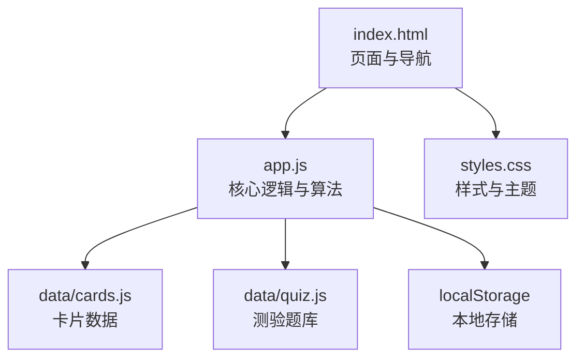
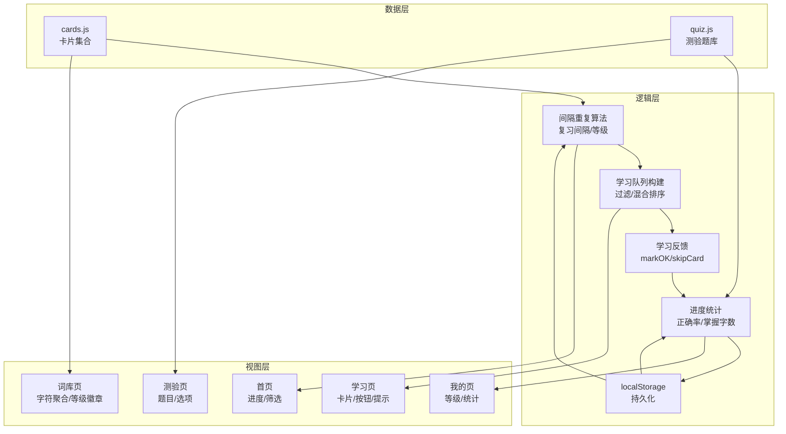
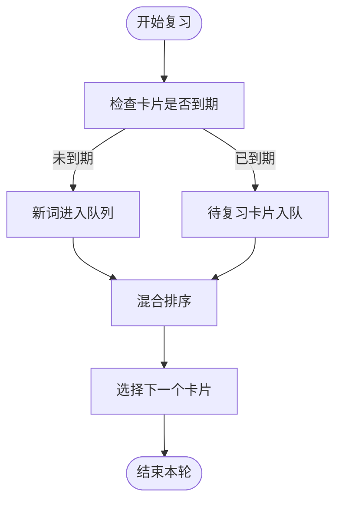
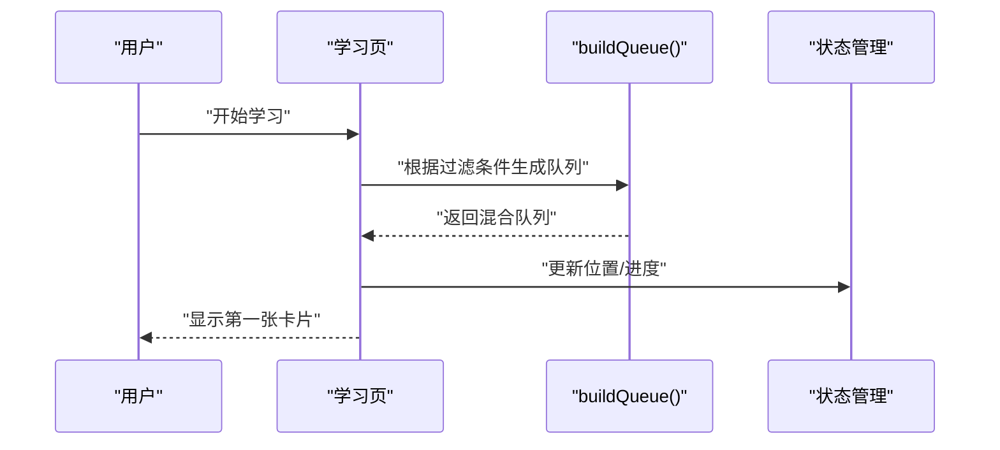
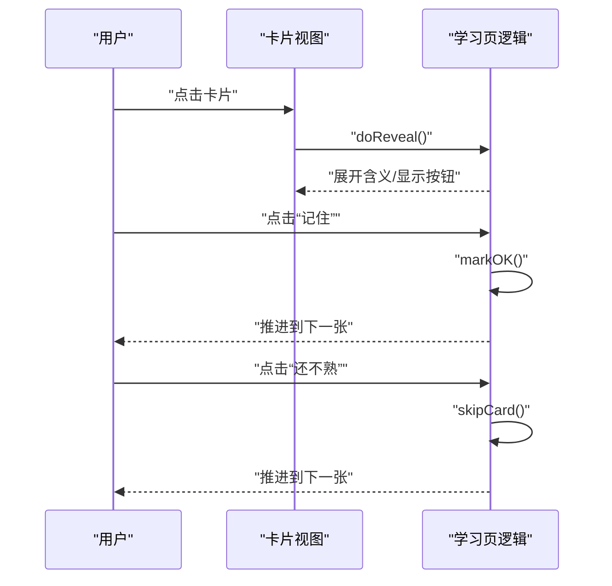
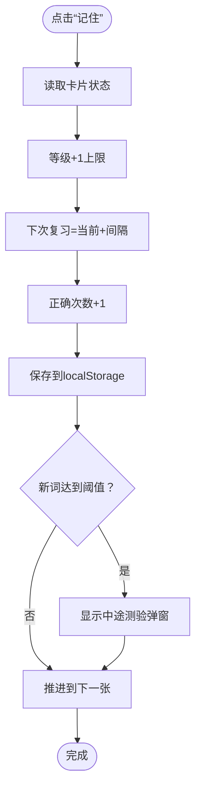
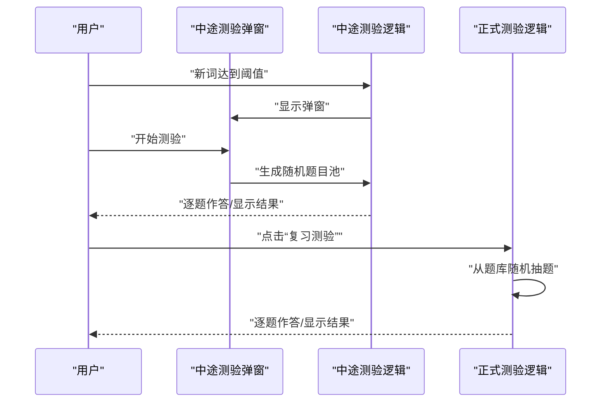
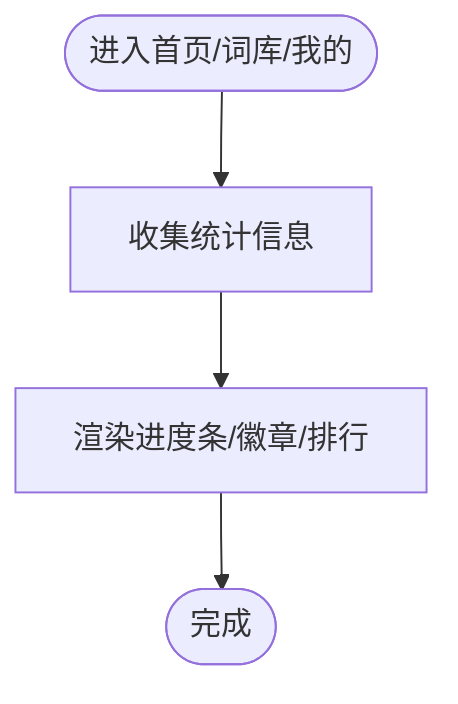
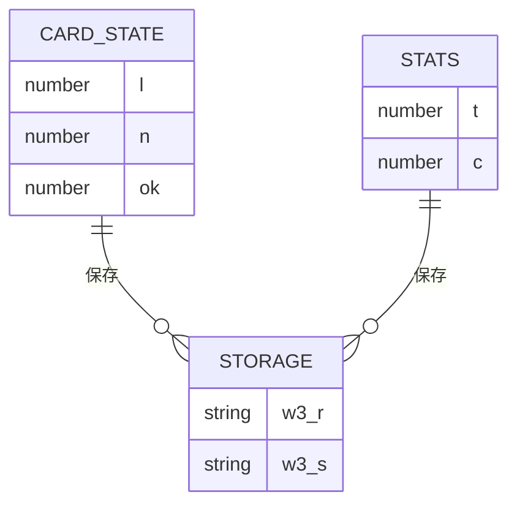
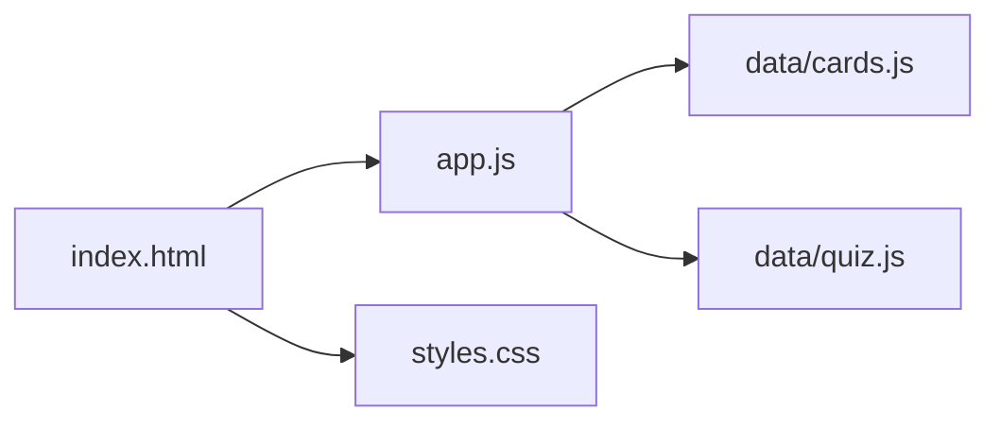

# 学习系统

<cite>
**本文引用的文件**
- [app.js](file://app.js)
- [index.html](file://index.html)
- [styles.css](file://styles.css)
- [data/cards.js](file://data/cards.js)
- [data/quiz.js](file://data/quiz.js)
</cite>

## 目录
1. [简介](#简介)
2. [项目结构](#项目结构)
3. [核心组件](#核心组件)
4. [架构总览](#架构总览)
5. [详细组件分析](#详细组件分析)
6. [依赖关系分析](#依赖关系分析)
7. [性能考量](#性能考量)
8. [故障排查指南](#故障排查指南)
9. [结论](#结论)
10. [附录](#附录)

## 简介
本项目是一个基于浏览器的文言文学习系统，采用间隔重复算法提升记忆效率。系统围绕“艾宾浩斯遗忘曲线”设计复习间隔、等级系统与状态管理，支持学习队列构建、卡片翻转交互、中途测验与进度跟踪，并通过 localStorage 实现数据持久化。本文档将深入解析算法实现、数据模型、交互流程与性能优化建议，帮助开发者与使用者更好地理解和使用该系统。

## 项目结构
系统采用前端单页应用模式，HTML 页面负责界面布局，CSS 提供样式，JavaScript 负责业务逻辑与数据持久化。数据来源于 data 目录下的卡片与测验题库。

图表来源
- [index.html:1-115](file://index.html#L1-L115)
- [app.js:1-308](file://app.js#L1-L308)
- [data/cards.js:1-166](file://data/cards.js#L1-L166)
- [data/quiz.js:1-72](file://data/quiz.js#L1-L72)
- [styles.css:1-122](file://styles.css#L1-L122)

章节来源
- [index.html:1-115](file://index.html#L1-L115)
- [app.js:1-308](file://app.js#L1-L308)
- [data/cards.js:1-166](file://data/cards.js#L1-L166)
- [data/quiz.js:1-72](file://data/quiz.js#L1-L72)
- [styles.css:1-122](file://styles.css#L1-L122)

## 核心组件
- 间隔重复参数与等级系统
  - 复习间隔数组：定义不同等级对应的复习间隔（毫秒）
  - 等级名称与颜色：用于界面展示与状态标识
- 状态与统计
  - 卡片状态对象：记录每个卡片的等级、下次复习时间、正确次数等
  - 统计信息：总答题数、正确数、学习进度等
- 学习队列与过滤
  - 过滤策略：全部、待复习、新词
  - 智能混合排序：复习与新词交替，提高学习连续性
- 交互与反馈
  - 翻转显示含义、确认记住与跳过反馈
  - 中途测验与正式测验
- 数据持久化
  - 使用 localStorage 存储卡片状态与统计

章节来源
- [app.js:4-25](file://app.js#L4-L25)
- [app.js:58-72](file://app.js#L58-L72)
- [app.js:116-142](file://app.js#L116-L142)
- [app.js:145-195](file://app.js#L145-L195)
- [app.js:198-228](file://app.js#L198-L228)
- [app.js:16](file://app.js#L16)

## 架构总览
系统采用“数据驱动”的前端架构：
- 数据层：卡片与测验题库
- 逻辑层：间隔重复算法、学习队列、交互反馈、进度统计
- 视图层：页面切换、卡片渲染、模态弹窗、进度条与徽章
- 存储层：localStorage

图表来源
- [app.js:4-25](file://app.js#L4-L25)
- [app.js:58-72](file://app.js#L58-L72)
- [app.js:116-142](file://app.js#L116-L142)
- [app.js:145-195](file://app.js#L145-L195)
- [app.js:198-228](file://app.js#L198-L228)
- [app.js:16](file://app.js#L16)
- [index.html:14-84](file://index.html#L14-L84)

## 详细组件分析

### 间隔重复与等级系统
- 复习间隔数组：按等级递增，确保随熟练度提升自动延长复习周期
- 等级名称与颜色：直观反映学习阶段与状态
- 等级上限：防止过度延长导致遗忘回潮
- 时间戳管理：下次复习时间与当前时间比较决定是否到期

图表来源
- [app.js:58-68](file://app.js#L58-L68)
- [app.js:18](file://app.js#L18)
- [app.js:22](file://app.js#L22)

章节来源
- [app.js:4-7](file://app.js#L4-L7)
- [app.js:17-21](file://app.js#L17-L21)
- [app.js:58-68](file://app.js#L58-L68)

### 学习队列构建算法（buildQueue）
- 过滤策略
  - 新词：仅包含未掌握卡片
  - 待复习：仅包含已掌握且到期卡片
  - 全部：混合复习与新词
- 混合排序策略
  - 将复习与新词分别打乱，交替取前若干个，保证学习节奏稳定
  - 优先处理到期卡片，兼顾新词输入

图表来源
- [app.js:58-68](file://app.js#L58-L68)
- [app.js:69-72](file://app.js#L69-L72)

章节来源
- [app.js:58-68](file://app.js#L58-L68)

### 卡片翻转与交互逻辑
- 点击卡片触发翻转，显示含义与提示
- 显示“记住/还不熟”按钮，分别调用 markOK 与 skipCard
- 翻转动画与按钮显隐增强交互体验

图表来源
- [app.js:116-121](file://app.js#L116-L121)
- [app.js:122-136](file://app.js#L122-L136)
- [app.js:137-142](file://app.js#L137-L142)

章节来源
- [app.js:116-121](file://app.js#L116-L121)
- [app.js:122-136](file://app.js#L122-L136)
- [app.js:137-142](file://app.js#L137-L142)

### 学习反馈处理（markOK 与 skipCard）
- markOK
  - 等级+1，不超过上限
  - 下次复习时间=当前时间+对应间隔
  - 正确次数+1，保存到 localStorage
  - 新词学习达到阈值触发中途测验
- skipCard
  - 已掌握卡片降两级，下次复习时间重置
  - 保持学习连续性，避免过度焦虑

图表来源
- [app.js:122-136](file://app.js#L122-L136)
- [app.js:16](file://app.js#L16)

章节来源
- [app.js:122-136](file://app.js#L122-L136)
- [app.js:137-142](file://app.js#L137-L142)
- [app.js:16](file://app.js#L16)

### 中途测验与正式测验
- 中途测验
  - 达到新词阈值时弹出，从本次新词中随机抽取若干题
  - 选项包含正确答案与其他用法，检验记忆效果
  - 结果计入统计，继续学习
- 正式测验
  - 随机抽取题库题目，进行语境选义测试
  - 记录正确率与总答题数

图表来源
- [app.js:145-195](file://app.js#L145-L195)
- [app.js:198-228](file://app.js#L198-L228)
- [data/quiz.js:1-72](file://data/quiz.js#L1-L72)

章节来源
- [app.js:145-195](file://app.js#L145-L195)
- [app.js:198-228](file://app.js#L198-L228)
- [data/quiz.js:1-72](file://data/quiz.js#L1-L72)

### 进度跟踪与等级徽章
- 首页进度条与统计：已掌握/总数、核心字掌握数量
- 词库页：按字符聚合，显示每个字符的全部含义完成情况与等级徽章
- 我的页：等级排行、正确率、总答题数、掌握字数

图表来源
- [app.js:38-54](file://app.js#L38-L54)
- [app.js:237-274](file://app.js#L237-L274)
- [app.js:277-296](file://app.js#L277-L296)

章节来源
- [app.js:38-54](file://app.js#L38-L54)
- [app.js:237-274](file://app.js#L237-L274)
- [app.js:277-296](file://app.js#L277-L296)

### 数据模型与持久化
- 卡片状态对象结构
  - l：等级
  - n：下次复习时间戳
  - ok：正确次数
- 统计对象结构
  - t：总答题数
  - c：正确次数
- 本地存储键
  - w3_r：卡片状态
  - w3_s：统计信息
- 加载与保存
  - 初始化时从 localStorage 读取
  - 每次反馈后立即保存

图表来源
- [app.js:9-10](file://app.js#L9-L10)
- [app.js:16](file://app.js#L16)
- [app.js:125](file://app.js#L125)

章节来源
- [app.js:9-10](file://app.js#L9-L10)
- [app.js:16](file://app.js#L16)
- [app.js:125](file://app.js#L125)

## 依赖关系分析
- app.js 依赖 data 目录的数据文件
- 页面通过 script 标签引入数据与逻辑
- 样式通过 link 标签引入，提供统一视觉风格

图表来源
- [index.html:110-112](file://index.html#L110-L112)
- [app.js:1](file://app.js#L1)
- [data/cards.js:1](file://data/cards.js#L1)
- [data/quiz.js:1](file://data/quiz.js#L1)
- [styles.css:1](file://styles.css#L1)

章节来源
- [index.html:110-112](file://index.html#L110-L112)
- [app.js:1](file://app.js#L1)
- [data/cards.js:1](file://data/cards.js#L1)
- [data/quiz.js:1](file://data/quiz.js#L1)
- [styles.css:1](file://styles.css#L1)

## 性能考量
- 队列构建与随机打乱
  - 对复习与新词分别打乱，减少局部偏差
  - 混合策略避免长时间单一类型卡片导致疲劳
- DOM 更新与动画
  - 翻转与按钮显隐使用过渡动画，提升流畅度
  - 模态弹窗采用渐入渐显，避免阻塞主线程
- 本地存储
  - 写入频率控制在关键节点（反馈后），减少频繁 IO
  - 初始化时一次性读取，避免重复解析

## 故障排查指南
- 无法加载数据
  - 检查 data 目录文件是否存在与路径是否正确
  - 确认 index.html 中 script 引入顺序
- 学习进度不更新
  - 确认 markOK/skipCard 是否触发保存
  - 检查 localStorage 权限与容量
- 界面显示异常
  - 检查 styles.css 是否正确加载
  - 确认元素 ID 与类名与 HTML 匹配

章节来源
- [index.html:110-112](file://index.html#L110-L112)
- [app.js:16](file://app.js#L16)

## 结论
本系统以艾宾浩斯遗忘曲线为核心，结合合理的复习间隔、等级系统与状态管理，实现了高效的记忆训练闭环。通过智能学习队列、卡片翻转交互、中途与正式测验，以及完善的进度跟踪与持久化机制，为文言文学习提供了科学、直观、可扩展的解决方案。建议在后续版本中进一步优化队列策略、增加个性化调整与导出功能，以提升用户体验与学习效果。

## 附录
- 关键函数与职责
  - buildQueue：学习队列构建与混合排序
  - markOK/skipCard：学习反馈与状态更新
  - doMidQuiz/showMidQuizQ：中途测验流程
  - startQuiz/renderQ：正式测验流程
  - save：本地存储写入
- 数据结构要点
  - 卡片状态：l/n/ok
  - 统计：t/c
  - 等级名称与颜色：用于界面徽章