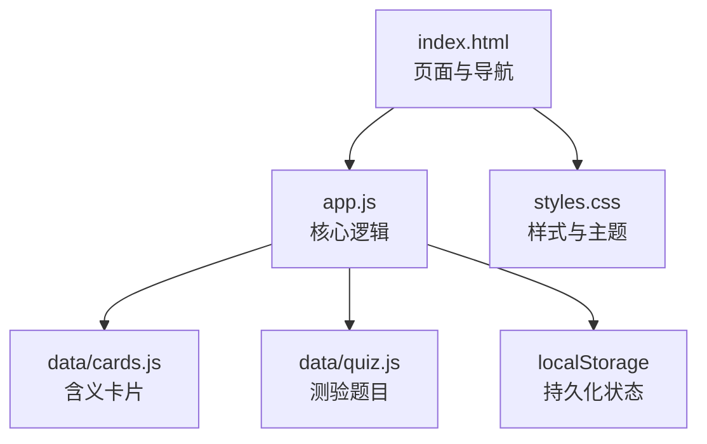
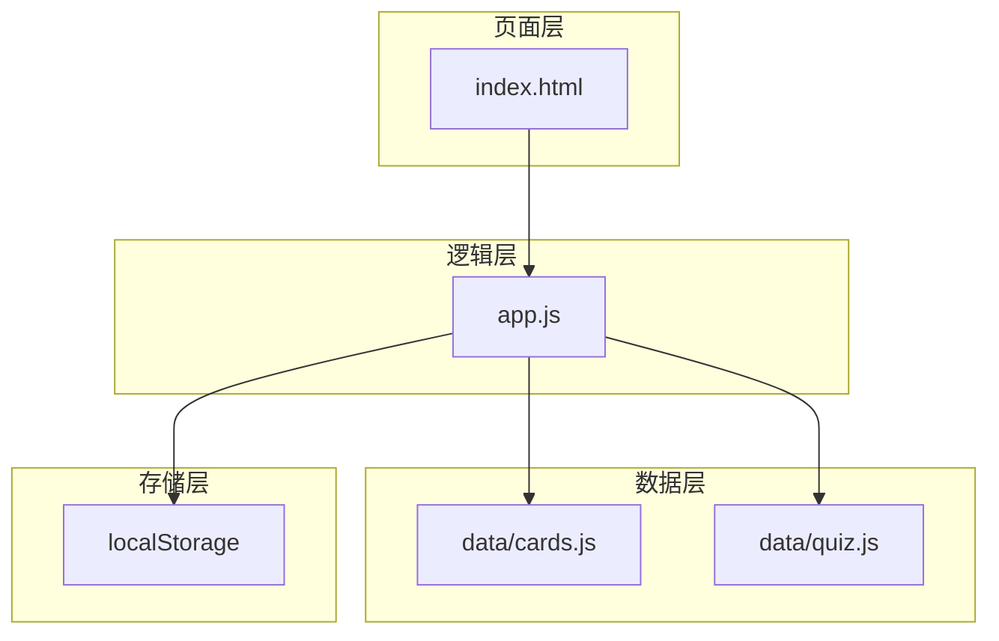
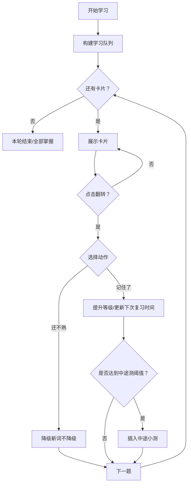
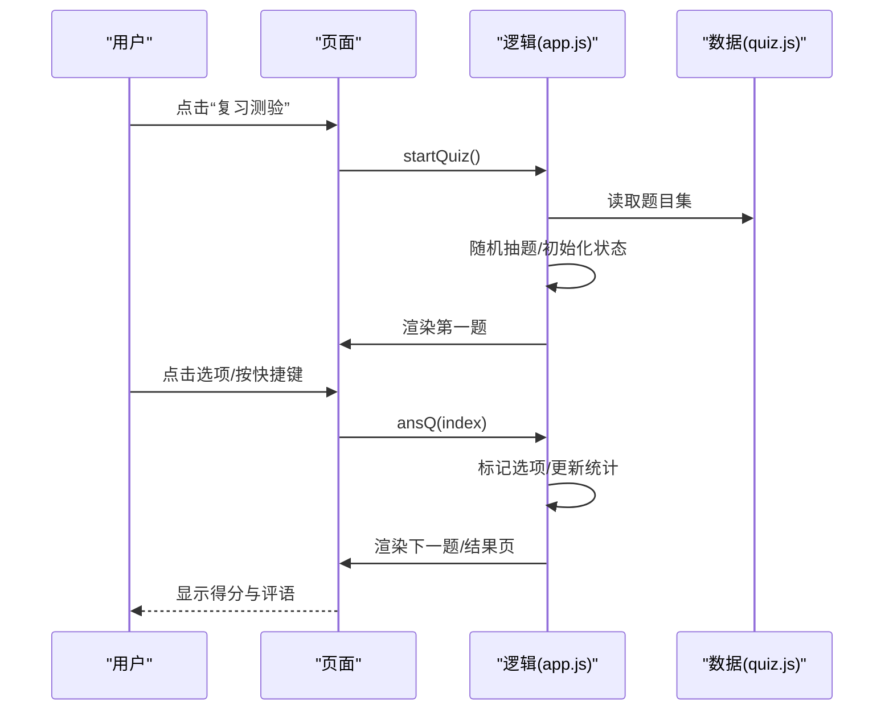
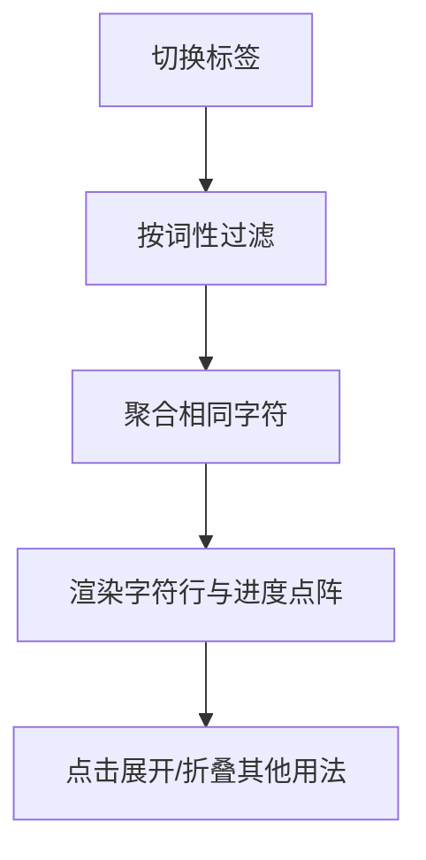
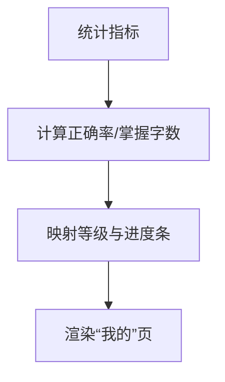
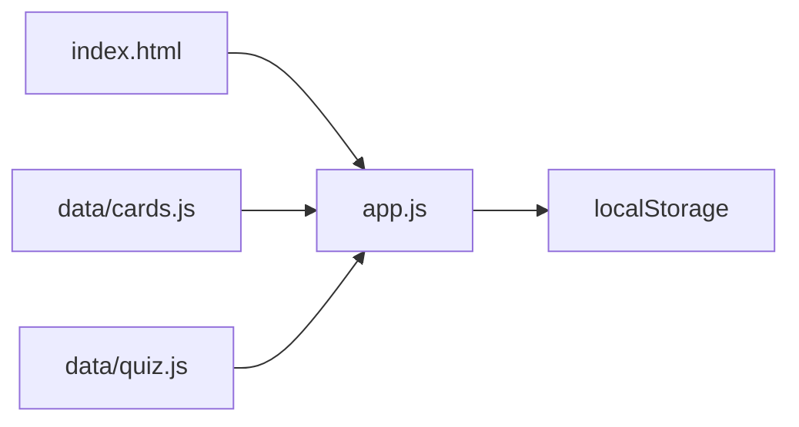

# 核心功能

<cite>
**本文引用的文件**
- [app.js](file://app.js)
- [index.html](file://index.html)
- [styles.css](file://styles.css)
- [data/cards.js](file://data/cards.js)
- [data/quiz.js](file://data/quiz.js)
</cite>

## 目录
1. [简介](#简介)
2. [项目结构](#项目结构)
3. [核心组件](#核心组件)
4. [架构总览](#架构总览)
5. [详细组件分析](#详细组件分析)
6. [依赖分析](#依赖分析)
7. [性能考量](#性能考量)
8. [故障排查指南](#故障排查指南)
9. [结论](#结论)
10. [附录](#附录)

## 简介
本应用面向文言文学习，围绕“学习系统（间隔重复）”、“测试系统（随机测验）”、“词库浏览（实词虚词分类查看）”、“个人统计（学习进度展示）”四大核心功能构建。系统采用纯前端实现，数据来源于本地资源文件，通过 localStorage 持久化用户状态与统计数据，提供流畅的学习体验与可视化进度反馈。

## 项目结构
- 前端页面与样式
  - index.html：页面骨架与导航、内容区域、模态框等
  - styles.css：主题变量、布局、交互样式与动画
- 功能逻辑
  - app.js：核心业务逻辑（学习队列、间隔重复、测验、词库、统计）
- 数据资源
  - data/cards.js：含义卡片集合（163张），包含字符、词性、例句、出处、释义、提示、其他用法等字段
  - data/quiz.js：随机测验题目集合（70题），每题含题干、语境句、出处、选项、答案索引

图表来源
- [index.html:1-115](file://index.html#L1-L115)
- [app.js:1-308](file://app.js#L1-L308)
- [data/cards.js:1-166](file://data/cards.js#L1-L166)
- [data/quiz.js:1-72](file://data/quiz.js#L1-L72)
- [styles.css:1-122](file://styles.css#L1-L122)

章节来源
- [index.html:1-115](file://index.html#L1-L115)
- [app.js:1-308](file://app.js#L1-L308)
- [data/cards.js:1-166](file://data/cards.js#L1-L166)
- [data/quiz.js:1-72](file://data/quiz.js#L1-L72)
- [styles.css:1-122](file://styles.css#L1-L122)

## 核心组件
- 学习系统（间隔重复）
  - 依据间隔重复算法动态构建学习队列，支持“全部/待复习/新词”过滤
  - 卡片翻转展示含义，提供“还不熟/记住了”评分
  - 定期插入中途小测，检验新学含义的记忆效果
- 测试系统（随机测验）
  - 随机抽取固定数量题目进行语境选义测验
  - 支持键盘快捷键答题，自动统计正确率与次数
- 词库浏览（实词虚词分类查看）
  - 按“全部/实词/虚词”筛选，按字符聚合显示学习进度与等级徽章
- 个人统计（学习进度展示）
  - 展示掌握字数、测验正确率、测验次数、等级进度条与称号

章节来源
- [app.js:3-308](file://app.js#L3-L308)
- [data/cards.js:1-166](file://data/cards.js#L1-L166)
- [data/quiz.js:1-72](file://data/quiz.js#L1-L72)

## 架构总览
系统采用“页面-逻辑-数据-存储”的分层：
- 页面层：index.html 提供导航与内容容器
- 逻辑层：app.js 实现学习、测验、浏览、统计与状态管理
- 数据层：data/cards.js 与 data/quiz.js 提供静态数据
- 存储层：localStorage 持久化用户状态与统计数据

图表来源
- [index.html:1-115](file://index.html#L1-L115)
- [app.js:1-308](file://app.js#L1-L308)
- [data/cards.js:1-166](file://data/cards.js#L1-L166)
- [data/quiz.js:1-72](file://data/quiz.js#L1-L72)

## 详细组件分析

### 学习系统（间隔重复）
- 间隔数组与等级名称/颜色映射
  - INT：各级间隔（毫秒）
  - LVL_NAME/LVL_CLR：等级名称与配色
- 状态与工具
  - R：用户学习状态（按卡片索引存储等级、下次复习时间、正确次数）
  - stats：全局统计（总题数、正确数）
  - save：持久化状态
  - dueCount/newCount/mastered：统计待复习、新词与掌握的核心字
- 学习队列构建
  - 过滤策略：全部/待复习/新词
  - 待复习与新词混合时采用三三混排打乱，保证复习优先与新鲜感
- 学习流程
  - startLearn → buildQueue → showCard → 用户交互（翻转/评分/跳过）
  - 评分规则：记住了提升等级并更新下次复习时间；跳过降级（新词不降级）
  - 达到一定新词数量后插入中途小测，检验记忆效果
- 关键函数路径
  - [buildQueue:58-68](file://app.js#L58-L68)
  - [startLearn:69-72](file://app.js#L69-L72)
  - [showCard:73-115](file://app.js#L73-L115)
  - [markOK:122-136](file://app.js#L122-L136)
  - [skipCard:137-142](file://app.js#L137-L142)
  - [dueCount/newCount/mastered/save:16-25](file://app.js#L16-L25)

图表来源
- [app.js:58-142](file://app.js#L58-L142)

章节来源
- [app.js:3-68](file://app.js#L3-L68)
- [app.js:69-142](file://app.js#L69-L142)

### 测试系统（随机测验）
- 随机抽题
  - 从 QUIZZES 中随机抽取固定数量题目组成测验池
- 答题流程
  - 渲染题目与选项，用户点击或按快捷键答题
  - 自动高亮正确/错误选项，累计得分与统计
  - 支持键盘 A/B/C/D 或数字键 1/2/3/4
- 结果展示
  - 显示得分、正确率与评语，支持重新开始或返回首页

图表来源
- [app.js:197-228](file://app.js#L197-L228)
- [data/quiz.js:1-72](file://data/quiz.js#L1-L72)

章节来源
- [app.js:197-228](file://app.js#L197-L228)
- [data/quiz.js:1-72](file://data/quiz.js#L1-L72)

### 词库浏览（实词虚词分类查看）
- 分类筛选
  - “全部/实词/虚词”，按词性过滤
- 字符聚合
  - 对同一字符的多个含义进行聚合，显示学习进度点阵与等级徽章
  - 点击字符可查看该字符的所有含义卡片
- 交互
  - 切换标签时重新渲染列表

图表来源
- [app.js:230-274](file://app.js#L230-L274)

章节来源
- [app.js:230-274](file://app.js#L230-L274)

### 个人统计（学习进度展示）
- 统计指标
  - 已学含义数、测验正确率、测验次数、已掌握核心字数
- 等级体系
  - 根据掌握核心字数映射到不同称号（如童生、秀才、举人等），并显示升级进度条
- 渲染
  - 在“我的”页展示各项指标与等级信息

图表来源
- [app.js:276-296](file://app.js#L276-L296)

章节来源
- [app.js:276-296](file://app.js#L276-L296)

## 依赖分析
- 模块耦合
  - app.js 依赖 window.CARDS 与 window.QUIZZES（由 data/*.js 注入）
  - app.js 依赖 localStorage 进行状态持久化
  - index.html 作为视图容器，通过事件绑定调用 app.js 方法
- 外部依赖
  - 无第三方库，纯前端实现
- 可能的循环依赖
  - 无循环依赖，数据注入在页面加载时完成

图表来源
- [index.html:110-112](file://index.html#L110-L112)
- [app.js:1](file://app.js#L1)
- [data/cards.js:1](file://data/cards.js#L1)
- [data/quiz.js:1](file://data/quiz.js#L1)

章节来源
- [index.html:110-112](file://index.html#L110-L112)
- [app.js:1-10](file://app.js#L1-L10)
- [data/cards.js:1](file://data/cards.js#L1)
- [data/quiz.js:1](file://data/quiz.js#L1)

## 性能考量
- 数据规模
  - 含义卡片约163张，测验题70题，数据量小，内存占用低
- DOM 操作
  - 学习与测验页面采用一次性渲染与局部更新，避免频繁重排
- 事件处理
  - 使用事件委托与最小化节点查询，减少开销
- 存储策略
  - localStorage 仅保存必要字段，避免序列化体积过大
- 建议
  - 若未来扩展至更大数据集，可考虑：
    - 将数据拆分为按字符分组的索引结构，加速筛选与聚合
    - 引入虚拟滚动以优化词库长列表渲染
    - 将 localStorage 访问合并为批量写入，减少 I/O 次数
    - 对测验池进行预洗牌，避免运行时排序成本

[本节为通用性能建议，不直接分析具体文件]

## 故障排查指南
- 学习队列为空
  - 检查过滤条件与 dueCount/newCount 计算逻辑
  - 确认 localStorage 中 R 是否存在异常
- 答题无响应
  - 检查键盘事件绑定与 qDone 状态
  - 确认选项元素 ID 与渲染一致
- 词库不刷新
  - 检查 libTab 与 renderLib 的标签切换逻辑
  - 确认按词性过滤与聚合逻辑
- 统计异常
  - 检查 stats.t/c 的累加时机与 save 调用
  - 确认 mastered 计算边界（掌握比例阈值）

章节来源
- [app.js:16-25](file://app.js#L16-L25)
- [app.js:299-304](file://app.js#L299-L304)
- [app.js:230-274](file://app.js#L230-L274)
- [app.js:276-296](file://app.js#L276-L296)

## 结论
本应用以简洁高效的前端架构实现了文言文学习的四大核心功能：基于间隔重复的学习系统、随机测验、词库浏览与个人统计。通过合理的数据组织与状态管理，系统在小规模数据下具备良好的性能与可维护性。建议在未来扩展时引入更精细的数据结构与渲染优化，以支撑更大规模的学习内容与更丰富的交互体验。

[本节为总结性内容，不直接分析具体文件]

## 附录
- 使用场景示例
  - 学习场景：每日启动“开始学习”，按“记住了/还不熟”评分，完成后可进入“复习测验”
  - 测验场景：点击“复习测验”进行随机 10 题测验，查看正确率与评语
  - 浏览场景：在“词库”页按“实词/虚词”筛选，查看字符聚合与等级进度
  - 统计场景：在“我的”页查看掌握字数、正确率、测验次数与等级进度
- 最佳实践
  - 保持 localStorage 写入频率合理，避免频繁 I/O
  - 在页面切换时清理定时器与事件监听，防止内存泄漏
  - 为移动端提供合适的触摸反馈与无障碍访问支持

[本节为概念性内容，不直接分析具体文件]