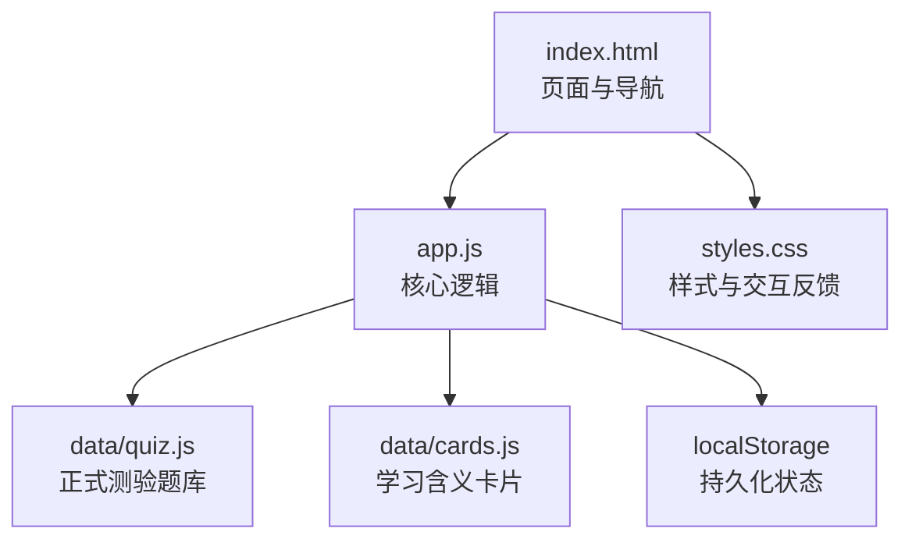
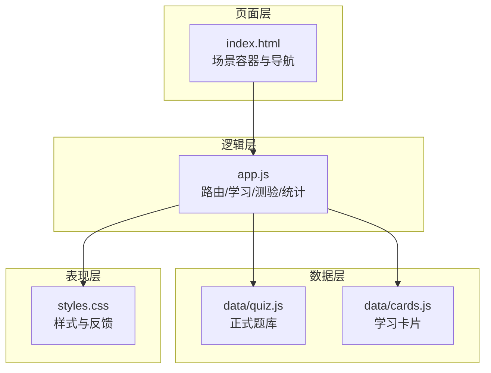
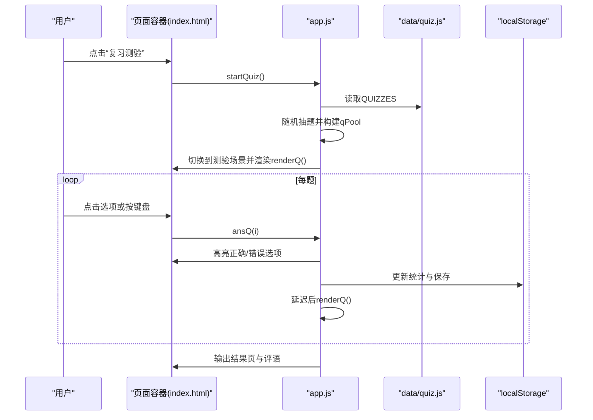
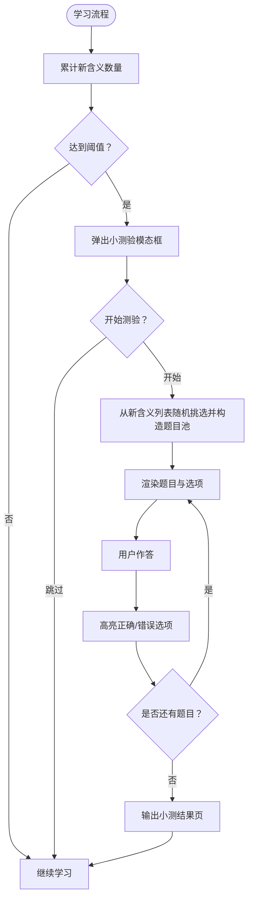
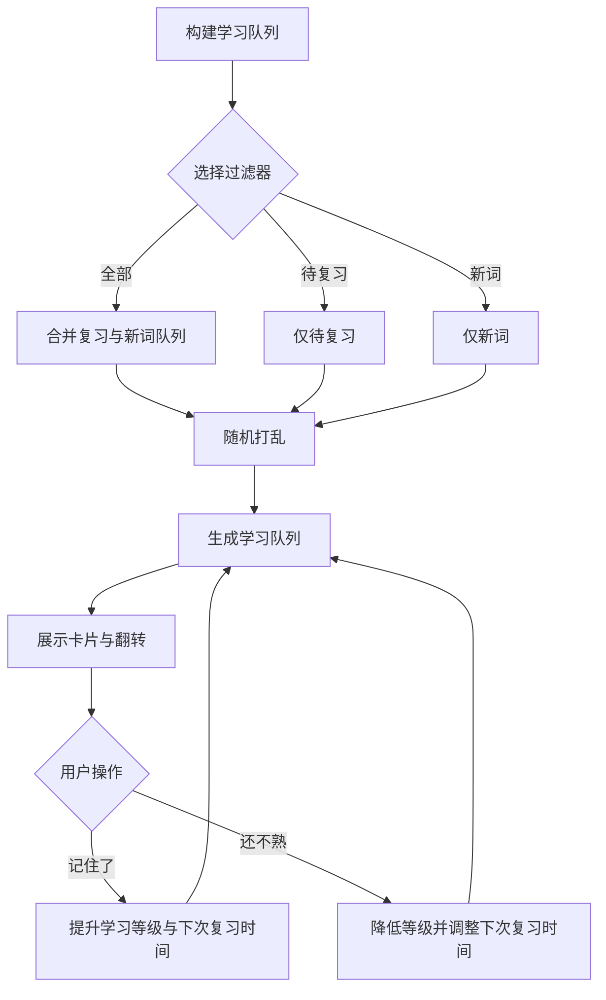
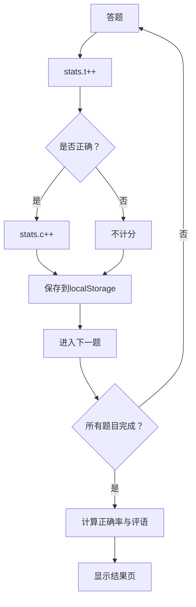
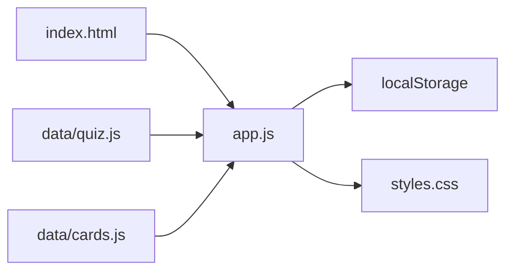

# 测试系统

<cite>
**本文档引用的文件**
- [app.js](file://app.js)
- [index.html](file://index.html)
- [styles.css](file://styles.css)
- [data/quiz.js](file://data/quiz.js)
- [data/cards.js](file://data/cards.js)
</cite>

## 目录
1. [简介](#简介)
2. [项目结构](#项目结构)
3. [核心组件](#核心组件)
4. [架构总览](#架构总览)
5. [详细组件分析](#详细组件分析)
6. [依赖关系分析](#依赖关系分析)
7. [性能考量](#性能考量)
8. [故障排查指南](#故障排查指南)
9. [结论](#结论)
10. [附录](#附录)

## 简介
本系统是一个面向文言文实词与虚词的测试与学习应用，支持“正式测验”和“中途测验”两种模式：
- 正式测验：从题库中随机抽取固定数量题目进行测试，提供实时评分与结果反馈。
- 中途测验：在学习过程中，当累计学到一定数量的新含义后，弹出小测验以即时检验记忆效果。

系统采用纯前端实现，使用本地存储持久化用户状态与统计数据；界面简洁直观，支持键盘快捷键答题。

## 项目结构
- app.js：核心业务逻辑，包括学习流程、两种测验模式、随机抽题、答案校验、评分统计与本地存储。
- index.html：页面骨架与导航，定义页面容器与交互入口。
- styles.css：样式定义，统一视觉风格与交互反馈。
- data/quiz.js：正式测验题库，包含题目、选项与正确答案。
- data/cards.js：学习含义卡片集合，用于“中途测验”的选项生成与学习展示。

图表来源
- [index.html:1-115](file://index.html#L1-L115)
- [app.js:1-308](file://app.js#L1-L308)
- [data/quiz.js:1-72](file://data/quiz.js#L1-L72)
- [data/cards.js:1-166](file://data/cards.js#L1-L166)
- [styles.css:1-122](file://styles.css#L1-L122)

章节来源
- [index.html:1-115](file://index.html#L1-L115)
- [app.js:1-308](file://app.js#L1-L308)
- [data/quiz.js:1-72](file://data/quiz.js#L1-L72)
- [data/cards.js:1-166](file://data/cards.js#L1-L166)
- [styles.css:1-122](file://styles.css#L1-L122)

## 核心组件
- 状态管理与持久化
  - 用户学习状态 R：记录每张卡片的学习等级、下次复习时间与正确次数。
  - 统计数据 stats：累计答题次数与正确次数。
  - 本地存储：通过统一保存函数将状态写入 localStorage。
- 随机抽题与题目池
  - 正式测验：从题库复制数组，随机排序后截取固定数量作为题目池。
  - 中途测验：从当前学习的新含义列表中随机挑选若干，构造题目池。
- 答案选项生成
  - 正式测验：直接使用题库中的选项。
  - 中途测验：以目标词的正确含义为主选项，再从该词的其他含义中选取若干作为干扰项，最后整体随机打乱。
- 答案校验与评分
  - 点击选项后，高亮正确与错误选项，更新统计并进入下一题。
  - 支持键盘快捷键答题（A/B/C/D 或 1/2/3/4）。
- 结果反馈与进度
  - 实时显示当前题号与进度条。
  - 完成后显示得分、正确率与等级化评语，并提供“再来一轮/回到首页”。

章节来源
- [app.js:9-16](file://app.js#L9-L16)
- [app.js:16](file://app.js#L16)
- [app.js:199-228](file://app.js#L199-L228)
- [app.js:151-195](file://app.js#L151-L195)
- [app.js:299-304](file://app.js#L299-L304)

## 架构总览
系统采用“页面容器 + 业务逻辑 + 数据源 + 样式”的分层设计：
- 页面容器：index.html 提供四个主场景（首页、学习、测验、词库、我的）与模态弹窗。
- 业务逻辑：app.js 负责路由切换、学习队列构建、测验流程、随机抽题、答案处理与统计。
- 数据源：data/quiz.js 与 data/cards.js 分别提供正式测验题库与学习卡片。
- 样式：styles.css 提供统一的视觉与交互反馈（如选项高亮、进度条等）。

图表来源
- [index.html:14-115](file://index.html#L14-L115)
- [app.js:1-308](file://app.js#L1-L308)
- [data/quiz.js:1-72](file://data/quiz.js#L1-L72)
- [data/cards.js:1-166](file://data/cards.js#L1-L166)
- [styles.css:1-122](file://styles.css#L1-L122)

## 详细组件分析

### 组件一：正式测验（startQuiz → renderQ → ansQ）
- 启动流程
  - startQuiz：复制题库数组，随机排序后截取固定数量作为 qPool，初始化索引与分数，切换到测验场景并渲染第一题。
- 渲染流程
  - renderQ：更新顶部题号提示，若题目遍历完毕则计算正确率并输出结果页；否则渲染题目卡片与选项列表。
- 答案处理
  - ansQ：标记正确与错误选项，更新统计与分数，延迟后进入下一题；支持键盘快捷键答题。

图表来源
- [app.js:199-228](file://app.js#L199-L228)
- [app.js:203-215](file://app.js#L203-L215)
- [app.js:216-228](file://app.js#L216-L228)
- [data/quiz.js:1-72](file://data/quiz.js#L1-L72)

章节来源
- [app.js:199-228](file://app.js#L199-L228)
- [app.js:203-215](file://app.js#L203-L215)
- [app.js:216-228](file://app.js#L216-L228)
- [data/quiz.js:1-72](file://data/quiz.js#L1-L72)

### 组件二：中途测验（学习流程触发 → 小测弹窗 → doMidQuiz → showMidQuizQ → mAnsQ）
- 触发条件
  - 在学习过程中，当累计学到一定数量的新含义后，弹出“小测验时间！”模态框。
- 题目池构建
  - 从当前学习的新含义列表中随机挑选若干，构造题目池；每个题目包含目标词、例句、出处与选项。
- 选项生成
  - 以正确含义为主选项，再从该词的其他含义中选取若干作为干扰项，最后整体随机打乱。
- 答案处理
  - 点击选项后高亮正确与错误选项，更新统计与分数，延迟后进入下一题；完成后输出小测结果页。

图表来源
- [app.js:145-195](file://app.js#L145-L195)
- [app.js:151-164](file://app.js#L151-L164)
- [app.js:165-195](file://app.js#L165-L195)
- [index.html:95-106](file://index.html#L95-L106)

章节来源
- [app.js:145-195](file://app.js#L145-L195)
- [app.js:151-164](file://app.js#L151-L164)
- [app.js:165-195](file://app.js#L165-L195)
- [index.html:95-106](file://index.html#L95-L106)

### 组件三：学习与轮换策略
- 学习队列构建
  - 支持三种过滤：全部、待复习、新词；按“复习优先、新词次之”的策略合并队列，确保复习优先。
- 卡片展示与翻转
  - 展示字符、例句、出处与提示；点击后翻转显示含义与要点。
- 记忆强度与复习计划
  - 通过学习等级与下次复习时间控制轮换节奏，实现间隔重复。

图表来源
- [app.js:58-68](file://app.js#L58-L68)
- [app.js:69-142](file://app.js#L69-L142)
- [app.js:116-142](file://app.js#L116-L142)

章节来源
- [app.js:58-68](file://app.js#L58-L68)
- [app.js:69-142](file://app.js#L69-L142)
- [app.js:116-142](file://app.js#L116-L142)

### 组件四：评分统计与结果反馈
- 统计字段
  - stats.t：累计答题次数；stats.c：累计正确次数。
- 反馈机制
  - 正式测验与中途测验均在完成后计算正确率并给出等级化评语；支持“再来一轮/回到首页”等后续操作。
- 键盘快捷键
  - 支持 A/B/C/D 或 1/2/3/4 直接答题，提升效率。

图表来源
- [app.js:184-194](file://app.js#L184-L194)
- [app.js:217-227](file://app.js#L217-L227)
- [app.js:299-304](file://app.js#L299-L304)

章节来源
- [app.js:184-194](file://app.js#L184-L194)
- [app.js:217-227](file://app.js#L217-L227)
- [app.js:299-304](file://app.js#L299-L304)

## 依赖关系分析
- 模块耦合
  - app.js 依赖 data/quiz.js 与 data/cards.js 提供的数据；依赖 index.html 的 DOM 结构与事件绑定；依赖 styles.css 的样式与交互反馈。
- 外部依赖
  - 使用浏览器原生 localStorage 进行状态持久化；使用原生 JavaScript 实现随机抽题与 DOM 操作。
- 潜在循环依赖
  - 无明显循环依赖；页面与逻辑分离清晰。

图表来源
- [index.html:1-115](file://index.html#L1-L115)
- [app.js:1-308](file://app.js#L1-L308)
- [data/quiz.js:1-72](file://data/quiz.js#L1-L72)
- [data/cards.js:1-166](file://data/cards.js#L1-L166)
- [styles.css:1-122](file://styles.css#L1-L122)

章节来源
- [index.html:1-115](file://index.html#L1-L115)
- [app.js:1-308](file://app.js#L1-L308)
- [data/quiz.js:1-72](file://data/quiz.js#L1-L72)
- [data/cards.js:1-166](file://data/cards.js#L1-L166)
- [styles.css:1-122](file://styles.css#L1-L122)

## 性能考量
- 随机抽题复杂度
  - 正式测验：复制数组 + 随机排序 + 截取，时间复杂度 O(n log n) + O(k)，空间复杂度 O(n)。
  - 中途测验：从新含义列表中随机挑选并构造题目池，时间复杂度 O(n) + O(k)。
- DOM 操作
  - 渲染与高亮选项采用最小化更新策略，避免不必要的重排。
- 本地存储
  - 仅在答题与学习操作后保存，减少频繁写入。

[本节为通用性能建议，无需特定文件来源]

## 故障排查指南
- 无法进入测验
  - 检查是否正确引入 data/quiz.js 与 app.js；确认 index.html 中的脚本加载顺序。
- 题库为空
  - 确认 data/quiz.js 是否正确导出窗口变量；检查浏览器控制台是否有语法错误。
- 选项不显示
  - 检查 renderQ 与 showMidQuizQ 的 DOM 插入逻辑；确认 q-opts 容器存在。
- 无法保存进度
  - 检查 localStorage 权限与容量；确认 save 函数调用时机。
- 键盘无效
  - 确认事件监听绑定在正确元素上；避免重复绑定导致冲突。

章节来源
- [index.html:110-112](file://index.html#L110-L112)
- [app.js:16](file://app.js#L16)
- [app.js:203-215](file://app.js#L203-L215)
- [app.js:165-181](file://app.js#L165-L181)
- [app.js:299-304](file://app.js#L299-L304)

## 结论
本系统通过清晰的模块划分与简洁的前端实现，提供了高效的文言文测试体验。正式测验与中途测验分别服务于系统性复习与即时巩固，配合随机抽题与选项生成逻辑，有效提升了学习效果与记忆强度。建议在未来版本中扩展更多题型与难度分级，并增加错题回顾与学习路径规划功能。

[本节为总结性内容，无需特定文件来源]

## 附录

### A. 代码实现分析要点
- startQuiz() 的题目随机抽取
  - 通过复制题库数组并随机排序后截取固定数量，确保每次测验的题目组合不同。
  - 参考路径：[app.js:199-201](file://app.js#L199-L201)
- renderQ() 的界面渲染逻辑
  - 动态更新题号与题目卡片，渲染选项列表；完成时输出结果页与评语。
  - 参考路径：[app.js:203-215](file://app.js#L203-L215)
- ansQ() 的答案验证处理
  - 高亮正确与错误选项，更新统计与分数，延迟后进入下一题。
  - 参考路径：[app.js:216-228](file://app.js#L216-L228)

### B. 测试效果评估方法与学习成果检验标准
- 正确率阈值
  - 优秀：≥80%
  - 良好：60%-79%
  - 待加强：<60%
- 成长指标
  - “字已掌握”数量占比与“测验正确率”综合评估学习成效。
- 反馈与激励
  - 根据正确率输出等级化评语，鼓励持续学习。

章节来源
- [app.js:206-210](file://app.js#L206-L210)
- [app.js:170-173](file://app.js#L170-L173)
- [app.js:277-296](file://app.js#L277-L296)