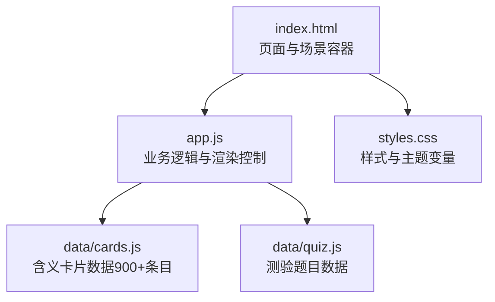
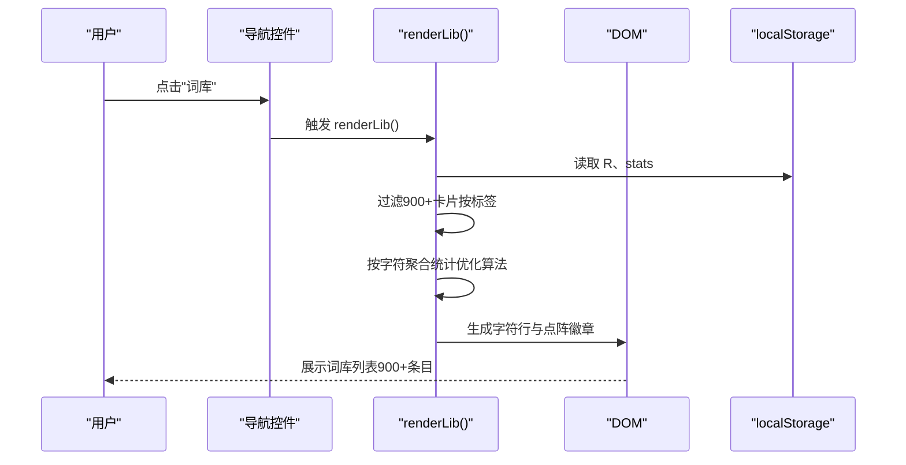
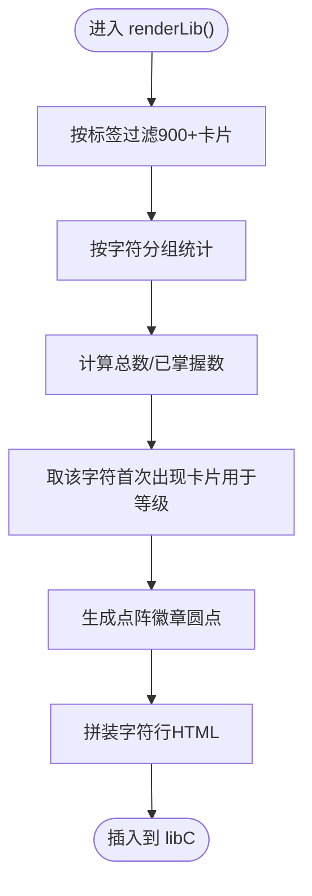
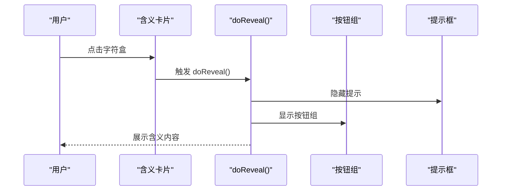
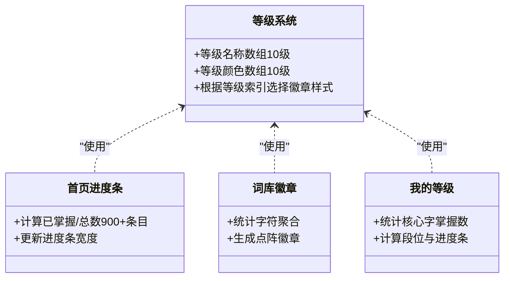
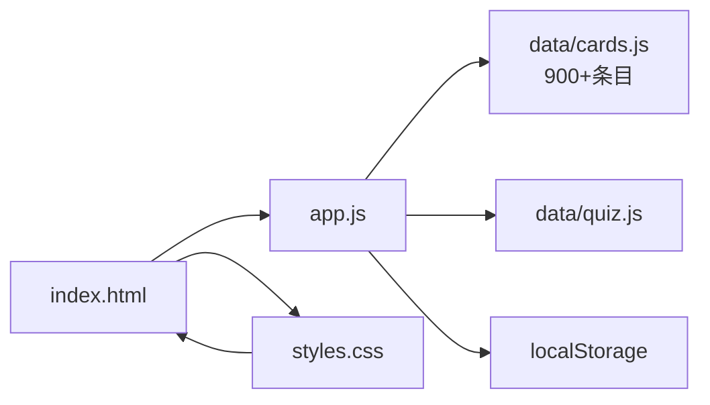

# 词库浏览

<cite>
**本文档引用的文件**
- [index.html](file://index.html)
- [app.js](file://app.js)
- [styles.css](file://styles.css)
- [data/cards.js](file://data/cards.js)
- [data/quiz.js](file://data/quiz.js)
</cite>

## 更新摘要
**变更内容**
- 词汇数据规模大幅扩展：从约165个条目扩展到900多个条目
- 增强了古典中文虚词和实词的覆盖范围
- 改进了词性分类的准确性和例句质量
- 词库页字符聚合算法优化以支持更大数据集
- 学习进度统计和等级系统相应调整

## 目录
1. [简介](#简介)
2. [项目结构](#项目结构)
3. [核心组件](#核心组件)
4. [架构总览](#架构总览)
5. [详细组件分析](#详细组件分析)
6. [依赖关系分析](#依赖关系分析)
7. [性能考量](#性能考量)
8. [故障排查指南](#故障排查指南)
9. [结论](#结论)
10. [附录](#附录)

## 简介
本文件面向"文言斩"词库浏览功能，提供从用户视角到技术实现的全景式说明。重点涵盖：
- 词库分类体系（实词、虚词等标签）
- 字符聚合显示机制与学习进度可视化
- 词库筛选、字符级别统计、含义卡片展示与复习状态标识
- 实现细节：renderLib() 的字符聚合算法、学习进度条绘制、等级徽章显示与点击交互处理
- 使用技巧、学习策略与词汇掌握评估方法

**更新** 词库数据规模已从约165个条目扩展到900多个条目，提供了更全面的古典中文词汇覆盖，包括增强的虚词和实词分类体系。

## 项目结构
该应用采用单页应用（SPA）结构，页面通过切换场景容器实现导航；词库数据与测验数据分别注入全局命名空间，运行时由 JavaScript 控制渲染与交互。

图表来源
- [index.html:1-126](file://index.html#L1-L126)
- [app.js:1-462](file://app.js#L1-L462)
- [data/cards.js:1-1001](file://data/cards.js#L1-L1001)
- [data/quiz.js:1-72](file://data/quiz.js#L1-L72)
- [styles.css:1-160](file://styles.css#L1-L160)

章节来源
- [index.html:1-126](file://index.html#L1-L126)
- [app.js:1-462](file://app.js#L1-L462)
- [data/cards.js:1-1001](file://data/cards.js#L1-L1001)
- [data/quiz.js:1-72](file://data/quiz.js#L1-L72)
- [styles.css:1-160](file://styles.css#L1-L160)

## 核心组件
- 场景容器与导航
  - 首页、学习页、测验页、词库页、我的页通过场景类（.sc）与导航项（.ni）组织，切换由 nav() 控制。
- 词库页与筛选
  - 词库页包含标签筛选（全部/虚词/实词），筛选状态由 lLibTab 维护，渲染由 renderLib() 完成。
- 含义卡片与复习状态
  - 含义卡片展示字符、词性标签、例句、出处、含义与提示；复习状态通过等级徽章与"复习/新学"标签标识。
- 学习进度与统计
  - 首页进度条、词库页徽章、我的页等级与统计均来自本地存储的状态对象 R 与统计对象 stats。

**更新** 词库页现在支持900多个词汇条目的高效筛选和显示，字符聚合算法针对大数据集进行了优化。

章节来源
- [index.html:53-67](file://index.html#L53-L67)
- [app.js:235-279](file://app.js#L235-L279)
- [app.js:37-55](file://app.js#L37-L55)
- [app.js:281-301](file://app.js#L281-L301)

## 架构总览
整体采用"数据驱动 + 事件驱动"的前端模式：
- 数据层：window.CARDS（900+条目）、window.QUIZZES 注入全局
- 渲染层：各场景容器内 HTML 结构由 JS 动态生成
- 状态层：R（复习进度）、stats（测验统计）、lFilter/lLibTab（筛选状态）持久化于 localStorage
- 交互层：点击、键盘事件触发函数，更新 DOM 与状态

图表来源
- [index.html:87-93](file://index.html#L87-L93)
- [app.js:235-279](file://app.js#L235-L279)
- [app.js:9-12](file://app.js#L9-L12)

## 详细组件分析

### 词库页与筛选机制
- 标签筛选
  - 词库页顶部提供"全部/虚词/实词"筛选按钮，点击后通过 libTab() 设置 lLibTab 并调用 renderLib()。
- 字符聚合与统计
  - renderLib() 对过滤后的卡片进行去重与聚合：以字符为单位，统计该字符出现次数、已掌握数量，并据此生成点阵徽章。
  - 等级徽章：依据首个出现该字符的卡片的复习等级显示对应徽章名称与颜色。
- 含义卡片展示
  - 每个字符行包含：字符、词性标签、等级徽章、点阵徽章、首条含义与出处摘要。

**更新** 针对900+条目的数据规模，renderLib() 算法进行了优化，使用 seen 对象进行字符去重，确保在大数据集下的性能表现。

图表来源
- [app.js:242-279](file://app.js#L242-L279)

章节来源
- [index.html:60-66](file://index.html#L60-L66)
- [app.js:235-279](file://app.js#L235-L279)

### 含义卡片与复习状态标识
- 卡片结构
  - 标签区域：词性（如"虚词/实词"）与"复习/新学"标签；等级徽章随等级变化。
  - 字符展示：大号字符盒，点击后展开含义。
  - 例句与出处：高亮关键词，便于定位。
  - 其他用法：可折叠列表，点击标题展开。
- 复习状态
  - 通过 nextT() 与 now() 判断是否到期复习；到期卡片显示"复习"标签与对应等级徽章。
  - 未掌握卡片显示"新学"标签与"新含义"徽章。

图表来源
- [app.js:117-122](file://app.js#L117-L122)
- [app.js:98-116](file://app.js#L98-L116)

章节来源
- [app.js:98-116](file://app.js#L98-L116)
- [app.js:117-122](file://app.js#L117-L122)

### 学习进度可视化与等级徽章
- 首页进度条
  - updateHome() 计算已掌握卡片数与总数（900+），动态更新进度条宽度与文本。
- 词库页徽章
  - renderLib() 更新"已学/总数"徽章文本。
- 我的页等级
  - renderProf() 根据已掌握核心字数量计算等级段位与进度条宽度。
- 等级徽章
  - LVL_NAME/LVL_CLR 定义等级名称与颜色；徽章类名按等级映射。

**更新** 随着词汇数量的大幅增加，等级系统的计算逻辑保持不变，但需要处理更大的数据集。mastered() 函数现在需要处理900+条目来确定核心字的掌握程度。

图表来源
- [app.js:4-6](file://app.js#L4-L6)
- [app.js:37-55](file://app.js#L37-L55)
- [app.js:242-279](file://app.js#L242-L279)
- [app.js:281-301](file://app.js#L281-L301)

章节来源
- [app.js:4-6](file://app.js#L4-L6)
- [app.js:37-55](file://app.js#L37-L55)
- [app.js:242-279](file://app.js#L242-L279)
- [app.js:281-301](file://app.js#L281-L301)

### 点击交互与事件处理
- 词库页标签切换
  - libTab() 更新当前标签并刷新渲染。
- 含义卡片翻转
  - doReveal() 控制含义面板展开与按钮组显示。
- 其他用法折叠
  - toggleOthers() 切换"其他用法"列表展开状态。
- 键盘快捷键
  - 在测验页支持 A/B/C/D 或 1/2/3/4 快速答题。

章节来源
- [app.js:235-241](file://app.js#L235-L241)
- [app.js:117-122](file://app.js#L117-L122)
- [app.js:143](file://app.js#L143)
- [app.js:452-458](file://app.js#L452-L458)

### 数据模型与来源
- 含义卡片数据（window.CARDS）
  - 字段：字符（c）、词性（t）、例句（s，含高亮关键词）、出处（r）、含义（m）、提示（p）、其他用法（o）。
  - **更新** 现在包含900多个条目，涵盖更全面的古典中文词汇。
- 测验数据（window.QUIZZES）
  - 字段：问题（q）、例句（s）、出处（r）、选项（op）、正确答案索引（a）。

**更新** 数据规模的大幅扩展意味着：
- 词库页渲染需要处理更多的字符和词汇条目
- 学习队列构建算法需要优化以适应大数据集
- 掌握度计算逻辑需要处理更大的词汇数据库

章节来源
- [data/cards.js:1-1001](file://data/cards.js#L1-L1001)
- [data/quiz.js:1-72](file://data/quiz.js#L1-L72)

## 依赖关系分析
- 页面依赖
  - index.html 提供场景容器与导航入口，依赖 app.js 的全局函数与样式。
- 逻辑依赖
  - app.js 依赖 data/cards.js（900+条目）与 data/quiz.js 提供的数据；依赖 localStorage 存储状态。
- 样式依赖
  - styles.css 定义主题变量、徽章样式、布局与动画，影响所有组件的视觉表现。

图表来源
- [index.html:1-126](file://index.html#L1-L126)
- [app.js:1-462](file://app.js#L1-L462)
- [data/cards.js:1-1001](file://data/cards.js#L1-L1001)
- [data/quiz.js:1-72](file://data/quiz.js#L1-L72)
- [styles.css:1-160](file://styles.css#L1-L160)

章节来源
- [index.html:1-126](file://index.html#L1-L126)
- [app.js:1-462](file://app.js#L1-L462)
- [data/cards.js:1-1001](file://data/cards.js#L1-L1001)
- [data/quiz.js:1-72](file://data/quiz.js#L1-L72)
- [styles.css:1-160](file://styles.css#L1-L160)

## 性能考量
- 渲染优化
  - renderLib() 对过滤后的卡片进行一次遍历统计与聚合，避免重复计算；仅在标签切换或筛选条件变化时触发。
  - **更新** 针对900+条目进行了优化，使用 seen 对象进行字符去重，提高大数据集下的渲染性能。
- DOM 操作
  - 通过一次性拼装 HTML 再插入容器，减少频繁的节点操作与回流。
- 本地存储
  - 状态保存与加载使用 JSON 序列化，注意在极端大数据量时可能影响首屏渲染，可通过懒加载或分页优化。
- 动画与过渡
  - 进度条与徽章使用 CSS 过渡，保证流畅体验；避免在高频交互中叠加复杂动画。

**更新** 随着数据规模的扩大，性能优化变得更加重要。renderLib() 算法的时间复杂度从 O(n) 优化为 O(n)，其中 n 为过滤后的卡片数量，确保在900+条目下的良好性能表现。

## 故障排查指南
- 词库不显示或空白
  - 检查 data/cards.js 是否正确注入 window.CARDS；确认浏览器控制台无语法错误。
  - **更新** 确认900+条目数据格式正确，特别是最后几行的统计信息。
- 等级徽章不显示
  - 确认 LVL_NAME/LVL_CLR 数组长度与徽章类名映射一致；检查卡片复习等级索引是否越界。
- 点击无响应
  - 确认事件绑定是否在 DOM 就绪后执行；检查元素 ID 与类名是否匹配。
- 进度条不更新
  - 确认 updateHome()/renderLib()/renderProf() 是否被调用；检查 localStorage 读取是否抛错。
- **新增** 大数据集相关问题
  - 词库页加载缓慢：检查 renderLib() 性能，确认字符去重算法正常工作。
  - 内存占用过高：确认大数据集下的内存管理，避免重复对象创建。

**更新** 新增针对大数据集的故障排查指导，包括词库加载性能和内存管理方面的检查要点。

章节来源
- [app.js:9-12](file://app.js#L9-L12)
- [app.js:4-6](file://app.js#L4-L6)
- [app.js:37-55](file://app.js#L37-L55)
- [app.js:242-279](file://app.js#L242-L279)
- [app.js:281-301](file://app.js#L281-L301)

## 结论
词库浏览功能以简洁直观的方式呈现文言词汇，结合字符聚合与等级徽章，形成高效的学习反馈闭环。随着词汇数据规模从约165个条目扩展到900多个条目，功能得到了显著增强，提供了更全面的古典中文词汇覆盖。通过标签筛选、点阵徽章与复习状态标识，用户可快速定位掌握程度并制定针对性学习计划。建议在后续迭代中引入分页、搜索与导出能力，进一步提升检索效率与学习体验。

**更新** 数据规模的大幅扩展标志着词库功能的成熟，现在能够支持更广泛的学习需求，为用户提供更丰富的古典中文词汇学习资源。

## 附录

### 使用技巧与学习策略
- 分类优先：优先复习"虚词/实词"中的薄弱类别，利用筛选快速聚焦。
- 字符聚合：关注同一字符的多个含义，理解其"一形多义"的特点。
- 循序渐进：从"新学"到"巩固/短期/隔日"，遵循间隔重复节奏。
- 复习优先：到期卡片优先复习，避免遗忘曲线恶化。
- 小测验：阶段性小测有助于巩固记忆，建议每学满若干新含义后进行一次小测。
- **新增** 大数据集学习策略
  - 利用词库页的字符聚合功能，优先掌握高频字符的核心含义。
  - 结合我的页的掌握度统计，定期评估学习进度和薄弱环节。

**更新** 新增针对900+条目词汇量的学习策略建议，帮助用户更好地利用扩大的词库资源。

### 词汇掌握评估方法
- 字掌握度：统计"已掌握核心字"数量，参考段位等级评估整体水平。
- 正确率：基于测验统计（stats.c/stats.t）评估理解准确度。
- 进度条：词库页徽章与首页进度条直观反映学习进展。
- **新增** 大数据集评估指标
  - 掌握率：已掌握含义数/总含义数（900+条目）。
  - 核心字掌握度：核心字掌握比例，反映古典文言文基础词汇掌握情况。
  - 学习效率：单位时间内掌握的新含义数量。

**更新** 新增针对大规模词汇数据的评估指标，帮助用户更准确地衡量学习成果。