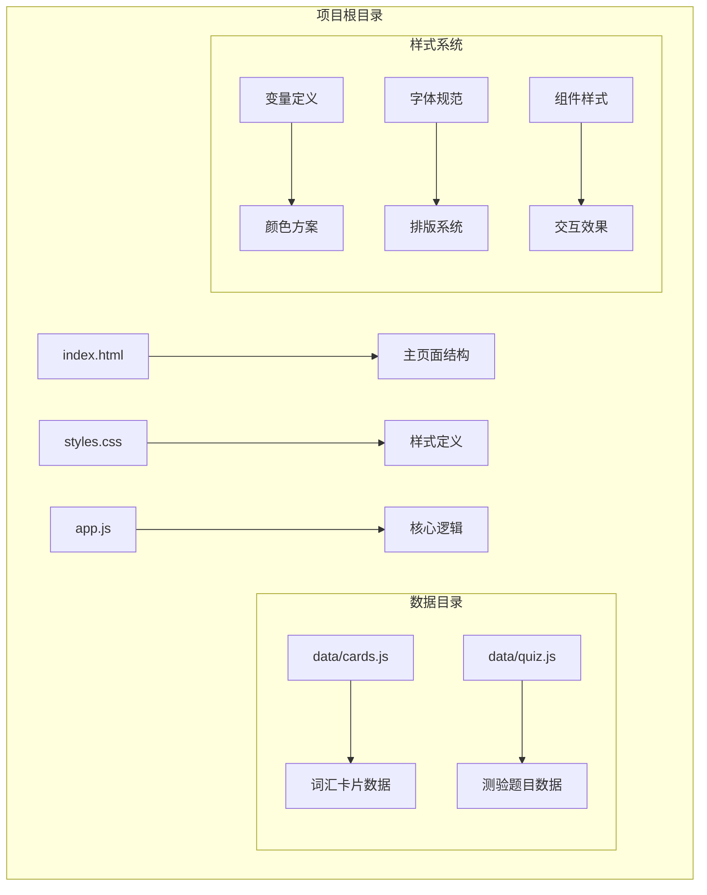
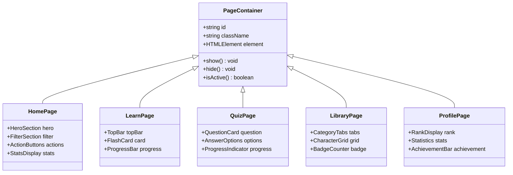
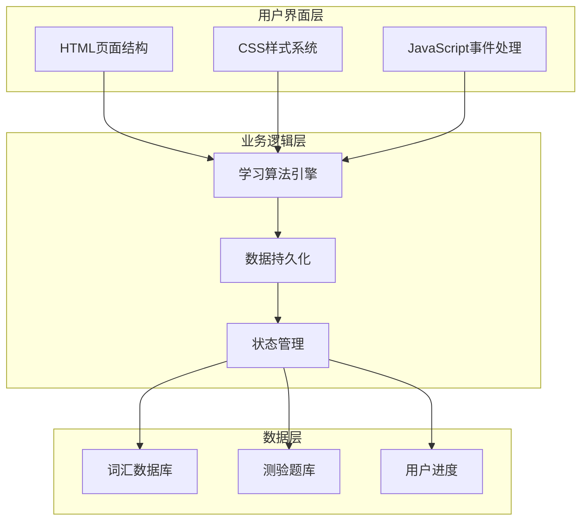
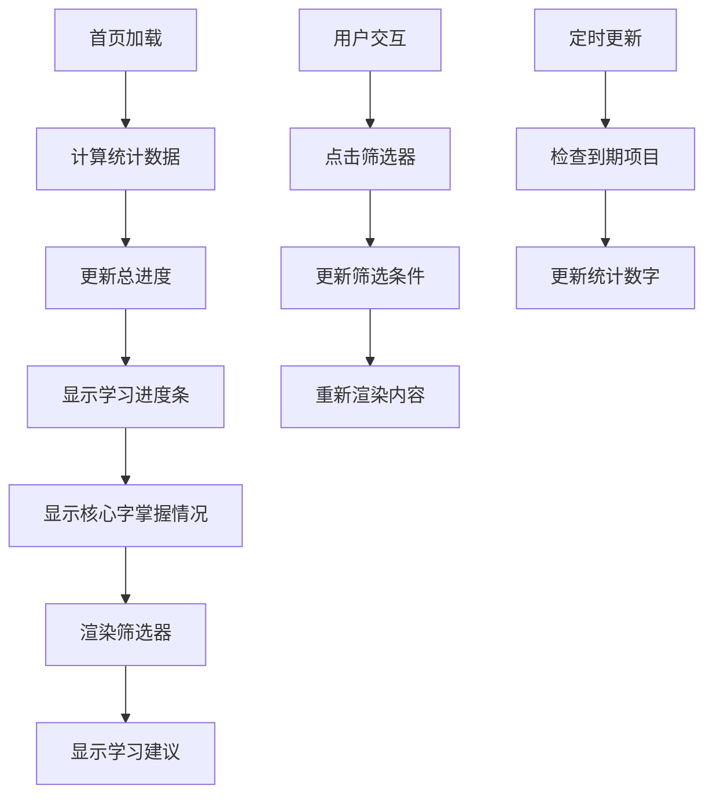
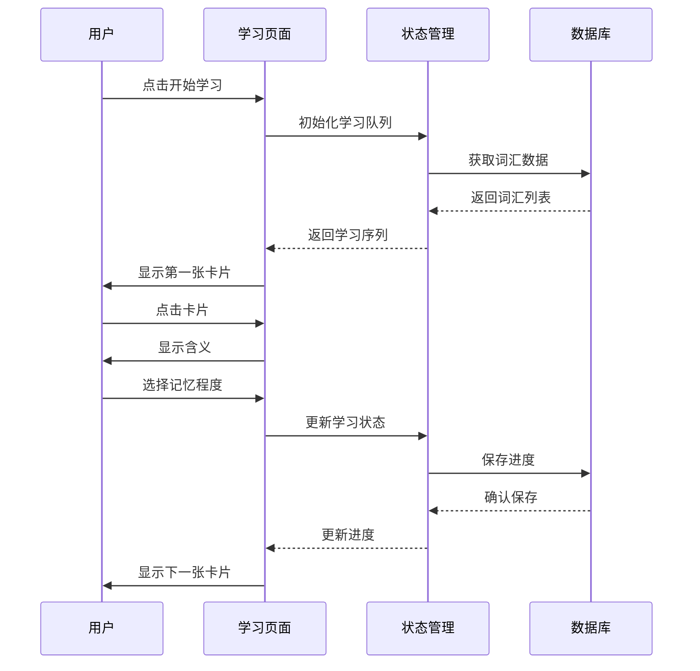
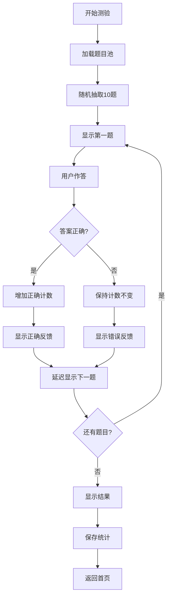
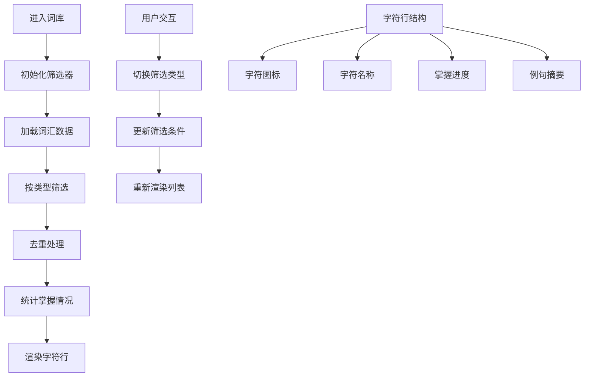
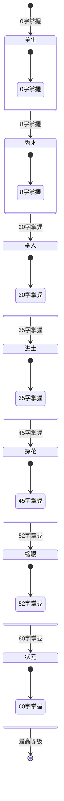
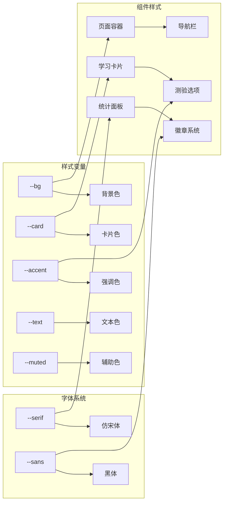
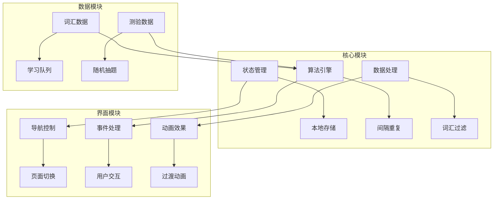

# 用户界面

<cite>
**本文档引用的文件**
- [index.html](file://index.html)
- [styles.css](file://styles.css)
- [app.js](file://app.js)
- [cards.js](file://data/cards.js)
- [quiz.js](file://data/quiz.js)
</cite>

## 目录
1. [简介](#简介)
2. [项目结构](#项目结构)
3. [核心组件](#核心组件)
4. [架构概览](#架构概览)
5. [详细组件分析](#详细组件分析)
6. [依赖关系分析](#依赖关系分析)
7. [性能考虑](#性能考虑)
8. [故障排除指南](#故障排除指南)
9. [结论](#结论)

## 简介

文言文学习应用是一个专为中文文言文学习设计的移动优先教育应用程序。该应用采用渐进式增强的设计理念，通过简洁直观的界面和科学的记忆算法，帮助用户高效掌握文言文字词知识。

应用的核心特色包括：
- 基于间隔重复算法的学习系统
- 响应式布局设计，完美适配移动端设备
- 直观的导航系统和交互体验
- 丰富的视觉层次和品牌色彩体系
- 无障碍访问支持和键盘快捷键

## 项目结构

该项目采用了模块化的文件组织结构，将不同类型的资源分离到专门的文件中：

**图表来源**
- [index.html:1-115](file://index.html#L1-L115)
- [styles.css:1-122](file://styles.css#L1-L122)
- [app.js:1-308](file://app.js#L1-L308)

**章节来源**
- [index.html:1-115](file://index.html#L1-L115)
- [styles.css:1-122](file://styles.css#L1-L122)
- [app.js:1-308](file://app.js#L1-L308)

## 核心组件

### 页面容器系统

应用采用统一的页面容器设计，每个功能页面都是一个独立的容器：

**图表来源**
- [index.html:14-84](file://index.html#L14-L84)
- [styles.css:11-122](file://styles.css#L11-L122)

### 导航系统

应用实现了底部导航栏，提供五个主要功能区域：

| 导航项 | 图标 | 标签 | 功能描述 |
|--------|------|------|----------|
| 首页 | 🏠 | home | 显示学习统计和快速入口 |
| 学习 | 📖 | learn | 进入词汇学习模式 |
| 测验 | ⚔️ | quiz | 参加随机测验 |
| 词库 | 📚 | lib | 查看词汇列表 |
| 我的 | 👤 | prof | 查看个人进度 |

**章节来源**
- [index.html:86-93](file://index.html#L86-L93)
- [app.js:28-35](file://app.js#L28-L35)

## 架构概览

应用采用MVVM架构模式，通过JavaScript控制DOM操作和状态管理：

**图表来源**
- [app.js:1-308](file://app.js#L1-L308)
- [cards.js:1-166](file://data/cards.js#L1-L166)
- [quiz.js:1-72](file://data/quiz.js#L1-L72)

## 详细组件分析

### 首页组件

首页是用户的主要入口，提供了全面的学习概览：

#### 统计面板设计

**图表来源**
- [app.js:38-54](file://app.js#L38-L54)
- [index.html:20-31](file://index.html#L20-L31)

#### 统计指标说明

| 指标类型 | 计算方式 | 显示格式 | 更新时机 |
|----------|----------|----------|----------|
| 总学习进度 | 已掌握词汇数/总词汇数 | 数字百分比 | 页面加载和学习后 |
| 核心字掌握 | 掌握的核心字数量/60 | 数字格式 | 页面加载和学习后 |
| 待复习数量 | 到期复习的词汇数 | 数字格式 | 页面加载和学习后 |
| 新词数量 | 未掌握的词汇数 | 数字格式 | 页面加载和学习后 |

**章节来源**
- [app.js:38-54](file://app.js#L38-L54)
- [index.html:20-31](file://index.html#L20-L31)

### 学习页面组件

学习页面采用闪卡模式，提供沉浸式的学习体验：

#### 闪卡交互流程

**图表来源**
- [app.js:69-142](file://app.js#L69-L142)
- [index.html:33-41](file://index.html#L33-L41)

#### 闪卡组件结构

| 组件元素 | 样式类名 | 功能描述 | 交互行为 |
|----------|----------|----------|----------|
| 标签区域 | `.fc-tag` | 显示词汇类型和学习阶段 | 固定显示 |
| 字母展示 | `.fc-char-box` | 主要学习字符 | 点击翻转 |
| 例句展示 | `.fc-sent` | 文言文例句 | 固定显示 |
| 来源标注 | `.fc-src` | 出处信息 | 固定显示 |
| 含义区域 | `.fc-meaning` | 词汇含义和解析 | 点击触发 |
| 操作按钮 | `.fc-btns` | 记忆确认按钮 | 点击显示 |

**章节来源**
- [app.js:98-142](file://app.js#L98-L142)
- [styles.css:40-65](file://styles.css#L40-L65)

### 测验页面组件

测验页面提供随机测试功能，检验学习效果：

#### 测验流程设计

**图表来源**
- [app.js:198-228](file://app.js#L198-L228)
- [index.html:43-51](file://index.html#L43-L51)

#### 测验界面元素

| 元素类型 | 样式类名 | 功能特性 | 视觉反馈 |
|----------|----------|----------|----------|
| 题型标识 | `.q-type` | 显示测验类型 | 渐变背景 |
| 题目卡片 | `.q-card` | 包含问题和例句 | 圆角边框 |
| 问题文本 | `.q-q` | 测验问题 | 普通文本 |
| 例句展示 | `.q-sent` | 文言文例句 | 仿宋体 |
| 来源标注 | `.q-src` | 出处信息 | 小号字体 |
| 答案选项 | `.qo` | 选择项容器 | 可点击 |
| 选项标签 | `.qo-l` | 选项字母 | 圆形标签 |

**章节来源**
- [app.js:203-228](file://app.js#L203-L228)
- [styles.css:109-122](file://styles.css#L109-L122)

### 词库页面组件

词库页面提供词汇的分类查看和统计功能：

#### 词库展示逻辑

**图表来源**
- [app.js:230-274](file://app.js#L230-L274)
- [index.html:53-67](file://index.html#L53-L67)

#### 词库统计系统

| 统计维度 | 计算公式 | 显示方式 | 更新机制 |
|----------|----------|----------|----------|
| 掌握进度 | 掌握词条数/总词条数 | 进度条 | 实时更新 |
| 字符分布 | 按字符分组统计 | 点状指示器 | 页面加载 |
| 类型分布 | 按虚词/实词统计 | 分类标签 | 筛选变化 |
| 学习状态 | 基于间隔重复算法 | 等级徽章 | 学习更新 |

**章节来源**
- [app.js:237-274](file://app.js#L237-L274)
- [styles.css:86-92](file://styles.css#L86-L92)

### 个人页面组件

个人页面展示用户的学习成就和进度：

#### 成就等级系统

**图表来源**
- [app.js:276-296](file://app.js#L276-L296)
- [index.html:69-84](file://index.html#L69-L84)

#### 统计指标展示

| 指标名称 | 数据来源 | 展示形式 | 更新频率 |
|----------|----------|----------|----------|
| 学过含义数 | 词汇数据库 | 大号数字 | 实时更新 |
| 测验正确率 | 用户统计 | 百分比 | 每次测验 |
| 测验次数 | 用户统计 | 数字计数 | 每次测验 |
| 掌握字数 | 词汇数据库 | 数字计数 | 实时更新 |

**章节来源**
- [app.js:277-296](file://app.js#L277-L296)
- [styles.css:93-103](file://styles.css#L93-L103)

## 依赖关系分析

### 样式依赖关系

应用的样式系统采用CSS变量和模块化设计：

**图表来源**
- [styles.css:3-8](file://styles.css#L3-L8)
- [styles.css:11-122](file://styles.css#L11-L122)

### JavaScript依赖关系

应用的JavaScript代码采用模块化设计，各功能模块相对独立：

**图表来源**
- [app.js:1-308](file://app.js#L1-L308)
- [cards.js:1-166](file://data/cards.js#L1-L166)
- [quiz.js:1-72](file://data/quiz.js#L1-L72)

**章节来源**
- [app.js:1-308](file://app.js#L1-L308)
- [styles.css:1-122](file://styles.css#L1-L122)

## 性能考虑

### 响应式设计优化

应用采用了多项性能优化策略：

1. **懒加载机制**：页面内容按需加载，减少初始渲染时间
2. **虚拟滚动**：词库页面使用虚拟滚动技术，提升大数据量下的滚动性能
3. **CSS变量缓存**：通过CSS变量避免重复计算，提升样式渲染效率
4. **事件委托**：使用事件委托减少事件处理器数量

### 内存管理

- **DOM节点复用**：通过innerHTML复用而非频繁创建新节点
- **状态清理**：页面切换时自动清理相关事件监听器
- **数据缓存**：关键数据在内存中缓存，避免重复加载

### 网络优化

- **字体预连接**：使用`rel="preconnect"`加速Google Fonts加载
- **脚本异步加载**：数据文件异步加载，不影响主界面渲染
- **最小化依赖**：纯JavaScript实现，无第三方库依赖

## 故障排除指南

### 常见问题诊断

#### 页面无法正常显示

**症状**：页面空白或样式错乱
**可能原因**：
1. CSS文件加载失败
2. JavaScript执行错误
3. 本地存储权限问题

**解决步骤**：
1. 检查网络连接和文件路径
2. 查看浏览器开发者工具控制台
3. 清除浏览器缓存
4. 检查本地存储空间

#### 学习进度不更新

**症状**：学习后进度数字不变化
**可能原因**：
1. 本地存储写入失败
2. JavaScript执行异常
3. 浏览器隐私设置限制

**解决步骤**：
1. 检查浏览器是否启用Cookie
2. 关闭隐私模式重试
3. 清除网站数据后重试
4. 检查磁盘空间

#### 测验功能异常

**症状**：测验题目不显示或无法作答
**可能原因**：
1. quiz.js数据加载失败
2. 事件绑定失效
3. DOM元素不存在

**解决步骤**：
1. 验证quiz.js文件完整性
2. 检查网络请求状态
3. 刷新页面重新加载数据
4. 检查浏览器兼容性

**章节来源**
- [app.js:16-25](file://app.js#L16-L25)
- [app.js:299-304](file://app.js#L299-L304)

## 结论

文言文学习应用展现了优秀的前端工程实践，通过合理的架构设计和精心的界面优化，为用户提供了流畅的学习体验。应用的主要优势包括：

### 设计亮点

1. **响应式布局**：完美适配各种移动设备屏幕尺寸
2. **直观导航**：底部导航栏提供清晰的功能分区
3. **沉浸式学习**：闪卡设计符合语言学习的认知规律
4. **个性化统计**：实时展示学习进度和成就
5. **无障碍支持**：键盘快捷键和触控友好的交互设计

### 技术优势

1. **模块化架构**：清晰的文件组织便于维护和扩展
2. **性能优化**：多项性能优化策略确保流畅体验
3. **数据驱动**：基于科学算法的学习进度管理
4. **跨平台兼容**：纯Web技术栈支持多平台运行

### 改进建议

1. **主题定制**：可考虑添加深色模式支持
2. **离线功能**：增强离线学习能力
3. **学习计划**：添加个性化学习计划功能
4. **社交互动**：考虑添加学习社区功能

该应用为文言文学习提供了一个优秀的数字化解决方案，通过持续的优化和改进，有望成为文言文教育领域的标杆产品。