# 部署与维护

<cite>
**本文档引用的文件**
- [app.js](file://app.js)
- [index.html](file://index.html)
- [styles.css](file://styles.css)
- [data/quiz.js](file://data/quiz.js)
- [CLAUDE.md](file://CLAUDE.md)
- [.claude/settings.local.json](file://.claude/settings.local.json)
- [.claude/PRPs/reports/split-index-html-report.md](file://.claude/PRPs/reports/split-index-html-report.md)
</cite>

## 目录
1. [简介](#简介)
2. [项目结构](#项目结构)
3. [核心组件](#核心组件)
4. [架构概览](#架构概览)
5. [详细组件分析](#详细组件分析)
6. [部署配置](#部署配置)
7. [域名与HTTPS配置](#域名与https配置)
8. [静态文件部署](#静态文件部署)
9. [浏览器兼容性检查](#浏览器兼容性检查)
10. [性能监控](#性能监控)
11. [错误追踪](#错误追踪)
12. [更新升级流程](#更新升级流程)
13. [版本管理](#版本管理)
14. [回滚策略](#回滚策略)
15. [用户数据备份](#用户数据备份)
16. [安全防护](#安全防护)
17. [隐私保护](#隐私保护)
18. [故障排除指南](#故障排除指南)
19. [结论](#结论)

## 简介

文言斩是一个专为上海中考/高考文言文实词虚词学习设计的单文件HTML应用。该项目采用纯前端技术栈（HTML/CSS/JavaScript），零依赖、零构建，直接通过浏览器file://协议即可运行。应用实现了间隔重复系统（Spaced Repetition System, SRS），支持用户数据本地存储，提供移动优先的设计体验。

## 项目结构

该项目采用模块化文件组织方式，将原本单文件的应用拆分为多个专门职责的文件：

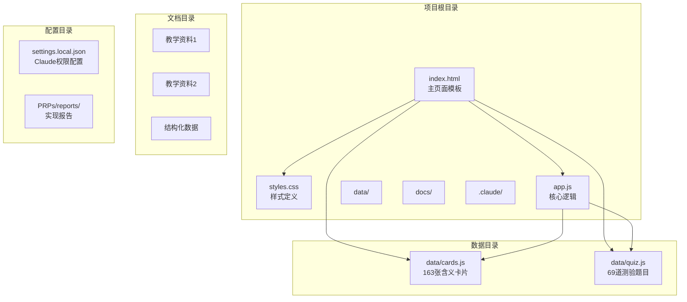

**图表来源**
- [index.html:1-115](file://index.html#L1-L115)
- [app.js:1-308](file://app.js#L1-L308)
- [data/quiz.js:1-72](file://data/quiz.js#L1-L72)

**章节来源**
- [CLAUDE.md:13-20](file://CLAUDE.md#L13-L20)
- [CLAUDE.md:46-48](file://CLAUDE.md#L46-L48)

## 核心组件

### 数据层组件

应用的数据层采用全局变量桥接的方式，通过window对象在不同文件间传递数据：

- **CARDS数组**：包含163张含义卡片，每张卡片包含字符、词性、例句、出处、含义、记忆提示和其它用法等信息
- **QUIZZES数组**：包含69道测验题目，每道题目包含问题、例句、出处、选项和正确答案索引
- **R状态对象**：间隔重复系统的复习状态，包含级别、下次复习时间戳和答对次数
- **stats统计对象**：用户学习统计数据，包含总答题数和正确数

### 逻辑层组件

应用的核心逻辑集中在app.js中，实现了以下主要功能：

- **间隔重复算法**：实现10级时间间隔的SRS系统
- **学习界面**：闪卡翻转、评记、中途测验等功能
- **测验系统**：随机10题四选一测验
- **词库管理**：按实词/虚词分类显示
- **个人统计**：学习进度、正确率、掌握字数等统计

**章节来源**
- [CLAUDE.md:26-29](file://CLAUDE.md#L26-L29)
- [app.js:1-308](file://app.js#L1-L308)

## 架构概览

应用采用单页应用（SPA）架构，通过CSS类切换实现页面导航：

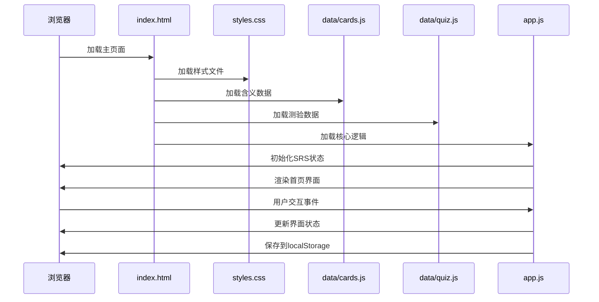

**图表来源**
- [CLAUDE.md:52-60](file://CLAUDE.md#L52-L60)
- [index.html:110-112](file://index.html#L110-L112)

## 详细组件分析

### 间隔重复系统

应用实现了完整的间隔重复算法，包含10个级别的时间间隔：

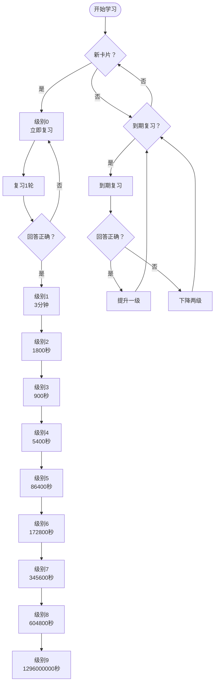

**图表来源**
- [app.js:4-6](file://app.js#L4-L6)
- [app.js:122-141](file://app.js#L122-L141)

### 学习界面组件

学习界面采用闪卡设计，支持用户交互和进度跟踪：

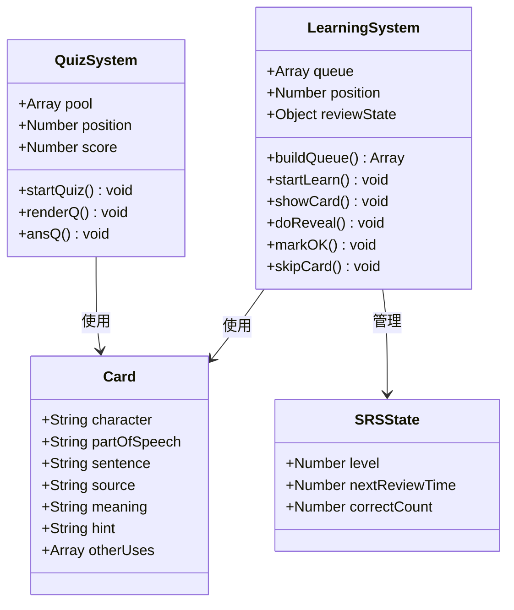

**图表来源**
- [app.js:58-141](file://app.js#L58-L141)
- [app.js:198-228](file://app.js#L198-L228)

**章节来源**
- [app.js:38-141](file://app.js#L38-L141)
- [app.js:198-228](file://app.js#L198-L228)

## 部署配置

### 服务器要求

由于应用采用纯前端技术栈，部署相对简单：

- **Web服务器**：Apache、Nginx或其他静态文件服务器
- **PHP支持**：可选，用于动态内容（当前版本不需要）
- **数据库**：不需要，用户数据存储在localStorage中
- **Node.js**：不需要，零构建环境

### 文件权限配置

部署时需要确保以下文件具有正确的访问权限：

- **index.html**：可读权限
- **styles.css**：可读权限  
- **data/*.js**：可读权限
- **app.js**：可读权限

### 缓存策略

建议配置适当的缓存头以优化性能：

- **HTML文件**：Cache-Control: no-cache
- **CSS文件**：Cache-Control: public, max-age=31536000
- **JavaScript文件**：Cache-Control: public, max-age=31536000
- **数据文件**：Cache-Control: no-store

## 域名与HTTPS配置

### 域名配置

应用支持多种部署方式：

1. **静态文件托管**：GitHub Pages、Netlify、Vercel等
2. **传统Web服务器**：Apache、Nginx配置虚拟主机
3. **CDN部署**：CloudFlare、阿里云CDN等

### HTTPS设置

推荐启用HTTPS以确保用户数据安全：

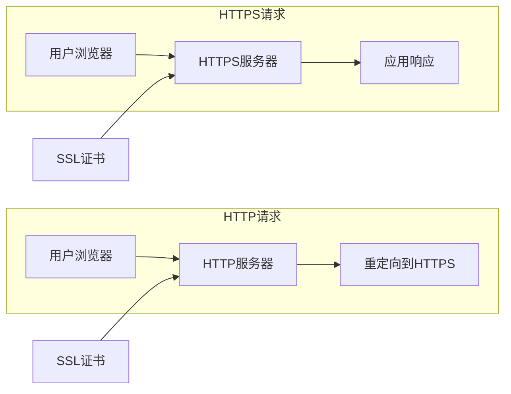

**图表来源**
- [index.html:6-8](file://index.html#L6-L8)

### CORS配置

如果需要跨域访问，需要配置适当的CORS头：

- **Access-Control-Allow-Origin**: *
- **Access-Control-Allow-Methods**: GET, POST, OPTIONS
- **Access-Control-Allow-Headers**: Content-Type, Authorization

## 静态文件部署

### 部署步骤

1. **准备文件**：确保所有文件完整上传
2. **配置服务器**：设置正确的MIME类型
3. **测试访问**：验证所有资源正常加载
4. **缓存配置**：设置适当的缓存策略
5. **监控设置**：配置访问日志和错误日志

### 服务器配置示例

#### Apache配置
```apache
# 设置MIME类型
AddType text/html .html
AddType text/css .css
AddType application/javascript .js

# 启用Gzip压缩
<IfModule mod_deflate.c>
    AddOutputFilterByType DEFLATE text/css
    AddOutputFilterByType DEFLATE application/javascript
</IfModule>

# 设置缓存头
<FilesMatch "\.(css|js)$">
    Header set Cache-Control "public, max-age=31536000"
</FilesMatch>
```

#### Nginx配置
```nginx
# 设置MIME类型
location ~* \.(html|css|js)$ {
    add_header Content-Type text/html;
}

# 启用gzip压缩
gzip on;
gzip_types text/css application/javascript;

# 设置缓存
location ~* \.(css|js)$ {
    expires 1y;
    add_header Cache-Control "public, immutable";
}
```

### CDN集成

建议使用CDN加速静态资源：

1. **选择CDN服务**：CloudFlare、阿里云CDN等
2. **配置域名**：将CDN域名指向源服务器
3. **设置缓存规则**：针对不同文件类型设置缓存策略
4. **启用HTTPS**：配置CDN SSL证书

## 浏览器兼容性检查

### 移动设备支持

应用采用移动优先的设计理念：

- **最大宽度**：430px（适配iPhone等主流手机）
- **触摸优化**：使用-webkit-overflow-scrolling: touch
- **视口配置**：viewport meta标签确保正确缩放
- **字体支持**：使用Noto Serif SC等中文字体

### JavaScript兼容性

应用使用现代JavaScript特性：

- **ES5兼容**：确保IE9+支持
- **localStorage**：现代浏览器完全支持
- **CSS3动画**：渐进增强设计
- **Flexbox布局**：现代浏览器支持

### 兼容性测试清单

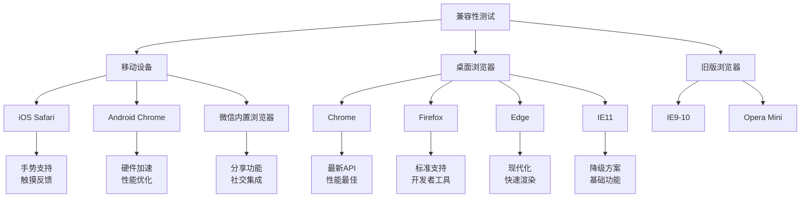

**图表来源**
- [styles.css:10](file://styles.css#L10)
- [index.html:4](file://index.html#L4)

### 性能优化

- **懒加载**：图片和字体延迟加载
- **资源压缩**：CSS和JavaScript压缩
- **缓存策略**：合理的缓存头设置
- **CDN加速**：静态资源CDN分发

## 性能监控

### 监控指标

应用性能监控应关注以下指标：

1. **加载性能**
   - 首屏渲染时间
   - 资源加载时间
   - TTFB（首字节时间）

2. **用户体验**
   - 交互响应时间
   - 页面流畅度
   - 错误发生频率

3. **服务器性能**
   - 请求响应时间
   - 并发连接数
   - 服务器负载

### 监控工具

推荐使用以下监控工具：

- **Google Analytics**：流量统计和用户行为分析
- **Sentry**：JavaScript错误追踪
- **New Relic**：应用性能监控
- **Pingdom**：网站性能监控

### 性能优化建议

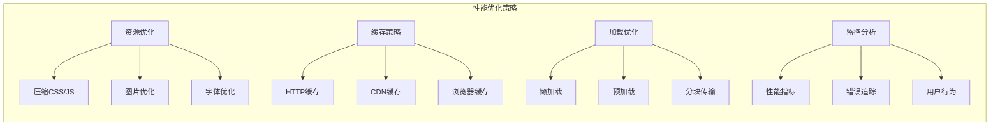

## 错误追踪

### 错误收集

应用错误追踪应包括：

1. **JavaScript错误**
   - 控制台错误
   - 异步错误
   - 跨域错误

2. **网络错误**
   - 资源加载失败
   - API调用错误
   - 网络超时

3. **用户行为错误**
   - 用户操作异常
   - 界面交互错误
   - 数据处理错误

### 错误上报机制

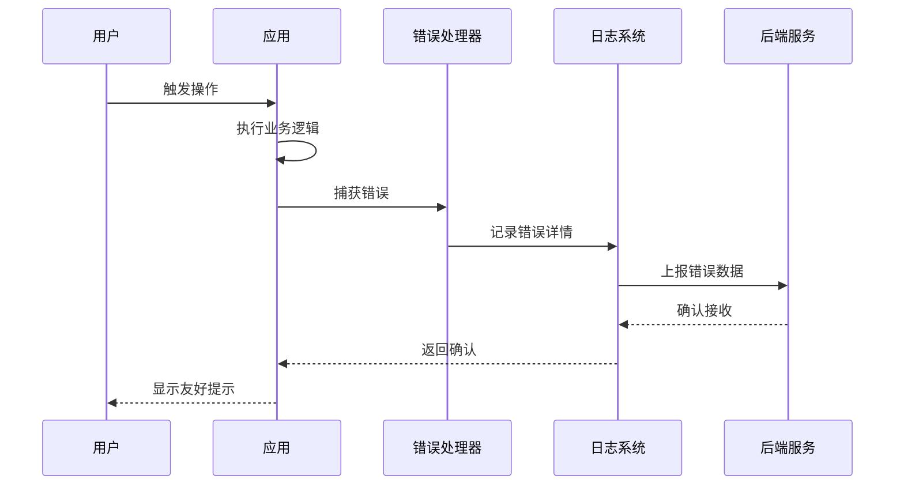

**图表来源**
- [app.js:16](file://app.js#L16)

### 错误处理策略

- **优雅降级**：错误时提供基本功能
- **用户提示**：友好的错误信息
- **自动恢复**：部分错误可自动修复
- **数据保护**：确保用户数据安全

## 更新升级流程

### 版本控制策略

应用采用语义化版本控制：

- **主版本号**：重大架构变更
- **次版本号**：新增功能
- **修订号**：bug修复和小改进

### 升级流程

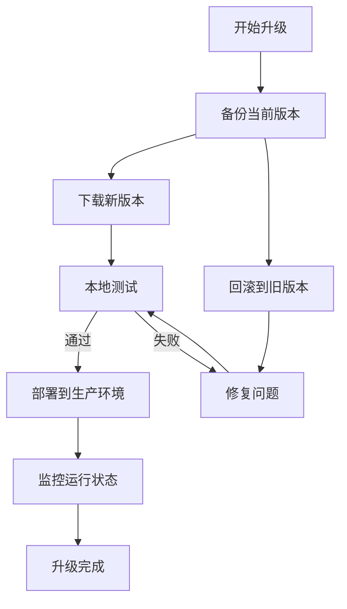

### 数据迁移

升级过程中可能涉及的数据迁移：

1. **localStorage格式变更**
   - 数据结构升级
   - 字段名称变更
   - 默认值设置

2. **API接口变更**
   - 数据格式调整
   - 接口地址变更
   - 认证方式更新

3. **文件结构变更**
   - 新增或删除文件
   - 文件路径调整
   - 权限设置更新

## 版本管理

### Git工作流程

推荐使用Git进行版本管理：

```mermaid
gitgraph
commit id: "初始版本"
branch develop
checkout develop
commit id: "添加新功能"
commit id: "修复bug"
checkout main
merge develop
commit id: "发布v1.0.0"
branch hotfix
checkout hotfix
commit id: "紧急修复"
checkout main
merge hotfix
commit id: "发布v1.0.1"
```

### 分支策略

- **main分支**：稳定版本，生产环境
- **develop分支**：开发版本，测试环境
- **feature分支**：新功能开发
- **hotfix分支**：紧急修复

### 标签管理

使用Git标签标记发布版本：

- `v1.0.0`：第一个稳定版本
- `v1.0.1`：小bug修复
- `v1.1.0`：新增功能

## 回滚策略

### 回滚触发条件

当出现以下情况时需要执行回滚：

1. **严重功能缺陷**
   - 核心功能失效
   - 数据丢失风险
   - 安全漏洞

2. **性能问题**
   - 页面加载缓慢
   - 用户体验恶化
   - 服务器压力过大

3. **兼容性问题**
   - 浏览器兼容性
   - 移动设备问题
   - 第三方服务故障

### 回滚步骤

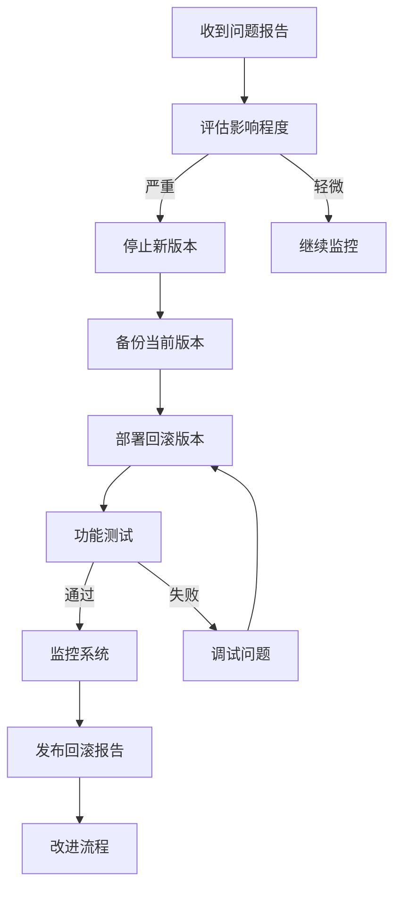

### 自动回滚机制

建议实现自动回滚机制：

- **健康检查**：定期检查应用状态
- **错误监控**：实时监控错误率
- **自动切换**：异常时自动切换到稳定版本
- **通知机制**：回滚时通知相关人员

## 用户数据备份

### 数据存储位置

用户数据存储在浏览器的localStorage中：

- **localStorage键名**：
  - `w3_r`：SRS复习状态
  - `w3_s`：学习统计信息

### 备份策略

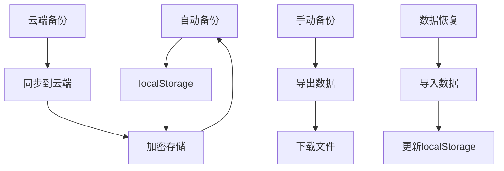

### 数据导出格式

用户数据导出为JSON格式：

```json
{
  "w3_r": {
    "0": {"l": 2, "n": 1634567890000, "ok": 5},
    "1": {"l": 1, "n": 1634567890000, "ok": 3}
  },
  "w3_s": {"t": 45, "c": 38}
}
```

### 备份频率

- **自动备份**：每次用户操作后
- **定时备份**：每日凌晨2点
- **手动备份**：用户主动触发
- **云端备份**：每周同步一次

## 安全防护

### XSS防护

应用采用以下XSS防护措施：

1. **输入验证**
   - 对用户输入进行严格验证
   - 过滤特殊字符
   - 限制输入长度

2. **输出编码**
   - 动态内容HTML转义
   - 属性值转义
   - URL参数编码

3. **内容安全策略**
   ```html
   <meta http-equiv="Content-Security-Policy" 
         content="default-src 'self'; script-src 'self' 'unsafe-inline'; style-src 'self' 'unsafe-inline'">
   ```

### CSRF防护

虽然应用主要是静态文件，但仍需考虑CSRF防护：

- **SameSite Cookie**：防止跨站请求
- **Token验证**：敏感操作需要令牌
- **Referer检查**：验证请求来源

### 数据安全

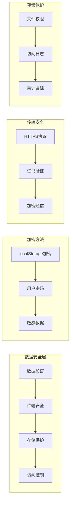

### 安全监控

- **异常登录检测**：IP地址和设备检测
- **数据访问监控**：记录敏感数据访问
- **安全事件告警**：异常活动及时通知
- **定期安全审计**：代码和配置审查

## 隐私保护

### 数据收集政策

应用遵循最小化数据收集原则：

- **必要数据**：仅收集实现功能必需的数据
- **匿名处理**：不收集可识别个人信息
- **本地存储**：用户数据存储在本地设备
- **透明公开**：明确告知数据使用方式

### 隐私合规

应用符合相关隐私法规：

- **GDPR合规**：欧盟通用数据保护条例
- **CCPA合规**：加州消费者隐私法案
- **个人信息保护法**：中国个人信息保护法

### 用户权利

用户享有以下权利：

- **知情权**：了解数据收集和使用
- **访问权**：查看个人数据
- **更正权**：修正不准确数据
- **删除权**：删除个人数据
- **撤回同意权**：撤销数据使用同意

## 故障排除指南

### 常见问题诊断

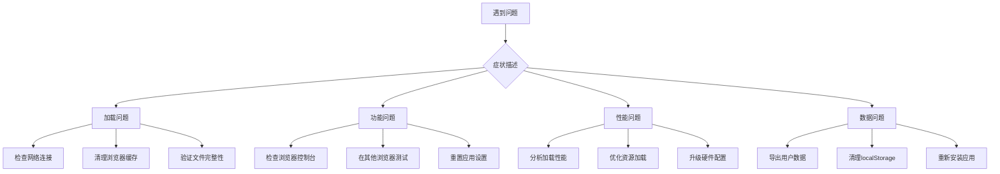

### 技术支持流程

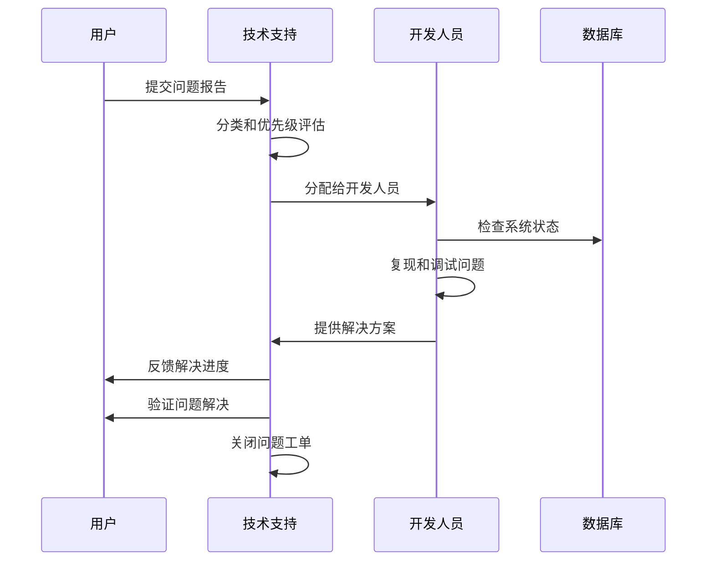

### 故障排查清单

#### 加载问题
- [ ] 检查网络连接是否稳定
- [ ] 验证所有文件是否完整下载
- [ ] 清理浏览器缓存和Cookie
- [ ] 检查防火墙和安全软件设置

#### 功能问题
- [ ] 在不同浏览器中测试
- [ ] 检查JavaScript是否启用
- [ ] 验证localStorage是否可用
- [ ] 查看浏览器控制台错误信息

#### 性能问题
- [ ] 使用开发者工具分析性能
- [ ] 检查网络请求时间和资源大小
- [ ] 优化图片和媒体文件
- [ ] 启用浏览器缓存和压缩

#### 数据问题
- [ ] 导出用户数据进行备份
- [ ] 检查localStorage存储空间
- [ ] 验证数据格式和完整性
- [ ] 重置应用到默认设置

### 最佳实践

1. **预防性维护**
   - 定期检查系统健康状况
   - 监控性能指标变化
   - 及时更新安全补丁

2. **用户沟通**
   - 提供清晰的问题反馈渠道
   - 及时回应用户咨询
   - 定期发布更新日志

3. **文档维护**
   - 保持技术文档更新
   - 记录常见问题和解决方案
   - 建立知识库和FAQ

## 结论

文言斩应用作为一个纯前端的文言文学习工具，采用了简洁高效的架构设计。通过模块化的文件组织、完善的间隔重复系统和本地数据存储，为用户提供了优质的文言文学习体验。

在部署和维护方面，应用具有以下优势：

- **部署简单**：零依赖、零构建，直接部署静态文件
- **维护成本低**：模块化设计便于功能扩展和bug修复
- **用户体验佳**：移动优先设计，支持离线使用
- **数据安全**：用户数据本地存储，隐私保护到位

建议在实际部署中重点关注以下方面：

1. **性能优化**：合理配置缓存和CDN，提升加载速度
2. **监控完善**：建立全面的性能和错误监控体系
3. **安全加固**：实施必要的安全防护措施
4. **备份策略**：制定完善的数据备份和恢复计划

通过遵循本文档提供的部署和维护指导，可以确保文言斩应用稳定可靠地运行，为用户提供持续的学习支持。