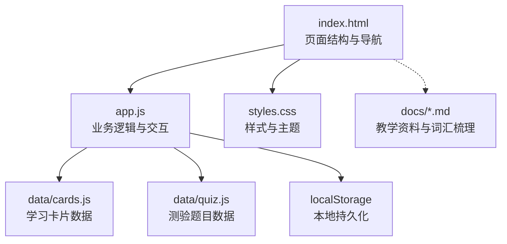
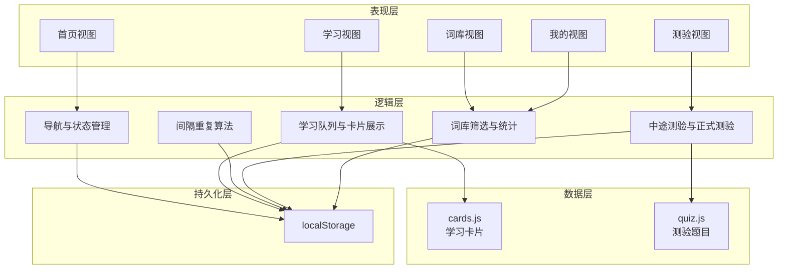
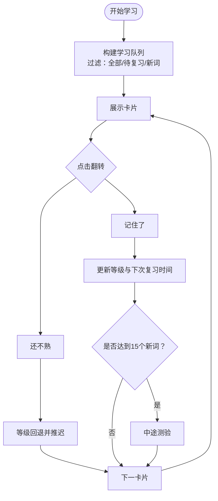
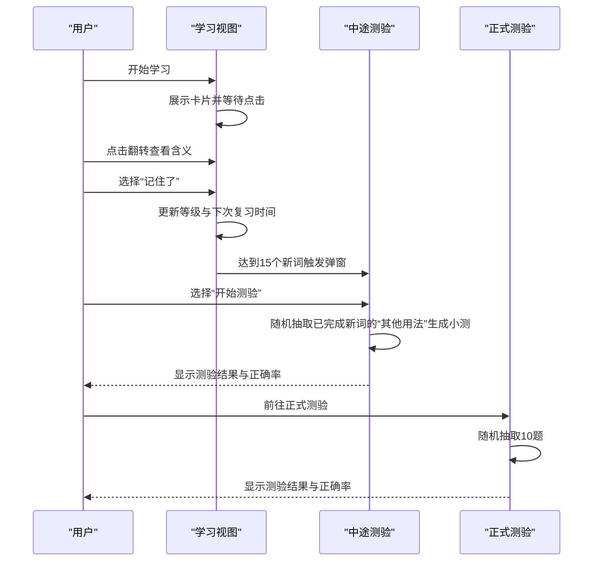
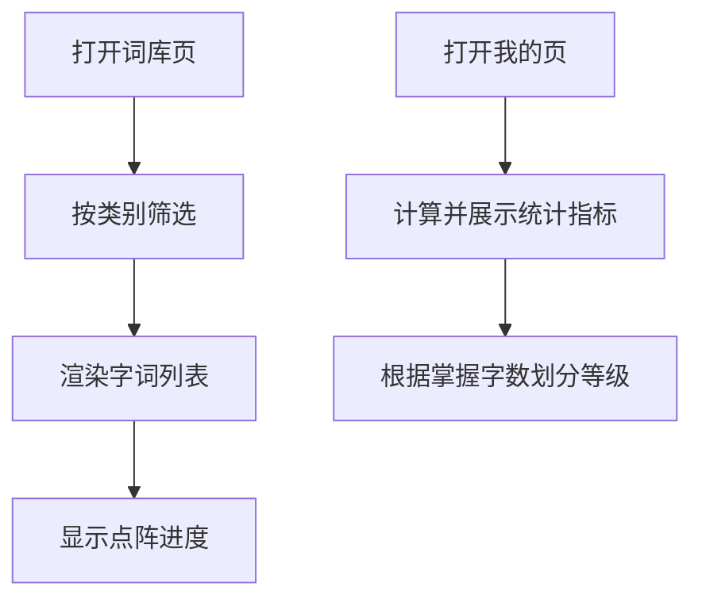
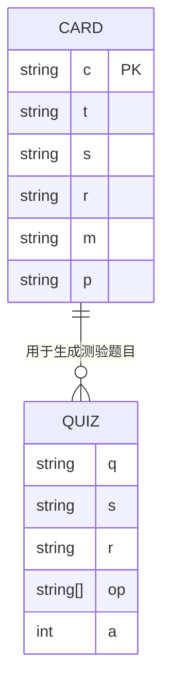
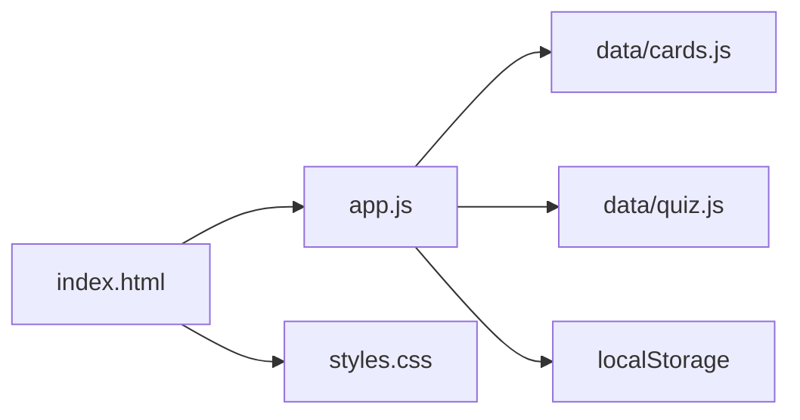

# 项目概述

<cite>
**本文档引用的文件**
- [index.html](file://index.html)
- [app.js](file://app.js)
- [styles.css](file://styles.css)
- [data/cards.js](file://data/cards.js)
- [data/quiz.js](file://data/quiz.js)
- [docs/上海市初中、高中文言文实词和虚词.md](file://docs/上海市初中、高中文言文实词和虚词.md)
- [docs/文言实词·虚词专项梳理.md](file://docs/文言实词·虚词专项梳理.md)
</cite>

## 目录
1. [简介](#简介)
2. [项目结构](#项目结构)
3. [核心组件](#核心组件)
4. [架构总览](#架构总览)
5. [详细组件分析](#详细组件分析)
6. [依赖关系分析](#依赖关系分析)
7. [性能考量](#性能考量)
8. [故障排查指南](#故障排查指南)
9. [结论](#结论)
10. [附录](#附录)

## 简介

“文言斩”是一个面向中文学习者的文言文词汇学习应用，专注于帮助用户高效掌握文言文实词与虚词。项目采用纯前端实现，无需服务器支持，所有数据与状态均保存在浏览器本地存储中，确保用户隐私与离线可用性。应用通过科学的记忆算法（间隔重复系统）帮助用户巩固词汇，结合“中途测验”机制强化短期记忆，同时提供“复习测验”与“词库查询”两大功能模块，满足不同学习阶段的需求。

- **核心目标**：帮助用户系统掌握文言文高频实词与虚词，提升文言语感与应试能力。
- **主要功能特性**：
  - 间隔重复学习系统：基于艾宾浩斯遗忘曲线设计的复习节奏控制。
  - 学习卡片展示：提供字词、例句、出处、含义与提示信息，支持点击翻转查看。
  - 中途测验：阶段性小测，检验新学词汇记忆效果。
  - 正式测验：随机抽取题目进行语境选义测试，评估整体掌握程度。
  - 词库查询：按类别筛选字词，直观显示学习进度与等级标签。
  - 个人统计：展示学习总量、正确率、测验次数与掌握字数等指标。
- **目标用户群体**：初中、高中学生，以及准备参加中考、高考或对文言文感兴趣的自学者。
- **教育价值**：通过系统化的词汇积累与间隔复习，构建扎实的文言文基础，提升阅读理解与翻译能力。
- **技术特色**：
  - 纯前端实现，无后端依赖。
  - 本地数据持久化（localStorage），保障数据安全与离线可用。
  - 响应式界面，适配移动端与桌面端。
  - 交互式学习卡片与测验流程，增强学习体验。

## 项目结构

项目采用极简的三层结构：HTML 页面骨架、JavaScript 业务逻辑、CSS 样式定义，辅以本地数据文件。文档资料用于支撑教学内容与词汇来源。

图表来源
- [index.html:1-115](file://index.html#L1-L115)
- [app.js:1-308](file://app.js#L1-L308)
- [styles.css:1-122](file://styles.css#L1-L122)
- [data/cards.js:1-166](file://data/cards.js#L1-L166)
- [data/quiz.js:1-72](file://data/quiz.js#L1-L72)

章节来源
- [index.html:1-115](file://index.html#L1-L115)
- [app.js:1-308](file://app.js#L1-L308)
- [styles.css:1-122](file://styles.css#L1-L122)
- [data/cards.js:1-166](file://data/cards.js#L1-L166)
- [data/quiz.js:1-72](file://data/quiz.js#L1-L72)

## 核心组件

- **页面容器与导航**：index.html 提供首页、学习页、测验页、词库页、我的页五个视图，底部导航栏实现页面切换。
- **学习引擎**：app.js 实现学习队列构建、卡片展示、间隔重复算法、中途测验与正式测验流程。
- **数据层**：data/cards.js 提供学习卡片（字词、类别、例句、出处、含义、提示、其他用法），data/quiz.js 提供测验题目。
- **样式系统**：styles.css 定义主题色、字体、布局与交互动画，确保良好的视觉与操作体验。
- **本地持久化**：app.js 使用 localStorage 存储学习进度与统计数据，保证跨会话一致性。
- **文档支撑**：docs 目录包含教学资料，为词汇与虚词讲解提供权威参考。

章节来源
- [index.html:14-106](file://index.html#L14-L106)
- [app.js:3-26](file://app.js#L3-L26)
- [app.js:58-142](file://app.js#L58-L142)
- [app.js:197-228](file://app.js#L197-L228)
- [app.js:230-274](file://app.js#L230-L274)
- [app.js:276-296](file://app.js#L276-L296)
- [data/cards.js:1-166](file://data/cards.js#L1-L166)
- [data/quiz.js:1-72](file://data/quiz.js#L1-L72)
- [styles.css:1-122](file://styles.css#L1-L122)

## 架构总览

应用采用“页面-逻辑-数据-持久化”的分层架构，页面负责渲染与交互，逻辑层处理学习流程与状态管理，数据层提供词汇与测验素材，持久化层保障用户进度与统计不丢失。

图表来源
- [index.html:27-93](file://index.html#L27-L93)
- [app.js:28-35](file://app.js#L28-L35)
- [app.js:58-142](file://app.js#L58-L142)
- [app.js:144-195](file://app.js#L144-L195)
- [app.js:197-228](file://app.js#L197-L228)
- [app.js:230-274](file://app.js#L230-L274)
- [app.js:276-296](file://app.js#L276-L296)
- [data/cards.js:1-166](file://data/cards.js#L1-L166)
- [data/quiz.js:1-72](file://data/quiz.js#L1-L72)

## 详细组件分析

### 1. 间隔重复系统（艾宾浩斯遗忘曲线）

- 设计理念：根据用户对单词的记忆强度动态调整复习周期，避免过度学习与遗忘回潮。
- 数据结构：
  - 复习间隔数组：定义不同等级对应的复习间隔（毫秒）。
  - 等级名称与颜色：用于界面展示学习进度与等级标签。
- 算法流程：
  - 计算到期数量：遍历卡片，统计当前已到期的复习任务。
  - 新词与复习混合：按“复习优先”策略混合队列，保证复习与新词的平衡。
  - 点击“记住了”：等级+1，更新下次复习时间；点击“还不熟”：等级回退，推迟复习。
  - 中途测验触发：每完成15个新词时弹出小测，检验短期记忆效果。

图表来源
- [app.js:58-68](file://app.js#L58-L68)
- [app.js:122-141](file://app.js#L122-L141)
- [app.js:144-150](file://app.js#L144-L150)
- [app.js:151-164](file://app.js#L151-L164)

章节来源
- [app.js:3-6](file://app.js#L3-L6)
- [app.js:16-25](file://app.js#L16-L25)
- [app.js:58-68](file://app.js#L58-L68)
- [app.js:122-141](file://app.js#L122-L141)
- [app.js:144-164](file://app.js#L144-L164)

### 2. 学习卡片与中途测验

- 学习卡片包含：字词、类别（实词/虚词）、例句（带高亮）、出处、含义、提示与“其他用法”列表。
- 翻转交互：点击卡片区域展开含义，按钮区淡入显示“还不熟/记住了”。
- 中途测验：随机抽取已完成的新词的“其他用法”作为选项，检验短期记忆。
- 正式测验：从题库中随机抽取10题，语境选义，即时反馈答案与正确率。

图表来源
- [index.html:34-51](file://index.html#L34-L51)
- [app.js:73-115](file://app.js#L73-L115)
- [app.js:144-195](file://app.js#L144-L195)
- [app.js:197-228](file://app.js#L197-L228)

章节来源
- [index.html:34-51](file://index.html#L34-L51)
- [app.js:73-115](file://app.js#L73-L115)
- [app.js:144-195](file://app.js#L144-L195)
- [app.js:197-228](file://app.js#L197-L228)

### 3. 词库与个人统计

- 词库页：按“全部/虚词/实词”筛选，展示每个字的多个含义与完成情况，用点阵直观反映掌握进度。
- 个人统计：展示“学过含义数”、“测验正确率”、“测验次数”、“字已掌握数”，并根据掌握字数划分等级（如童生、秀才、举人、进士等）。

图表来源
- [index.html:54-84](file://index.html#L54-L84)
- [app.js:230-274](file://app.js#L230-L274)
- [app.js:276-296](file://app.js#L276-L296)

章节来源
- [index.html:54-84](file://index.html#L54-L84)
- [app.js:230-274](file://app.js#L230-L274)
- [app.js:276-296](file://app.js#L276-L296)

### 4. 数据模型与来源

- 学习卡片（cards.js）：包含字词、类别、例句、出处、含义、提示与“其他用法”等字段，覆盖高频实词与虚词。
- 测验题目（quiz.js）：提供语境选义题目，涵盖常见虚词与实词的用法辨析。
- 教学资料（docs/*.md）：提供系统化的词汇与虚词讲解，支撑学习内容的权威性与完整性。

图表来源
- [data/cards.js:1-166](file://data/cards.js#L1-L166)
- [data/quiz.js:1-72](file://data/quiz.js#L1-L72)

章节来源
- [data/cards.js:1-166](file://data/cards.js#L1-L166)
- [data/quiz.js:1-72](file://data/quiz.js#L1-L72)
- [docs/上海市初中、高中文言文实词和虚词.md:1-800](file://docs/上海市初中、高中文言文实词和虚词.md#L1-L800)
- [docs/文言实词·虚词专项梳理.md:1-800](file://docs/文言实词·虚词专项梳理.md#L1-L800)

## 依赖关系分析

- 页面依赖逻辑：index.html 通过脚本引入 app.js，并在页面元素上绑定事件回调。
- 逻辑依赖数据：app.js 依赖 data/cards.js 与 data/quiz.js 提供的学习与测验数据。
- 逻辑依赖持久化：app.js 通过 localStorage 读写学习状态与统计数据。
- 样式依赖：styles.css 为所有视图提供统一的视觉风格与交互反馈。

图表来源
- [index.html:110-112](file://index.html#L110-L112)
- [app.js:1](file://app.js#L1)
- [data/cards.js:1](file://data/cards.js#L1)
- [data/quiz.js:1](file://data/quiz.js#L1)

章节来源
- [index.html:110-112](file://index.html#L110-L112)
- [app.js:1](file://app.js#L1)

## 性能考量

- 前端纯实现：无网络请求，加载与交互响应迅速，适合离线使用。
- 本地存储：使用 JSON 序列化保存状态，避免频繁 IO；建议在批量更新后统一调用保存函数，减少写入频率。
- DOM 操作：通过一次性拼接 HTML 与切换类名实现视图切换，避免深层嵌套与复杂选择器。
- 数据规模：当前数据量较小，无需分页或懒加载；若未来扩展至数千条卡片，可考虑虚拟滚动与分段加载。

## 故障排查指南

- 无法保存学习进度：检查浏览器是否禁用 localStorage，或清理缓存后重试。
- 学习队列为空：确认筛选条件（全部/待复习/新词）与到期数量，确保存在可学内容。
- 测验题目重复：确认题库数量充足，随机抽样逻辑正常工作。
- 界面显示异常：检查 CSS 文件是否正确加载，字体资源是否可用。
- 键盘快捷键无效：确认当前页面处于测验状态，且未被输入框占用焦点。

章节来源
- [app.js:9-11](file://app.js#L9-L11)
- [app.js:16](file://app.js#L16)
- [app.js:299-304](file://app.js#L299-L304)

## 结论

“文言斩”通过简洁高效的纯前端架构与科学的记忆算法，为用户提供了一个可离线、可持久、可扩展的文言文词汇学习平台。其间隔重复系统与阶段性测验机制有助于巩固记忆、提升学习效率；词库与个人统计功能则帮助用户清晰掌握学习进度与薄弱环节。项目具备良好的可维护性与扩展性，适合进一步引入更多教学资源与个性化功能。

## 附录

- 使用场景与预期学习效果：
  - 课堂预习：提前熟悉高频实词与虚词，提高课堂效率。
  - 课后复习：利用间隔重复系统巩固记忆，减少遗忘。
  - 专项突破：针对薄弱字词进行集中训练，查漏补缺。
  - 考前冲刺：通过正式测验与词库回顾，快速提升应试能力。
- 教育价值与技术特色总结：
  - 教育价值：系统化词汇积累、语感培养与应试能力提升。
  - 技术特色：纯前端实现、本地持久化、响应式设计、交互式学习体验。